# Module 1: Introduction & Flowcharts 🌱

> **Level: Beginner** | **Estimated Time: 2-3 hours**

## 📋 Module Overview

This module introduces you to Mermaid and covers the most fundamental diagram type - Flowcharts. By the end of this module, you'll be able to create professional flowcharts for any use case.

```mermaid
graph LR
    A[1.1 Getting Started] --> B[1.2 Flowchart Basics]
    B --> C[1.3 Advanced Flowcharts]
    C --> D[✅ Module Complete]
    
    style A fill:#90EE90
    style D fill:#FFD700
```



---

## 📖 Chapter 1.1: Getting Started

### What is Mermaid?

Mermaid is a JavaScript-based diagramming tool that uses text definitions to create diagrams. Instead of dragging and dropping shapes, you write simple text that gets rendered into beautiful diagrams.

**Advantages:**
- 📝 **Version Control Friendly** - Diagrams are plain text
- 🚀 **Fast to Create** - No complex tools needed
- 🔄 **Easy to Update** - Just modify the text
- 🌐 **Wide Support** - GitHub, GitLab, VS Code, Obsidian, etc.

### Where Can You Use Mermaid?

| Platform | Support |
|----------|---------|
| GitHub Markdown | ✅ Native |
| GitLab Markdown | ✅ Native |
| VS Code | ✅ Extension |
| Obsidian | ✅ Built-in |
| Notion | ✅ Code blocks |
| Confluence | ✅ Plugin |
| Mermaid Live Editor | ✅ Online |

### Your First Diagram

Try this in the [Mermaid Live Editor](https://mermaid.live/):


**Code breakdown:**
- `graph` - Declares a flowchart
- `TD` - Direction: Top to Down
- `A[Hello]` - Node A with text "Hello"
- `-->` - Arrow connecting nodes
- `B[World]` - Node B with text "World"

### Comments

Use `%%` to add comments (won't be rendered):


---

## 📖 Chapter 1.2: Flowchart Basics

### Direction Options


| Code | Direction | Description |
|------|-----------|-------------|
| `TB` or `TD` | Top → Bottom | Vertical, downward |
| `BT` | Bottom → Top | Vertical, upward |
| `LR` | Left → Right | Horizontal, rightward |
| `RL` | Right → Left | Horizontal, leftward |

### Node Shapes (Complete Reference)


**All Node Shapes:**

| Syntax | Shape | Use Case |
|--------|-------|----------|
| `[text]` | Rectangle | Process/Action |
| `(text)` | Rounded Rectangle | Start/End |
| `([text])` | Stadium | Terminal |
| `[[text]]` | Subroutine | Subprocess |
| `[(text)]` | Cylinder | Database |
| `((text))` | Circle | Connector |
| `(((text)))` | Double Circle | Special connector |
| `{text}` | Diamond | Decision |
| `{{text}}` | Hexagon | Preparation |
| `>text]` | Flag/Asymmetric | Note/Flag |
| `[/text/]` | Parallelogram | Input/Output |
| `[\text\]` | Alt Parallelogram | Input/Output |
| `[/text\]` | Trapezoid | Manual Operation |
| `[\text/]` | Alt Trapezoid | Manual Operation |

### More Node Shapes Example


### Connection Types


| Syntax | Type | Description |
|--------|------|-------------|
| `-->` | Arrow | Solid line with arrow |
| `---` | Line | Solid line, no arrow |
| `-.-` | Dotted | Dotted line, no arrow |
| `-.->` | Dotted Arrow | Dotted line with arrow |
| `==>` | Thick Arrow | Bold line with arrow |
| `===` | Thick Line | Bold line, no arrow |
| `~~~` | Invisible | Hidden connection |
| `<-->` | Bidirectional | Arrow on both ends |
| `o--o` | Circle ends | Circle on both ends |
| `x--x` | Cross ends | X on both ends |

### Link Length Control

Control link length by adding more dashes:


| Syntax | Length |
|--------|--------|
| `-->` | Normal |
| `--->` | Longer |
| `---->` | Even longer |
| `----->` | Very long |

### Link Text

Add text to your connections:


**Syntax options:**
- `-->|text|` - Text on arrow
- `-- text ---` - Text on line
- `-. text .->` - Text on dotted arrow

### Chaining Links

Simplify multiple connections:


### Multi-Node Connections

Connect multiple nodes at once with `&`:


This is equivalent to:
```
A --> C
A --> D
B --> C
B --> D
```

### Complex Example


---

## 📖 Chapter 1.3: Advanced Flowcharts

### Subgraphs

Group related nodes together:


**Syntax:**
```
subgraph Title
    nodes and connections
end
```

### Subgraph Direction

Control direction within subgraphs:


### Nested Subgraphs


### Subgraph Connections

You can connect subgraphs directly:


### Styling Nodes


**Styling syntax:**
```
classDef className fill:#color,stroke:#color,stroke-width:2px
A:::className
```

### Style Properties

| Property | Description | Example |
|----------|-------------|---------|
| `fill` | Background color | `fill:#ff0000` |
| `stroke` | Border color | `stroke:#333` |
| `stroke-width` | Border width | `stroke-width:2px` |
| `color` | Text color | `color:#fff` |
| `stroke-dasharray` | Dashed border | `stroke-dasharray:5,5` |

### Inline Styling


### Link Styling


### Special Characters

Use quotes for special characters:


### Markdown in Nodes

```mermaid
graph LR
    A["`**Bold** text`"] --> B["`*Italic* text`"]
    B --> C["`~~Strikethrough~~`"]
```

### Unicode Support

```mermaid
graph LR
    A[🚀 Launch] --> B[📊 Analyze]
    B --> C[✅ Complete]
```

### Click Events (Interactive)

```mermaid
graph LR
    A[Click Me] --> B[Open Google]
    click A "https://mermaid.js.org/" "Open Mermaid Docs"
    click B "https://google.com" _blank
```

### Configuration Directive

Customize diagram behavior:

```
%%{init: {'theme': 'dark', 'flowchart': {'curve': 'basis'}}}%%
graph TD
    A --> B --> C
```

**Common config options:**
- `theme`: 'default', 'dark', 'forest', 'neutral'
- `flowchart.curve`: 'basis', 'linear', 'cardinal'
- `flowchart.nodeSpacing`: number
- `flowchart.rankSpacing`: number

---

## 🏋️ Exercises

### Exercise 1: Simple Flow
Create a flowchart showing the morning routine:
- Wake up → Shower → Breakfast → Go to work

### Exercise 2: Decision Making
Create a flowchart for: "Is it raining?"
- If yes → Take umbrella
- If no → Enjoy the sun
- Both paths → Go outside

### Exercise 3: Software Architecture
Create a diagram showing:
- Frontend (React, TypeScript)
- Backend (Node.js, Express)
- Database (PostgreSQL)
- Show data flow between layers

### Exercise 4: Styled Diagram
Create a process flow with:
- Green node for start
- Yellow nodes for processes
- Red node for error handling
- Blue node for end

📝 **See answers in:** [exercises/answers.md](./exercises/answers.md)

---

## ✅ Module Checklist

- [ ] Understand what Mermaid is and where to use it
- [ ] Can add comments to diagrams
- [ ] Know all node shape syntaxes
- [ ] Can create different connection types
- [ ] Understand link length control
- [ ] Can chain and multi-connect nodes
- [ ] Can add text to connections
- [ ] Understand subgraphs and directions
- [ ] Can apply styles to nodes and links
- [ ] Know how to use special characters
- [ ] Understand configuration directives
- [ ] Completed all exercises

---

## 🔗 Resources

- [Mermaid Flowchart Documentation](https://mermaid.js.org/syntax/flowchart.html)
- [Mermaid Live Editor](https://mermaid.live/)
- [Mermaid Configuration](https://mermaid.js.org/config/configuration.html)

---

> **Next Module:** [Module 2: Sequence Diagrams](../2-sequence-diagrams/README.md) →
