# Flowchart Examples 📊

A collection of ready-to-use flowchart examples.

---

## 1. Basic Flow

---

## 2. Decision Flow

---

## 3. Loop Flow

---

## 4. Parallel Processing

---

## 5. Error Handling

---

## 6. API Request Flow

---

## 7. Git Workflow

---

## 8. CI/CD Pipeline

---

## 9. User Authentication

---

## 10. E-commerce Checkout

```mermaid
graph TD
    A[🛒 Shopping Cart] --> B[Review Items]
    B --> C{Items Available?}
    C -->|No| D[Remove Unavailable]
    D --> B
    C -->|Yes| E[Enter Shipping Info]
    E --> F[Select Payment Method]
    F --> G{Payment Valid?}
    G -->|No| H[Show Payment Error]
    H --> F
    G -->|Yes| I[Process Payment]
    I --> J{Payment Success?}
    J -->|No| K[Refund & Notify]
    J -->|Yes| L[Create Order]
    L --> M[Send Confirmation Email]
    M --> N[📦 Order Complete]
```

---

## How to Use These Examples

1. Copy any example code block
2. Paste into [Mermaid Live Editor](https://mermaid.live/)
3. Modify to fit your needs
4. Export as SVG or PNG if needed
