# Node Shapes Reference 🔷

Complete reference for all Mermaid flowchart node shapes.

---

## All Node Shapes

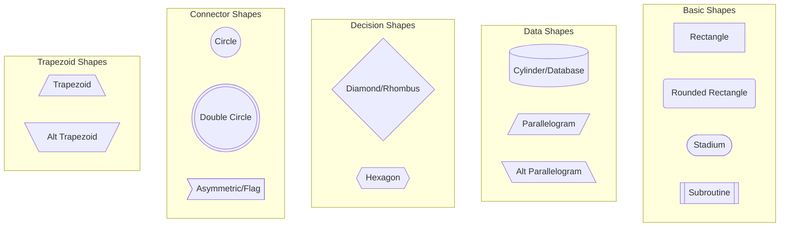

---

## Shape Syntax Quick Reference

| Shape | Syntax | Example |
|-------|--------|---------|
| Rectangle | `[text]` | `A[Process]` |
| Rounded | `(text)` | `A(Start)` |
| Stadium | `([text])` | `A([Terminal])` |
| Subroutine | `[[text]]` | `A[[Function]]` |
| Database | `[(text)]` | `A[(MySQL)]` |
| Circle | `((text))` | `A((Hub))` |
| Double Circle | `(((text)))` | `A(((Special)))` |
| Diamond | `{text}` | `A{Decision}` |
| Hexagon | `{{text}}` | `A{{Prepare}}` |
| Flag | `>text]` | `A>Note]` |
| Parallelogram | `[/text/]` | `A[/Input/]` |
| Alt Parallelogram | `[\text\]` | `A[\Output\]` |
| Trapezoid | `[/text\]` | `A[/Manual\]` |
| Alt Trapezoid | `[\text/]` | `A[\Manual/]` |

---

## When to Use Each Shape

### Rectangle `[text]`
**Use for:** General processes, actions, operations
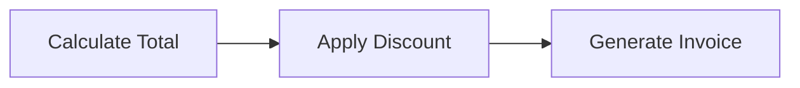

### Rounded Rectangle `(text)`
**Use for:** Start/End points, terminals
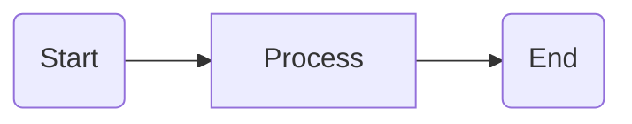

### Stadium `([text])`
**Use for:** Terminal points, entry/exit
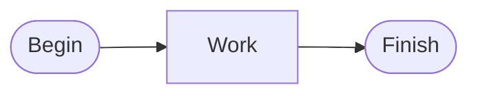

### Diamond `{text}`
**Use for:** Decisions, conditions, branching
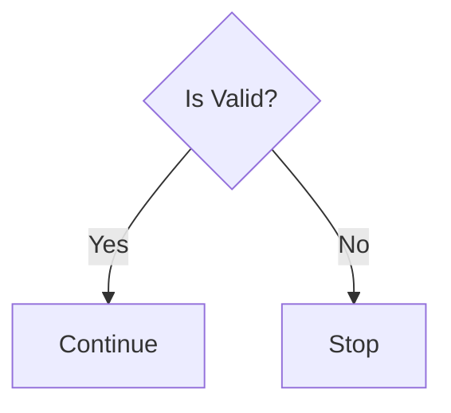

### Database/Cylinder `[(text)]`
**Use for:** Databases, data stores
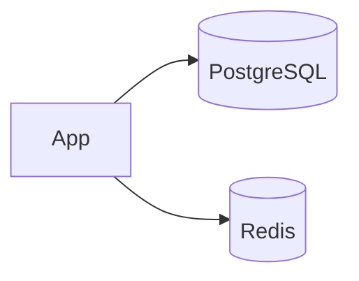

### Parallelogram `[/text/]`
**Use for:** Input/Output operations
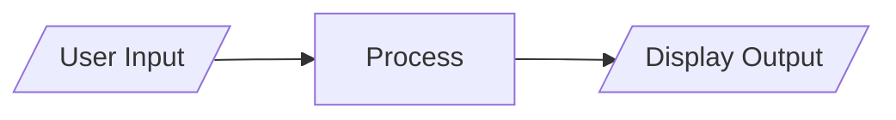

### Hexagon `{{text}}`
**Use for:** Preparation, initialization
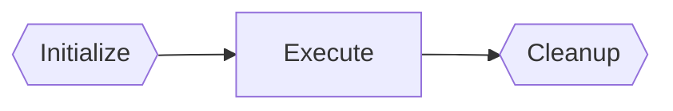

### Circle `((text))`
**Use for:** Connectors, junctions
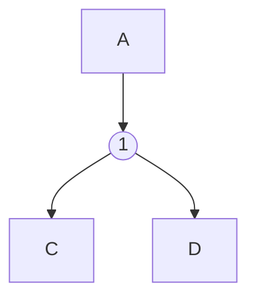

### Subroutine `[[text]]`
**Use for:** External processes, functions
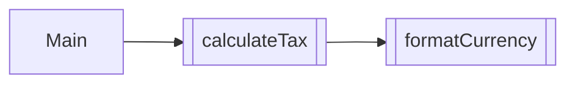

---

## Combining Shapes

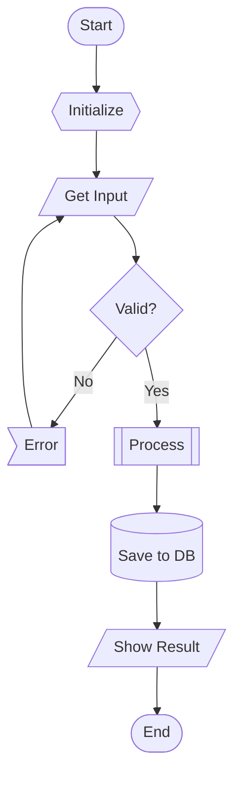
