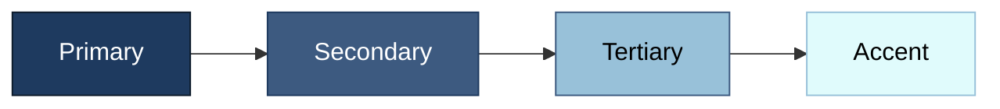

# Styling Reference 🎨

Complete guide to styling Mermaid flowcharts.

---

## ClassDef Styling

Define reusable style classes:


---

## Style Properties

| Property | Description | Example |
|----------|-------------|---------|
| `fill` | Background color | `fill:#ff0000` |
| `stroke` | Border color | `stroke:#333` |
| `stroke-width` | Border thickness | `stroke-width:2px` |
| `color` | Text color | `color:#fff` |
| `stroke-dasharray` | Dashed border | `stroke-dasharray:5,5` |
| `opacity` | Transparency | `opacity:0.8` |

---

## Inline Styling

Apply styles to individual nodes:


---

## Link Styling

Style connections between nodes:


**Note:** Link indices start at 0 and follow the order of definition.

---

## Applying Classes to Multiple Nodes

```mermaid
graph TD
    A[Start]:::start
    B[Step 1]:::process
    C[Step 2]:::process
    D[Step 3]:::process
    E[End]:::end
    
    A --> B --> C --> D --> E
    
    classDef start fill:#90EE90,stroke:#228B22
    classDef process fill:#87CEEB,stroke:#4169E1
    classDef end fill:#DDA0DD,stroke:#9370DB
```

Or apply to multiple nodes at once:

```
class B,C,D process
```

---

## Color Palettes

### Professional Blue



### Nature Green


### Warm Sunset


---

## Subgraph Styling


---

## Dark Theme Example


---

## Complete Styling Example

```mermaid
graph TD
    A([🚀 Start]):::start --> B[Initialize]:::step
    B --> C{Config Valid?}:::decision
    C -->|No| D[⚠️ Load Defaults]:::warning
    D --> B
    C -->|Yes| E[Process Data]:::step
    E --> F{Success?}:::decision
    F -->|No| G[❌ Log Error]:::error
    G --> H[Retry Logic]:::step
    H --> E
    F -->|Yes| I[Save Results]:::step
    I --> J[(Database)]:::database
    J --> K([✅ Complete]):::success
    
    classDef start fill:#a8e6cf,stroke:#3d9970,stroke-width:2px
    classDef step fill:#dfe6e9,stroke:#636e72,stroke-width:1px
    classDef decision fill:#ffeaa7,stroke:#fdcb6e,stroke-width:2px
    classDef warning fill:#fab1a0,stroke:#e17055,stroke-width:1px
    classDef error fill:#ff7675,stroke:#d63031,stroke-width:2px,color:#fff
    classDef database fill:#74b9ff,stroke:#0984e3,stroke-width:2px
    classDef success fill:#55efc4,stroke:#00b894,stroke-width:2px
    
    linkStyle 0,1,4,7,8 stroke:#2d3436,stroke-width:2px
    linkStyle 2,3 stroke:#e17055,stroke-width:2px
    linkStyle 5,6 stroke:#d63031,stroke-width:2px
```


