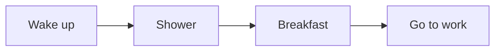
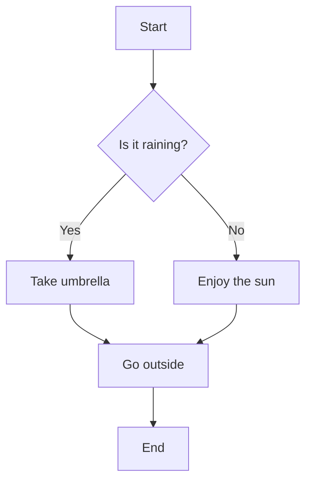
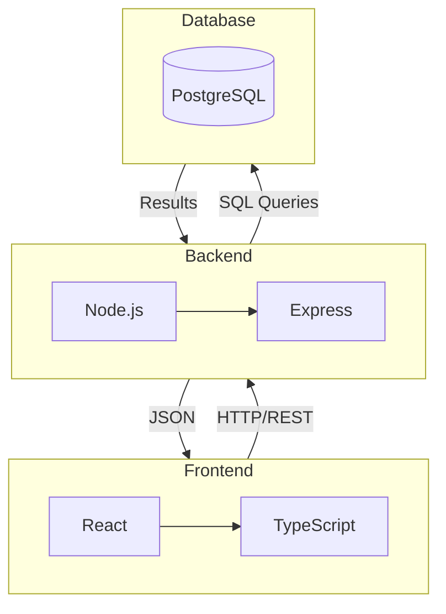
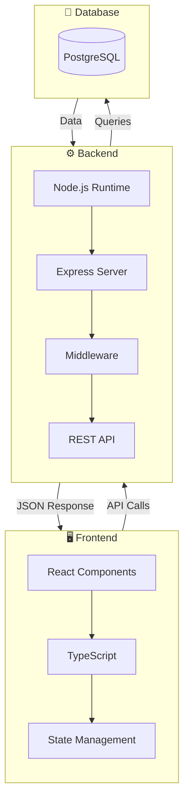
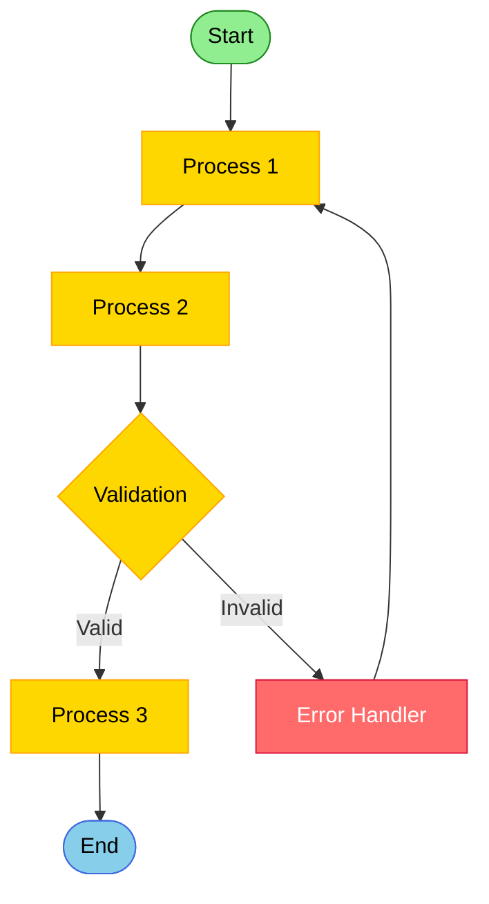

# Exercise Answers 📝

## Exercise 1: Simple Flow (Morning Routine)



**Alternative with styling:**

```mermaid
graph LR
    A([🌅 Wake up]):::start --> B[🚿 Shower]
    B --> C[🍳 Breakfast]
    C --> D([🚗 Go to work]):::end
    
    classDef start fill:#90EE90,stroke:#228B22
    classDef end fill:#87CEEB,stroke:#4169E1
```

---

## Exercise 2: Decision Making (Is it Raining?)



**With styling:**

```mermaid
graph TD
    A([Start]):::start --> B{Is it raining?}:::decision
    B -->|Yes| C[☔ Take umbrella]:::action
    B -->|No| D[☀️ Enjoy the sun]:::action
    C --> E[🚶 Go outside]:::action
    D --> E
    E --> F([End]):::end
    
    classDef start fill:#90EE90,stroke:#228B22
    classDef decision fill:#FFD700,stroke:#FFA500
    classDef action fill:#E6E6FA,stroke:#9370DB
    classDef end fill:#87CEEB,stroke:#4169E1
```

---

## Exercise 3: Software Architecture



**Detailed version:**



---

## Exercise 4: Styled Process Flow



---

## Bonus: Complete Real-World Example

### User Registration Flow

```mermaid
graph TD
    A([🏠 Landing Page]):::start --> B[📝 Fill Registration Form]
    B --> C{Valid Input?}:::decision
    C -->|No| D[⚠️ Show Errors]:::error
    D --> B
    C -->|Yes| E[📧 Send Verification Email]
    E --> F{Email Verified?}:::decision
    F -->|No, Timeout| G[🔄 Resend Email]:::warning
    G --> F
    F -->|Yes| H[✅ Create Account]:::success
    H --> I[🎉 Welcome Page]
    I --> J([🏁 Complete]):::end
    
    classDef start fill:#E8F5E9,stroke:#4CAF50
    classDef end fill:#E3F2FD,stroke:#2196F3
    classDef decision fill:#FFF3E0,stroke:#FF9800
    classDef error fill:#FFEBEE,stroke:#F44336
    classDef warning fill:#FFF8E1,stroke:#FFC107
    classDef success fill:#E8F5E9,stroke:#4CAF50
```

---

## Tips for Creating Good Flowcharts

1. **Keep it simple** - Don't overcomplicate with too many nodes
2. **Use consistent direction** - Stick to one primary direction
3. **Group related items** - Use subgraphs for organization
4. **Add meaningful labels** - Connection text should be clear
5. **Style purposefully** - Colors should convey meaning
6. **Use emojis sparingly** - They can improve readability
7. **Add comments** - Document complex sections with `%%`
