# Module 2: Sequence Diagrams 🌱

> **Level: Beginner** | **Estimated Time: 2-3 hours**

## 📋 Module Overview

Sequence diagrams show how different parts of a system interact with each other over time. They're essential for documenting APIs, user flows, and system communications.

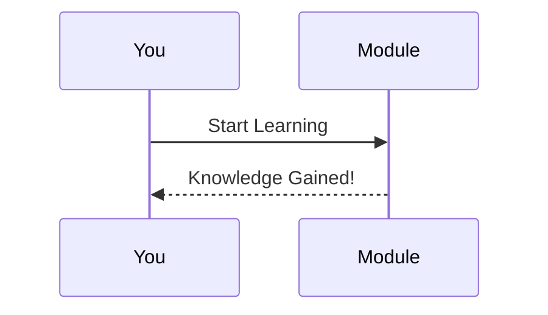
```mermaid
sequenceDiagram
    participant You
    participant Module
    You->>Module: Start Learning
    Module-->>You: Knowledge Gained!
```

---

## 📖 Chapter 2.1: Sequence Diagram Basics

### Basic Syntax

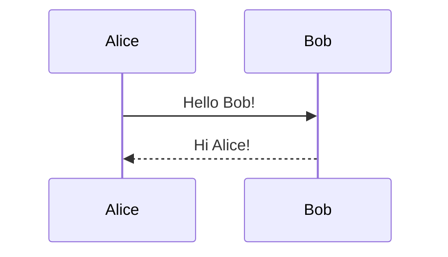
```mermaid
sequenceDiagram
    Alice->>Bob: Hello Bob!
    Bob-->>Alice: Hi Alice!
```

**Key elements:**
- `sequenceDiagram` - Declares the diagram type
- `Alice`, `Bob` - Participants (auto-created)
- `->>` - Solid arrow with arrowhead
- `-->>` - Dotted arrow with arrowhead

### Participants and Actors

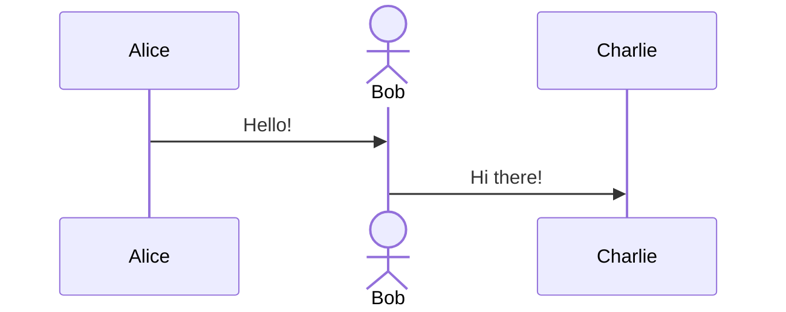
```mermaid
sequenceDiagram
    participant A as Alice
    actor B as Bob
    participant C as Charlie
    
    A->>B: Hello!
    B->>C: Hi there!
```

**Syntax:**
- `participant Name` - Box participant
- `actor Name` - Stick figure
- `participant A as Alice` - Alias (use A in code, show Alice)

### Message Types

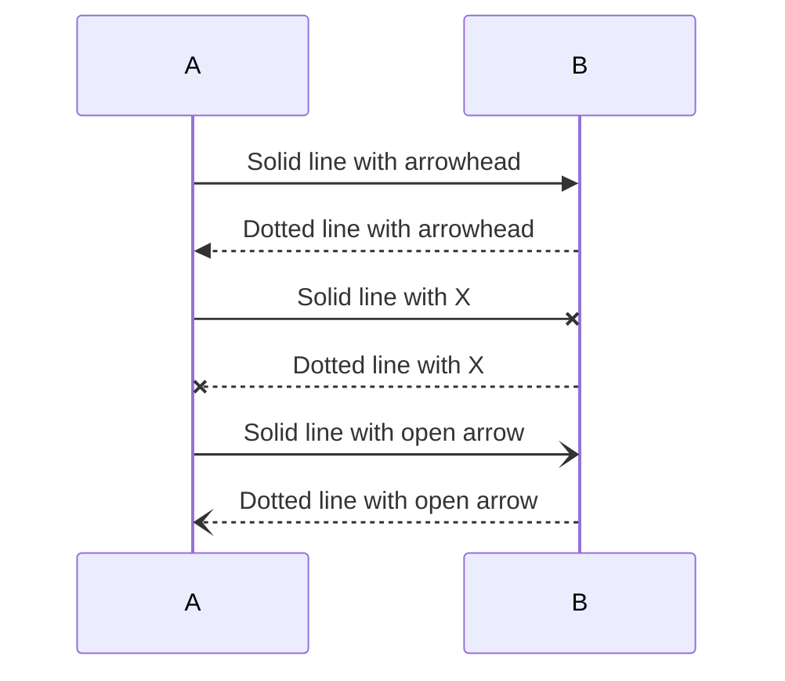
```mermaid
sequenceDiagram
    A->>B: Solid line with arrowhead
    B-->>A: Dotted line with arrowhead
    A-xB: Solid line with X
    B--xA: Dotted line with X
    A-)B: Solid line with open arrow
    B--)A: Dotted line with open arrow
```

| Syntax | Description |
|--------|-------------|
| `->>` | Solid line, arrowhead (sync) |
| `-->>` | Dotted line, arrowhead (response) |
| `-x` | Solid line, X end (async) |
| `--x` | Dotted line, X end |
| `-)` | Solid line, open arrow |
| `--)` | Dotted line, open arrow |

### Activations

Show when a participant is active/processing:

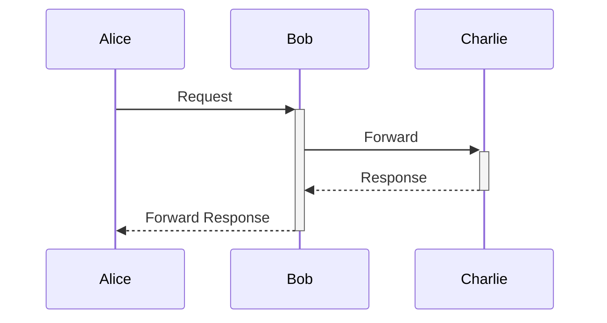
```mermaid
sequenceDiagram
    Alice->>+Bob: Request
    Bob->>+Charlie: Forward
    Charlie-->>-Bob: Response
    Bob-->>-Alice: Forward Response
```

**Syntax:**
- `+` after arrow - Activate participant
- `-` before arrow - Deactivate participant

### Explicit Activation

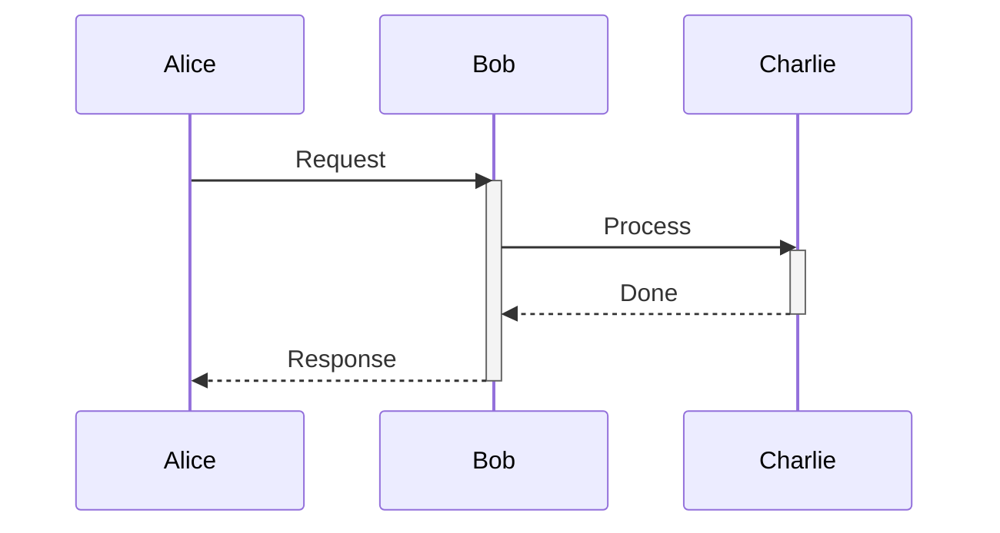
```mermaid
sequenceDiagram
    Alice->>Bob: Request
    activate Bob
    Bob->>Charlie: Process
    activate Charlie
    Charlie-->>Bob: Done
    deactivate Charlie
    Bob-->>Alice: Response
    deactivate Bob
```

### Notes

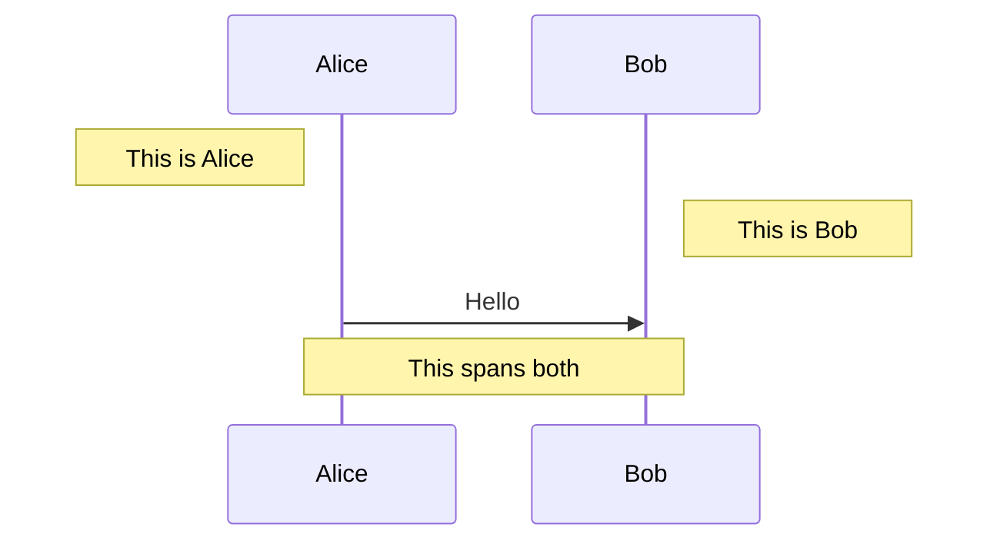
```mermaid
sequenceDiagram
    participant A as Alice
    participant B as Bob
    
    Note left of A: This is Alice
    Note right of B: This is Bob
    A->>B: Hello
    Note over A,B: This spans both
```

**Note positions:**
- `Note left of Participant`
- `Note right of Participant`
- `Note over Participant`
- `Note over A,B` - Spans multiple

---

## 📖 Chapter 2.2: Sequence Diagram Advanced

### Loops

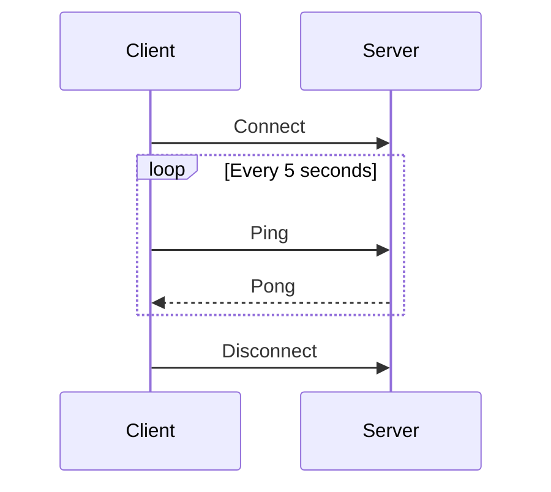
```mermaid
sequenceDiagram
    participant Client
    participant Server
    
    Client->>Server: Connect
    loop Every 5 seconds
        Client->>Server: Ping
        Server-->>Client: Pong
    end
    Client->>Server: Disconnect
```

### Alternatives (If/Else)

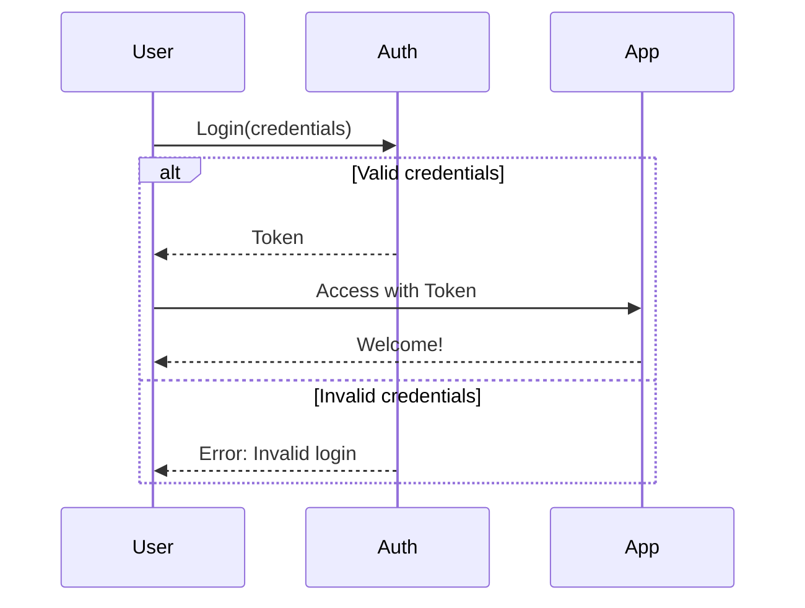
```mermaid
sequenceDiagram
    participant User
    participant Auth
    participant App
    
    User->>Auth: Login(credentials)
    alt Valid credentials
        Auth-->>User: Token
        User->>App: Access with Token
        App-->>User: Welcome!
    else Invalid credentials
        Auth-->>User: Error: Invalid login
    end
```

### Optional (If without Else)

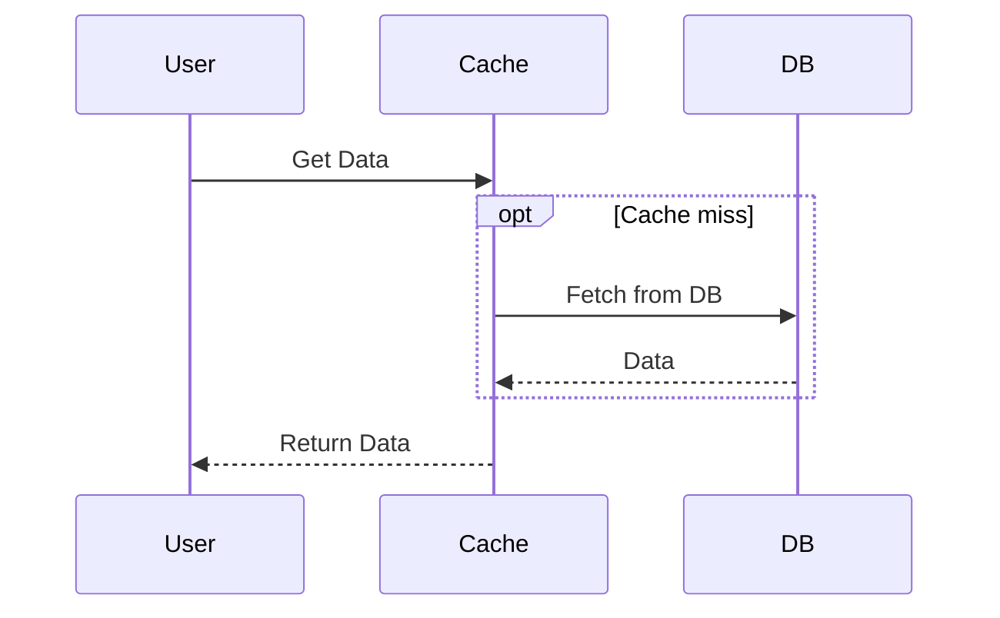
```mermaid
sequenceDiagram
    participant User
    participant Cache
    participant DB
    
    User->>Cache: Get Data
    opt Cache miss
        Cache->>DB: Fetch from DB
        DB-->>Cache: Data
    end
    Cache-->>User: Return Data
```

### Parallel Execution

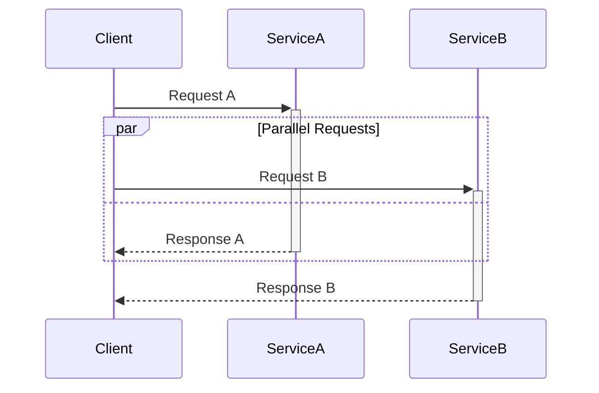
```mermaid
sequenceDiagram
    participant Client
    participant ServiceA
    participant ServiceB
    
    Client->>+ServiceA: Request A
    par Parallel Requests
        Client->>+ServiceB: Request B
    and
        ServiceA-->>-Client: Response A
    end
    ServiceB-->>-Client: Response B
```

### Critical Region

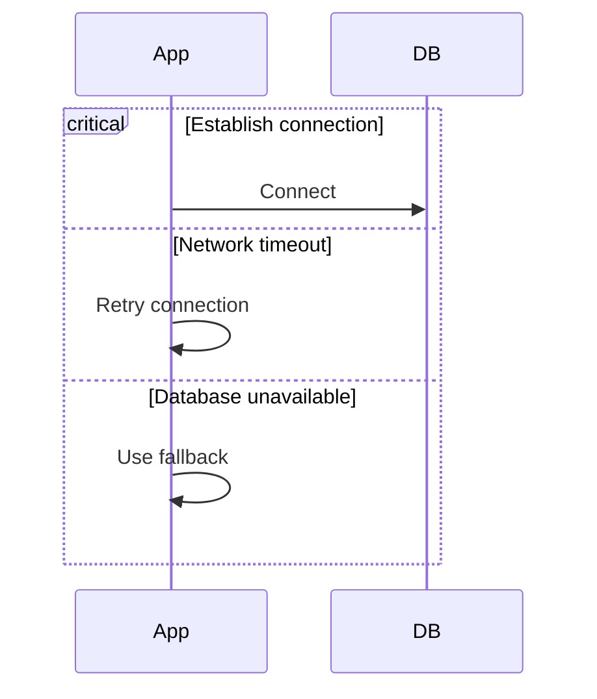
```mermaid
sequenceDiagram
    participant App
    participant DB
    
    critical Establish connection
        App->>DB: Connect
    option Network timeout
        App->>App: Retry connection
    option Database unavailable
        App->>App: Use fallback
    end
```

### Break

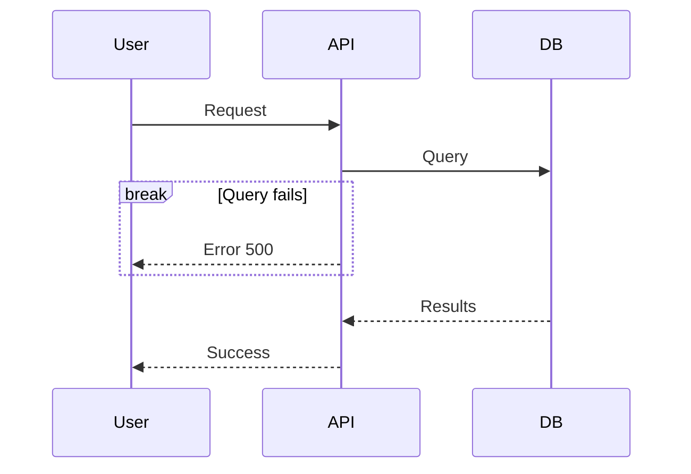
```mermaid
sequenceDiagram
    participant User
    participant API
    participant DB
    
    User->>API: Request
    API->>DB: Query
    break Query fails
        API-->>User: Error 500
    end
    DB-->>API: Results
    API-->>User: Success
```

### Auto-Numbering

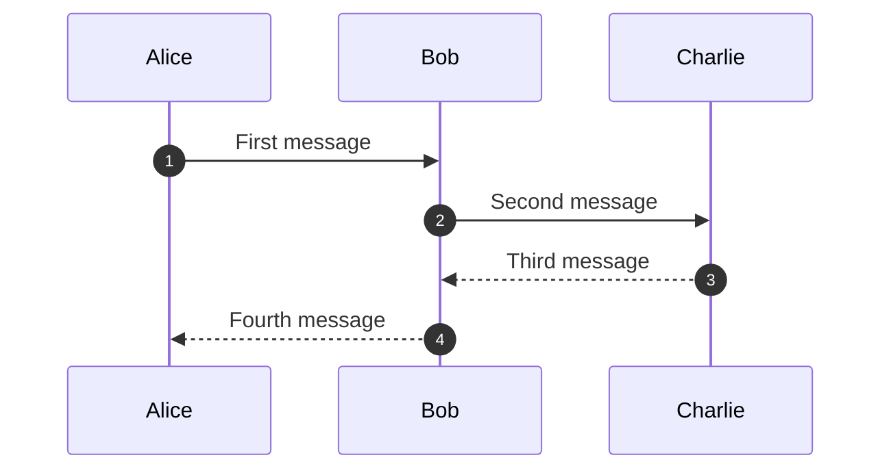
```mermaid
sequenceDiagram
    autonumber
    Alice->>Bob: First message
    Bob->>Charlie: Second message
    Charlie-->>Bob: Third message
    Bob-->>Alice: Fourth message
```

### Highlighting (rect)

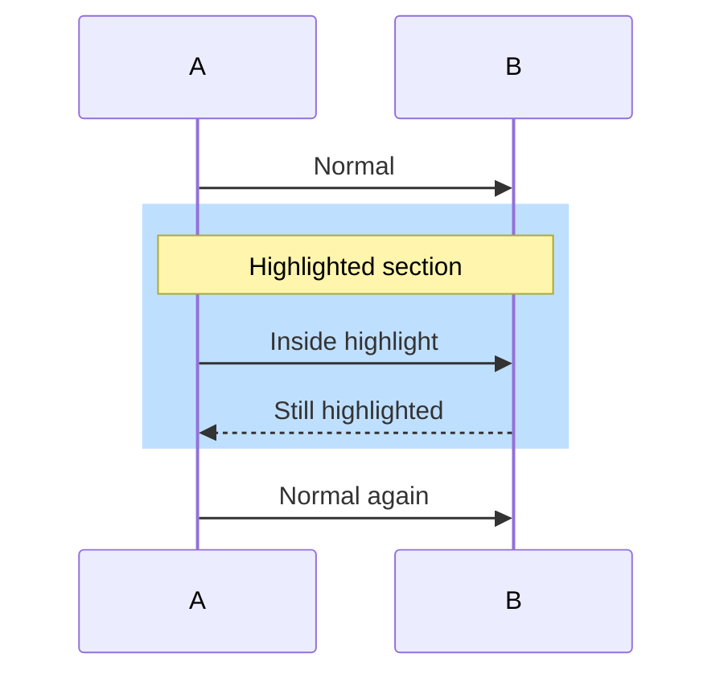
```mermaid
sequenceDiagram
    participant A
    participant B
    
    A->>B: Normal
    rect rgb(191, 223, 255)
        Note over A,B: Highlighted section
        A->>B: Inside highlight
        B-->>A: Still highlighted
    end
    A->>B: Normal again
```

### Combined Example: Login Flow

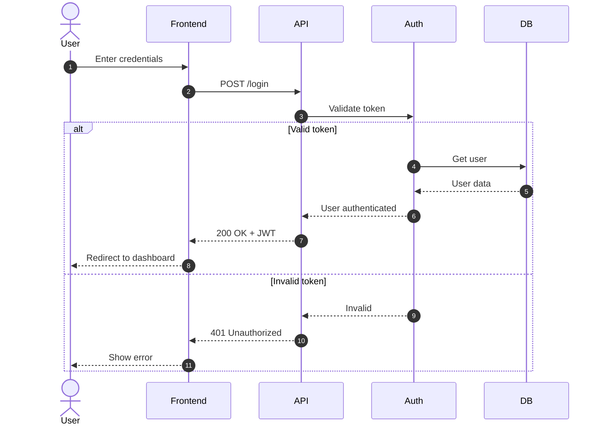
```mermaid
sequenceDiagram
    autonumber
    actor User
    participant Frontend
    participant API
    participant Auth
    participant DB
    
    User->>Frontend: Enter credentials
    Frontend->>API: POST /login
    
    API->>Auth: Validate token
    
    alt Valid token
        Auth->>DB: Get user
        DB-->>Auth: User data
        Auth-->>API: User authenticated
        API-->>Frontend: 200 OK + JWT
        Frontend-->>User: Redirect to dashboard
    else Invalid token
        Auth-->>API: Invalid
        API-->>Frontend: 401 Unauthorized
        Frontend-->>User: Show error
    end
```

---

## 🏋️ Exercises

### Exercise 1: Simple API Call
Create a sequence diagram showing:
- Client → API: GET /users
- API → Database: Query
- Database → API: Results
- API → Client: JSON Response

### Exercise 2: Authentication Flow
Create a login flow with:
- User enters credentials
- Frontend sends to Auth service
- Auth validates with database
- Success: Return token
- Failure: Return error
- Use alt/else blocks

### Exercise 3: Microservices
Create a diagram with:
- API Gateway receiving request
- Parallel calls to User Service and Product Service
- Both respond back
- Gateway combines and returns

### Exercise 4: WebSocket Connection
Create a diagram showing:
- Client connects to server
- Server acknowledges
- Loop: Client sends heartbeat every 30s
- Eventually client disconnects

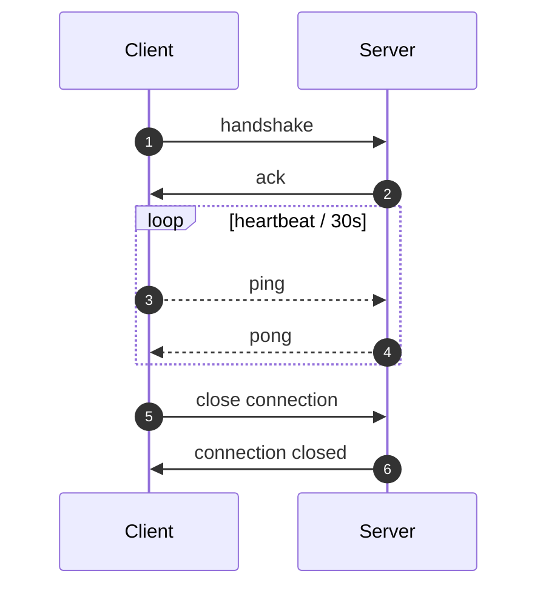
```mermaid
sequenceDiagram
    participant Client
    participant Server

    autonumber
    Client ->> Server: handshake
    Server ->> Client: ack
    loop heartbeat / 30s
        Client -->> Server: ping
        Server -->> Client: pong
    end

    Client ->> Server: close connection
    Server ->> Client: connection closed
```

---

## ✅ Module Checklist

- [ ] Understand sequence diagram basic syntax
- [ ] Can create participants and actors
- [ ] Know all message types
- [ ] Can use activations properly
- [ ] Can add notes to diagrams
- [ ] Understand loops, alt, opt, par blocks
- [ ] Can use auto-numbering
- [ ] Can highlight sections with rect
- [ ] Completed all exercises

---

## 🔗 Resources

- [Mermaid Sequence Diagram Docs](https://mermaid.js.org/syntax/sequenceDiagram.html)
- [Mermaid Live Editor](https://mermaid.live/)

---

> **Next Module:** [Module 3: Class & ER Diagrams](../3-class-er-diagrams/README.md) →
