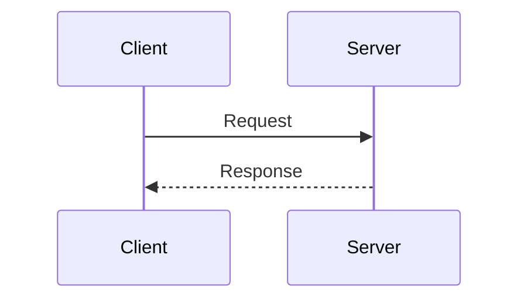
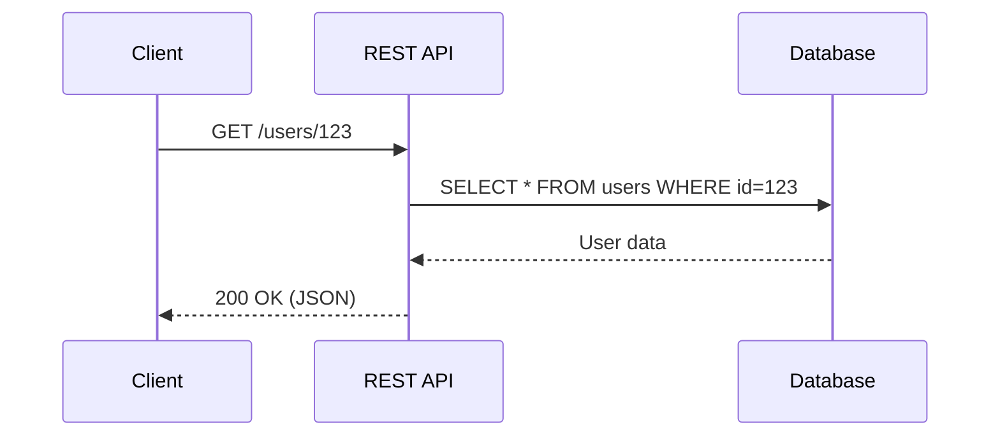
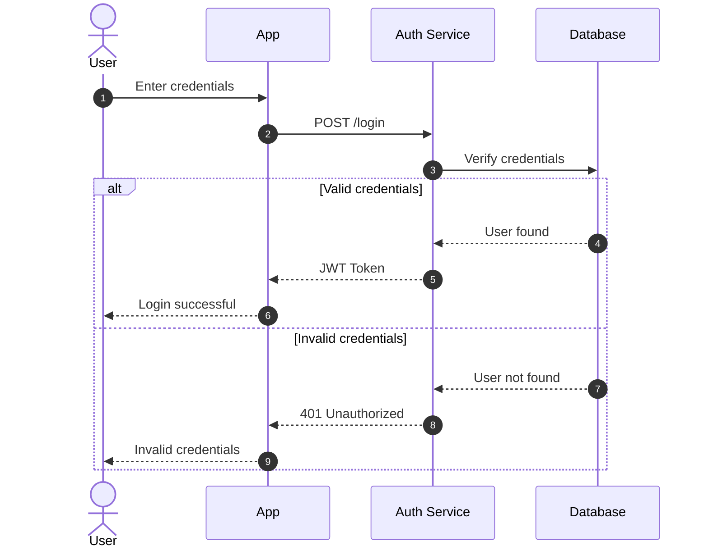
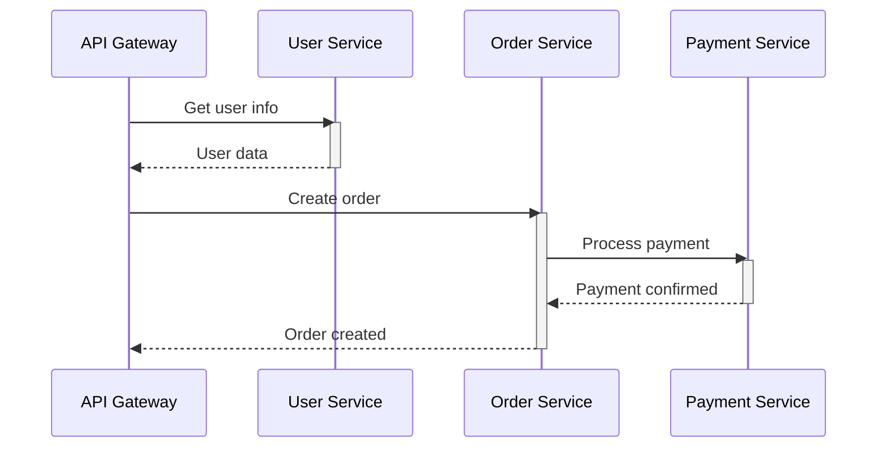
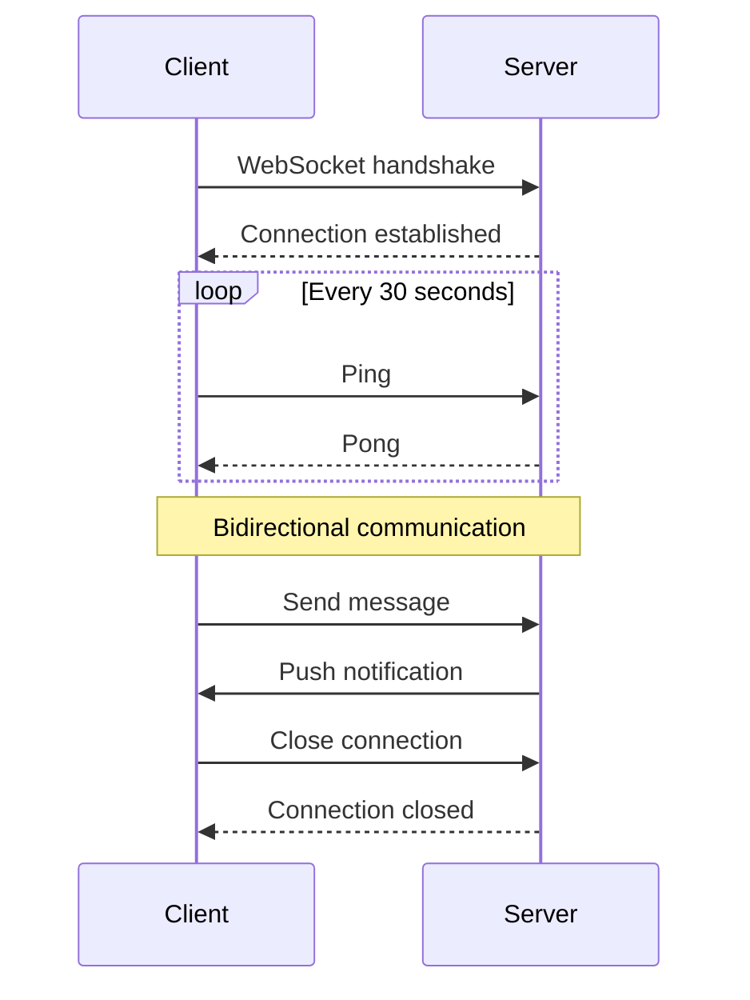
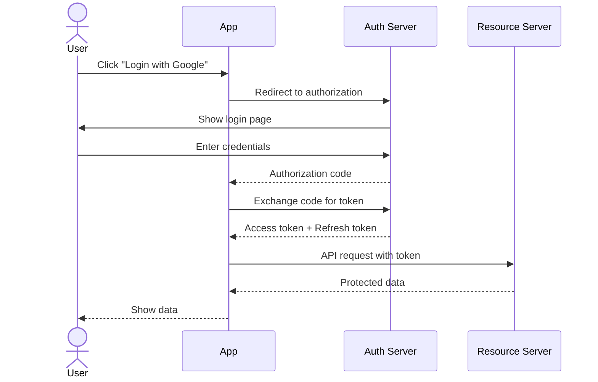
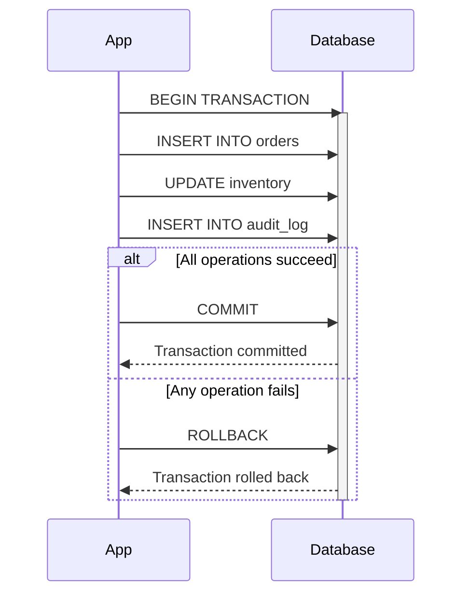
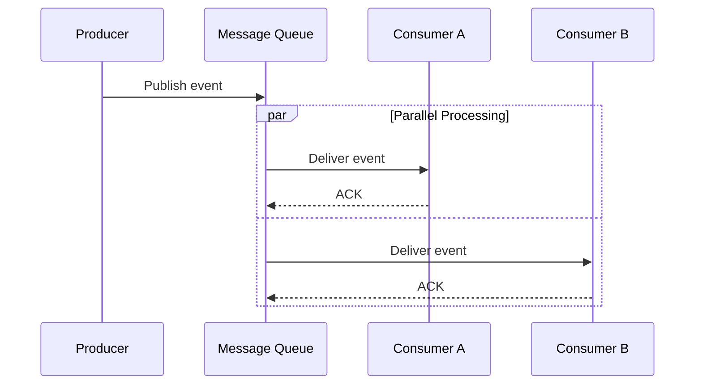
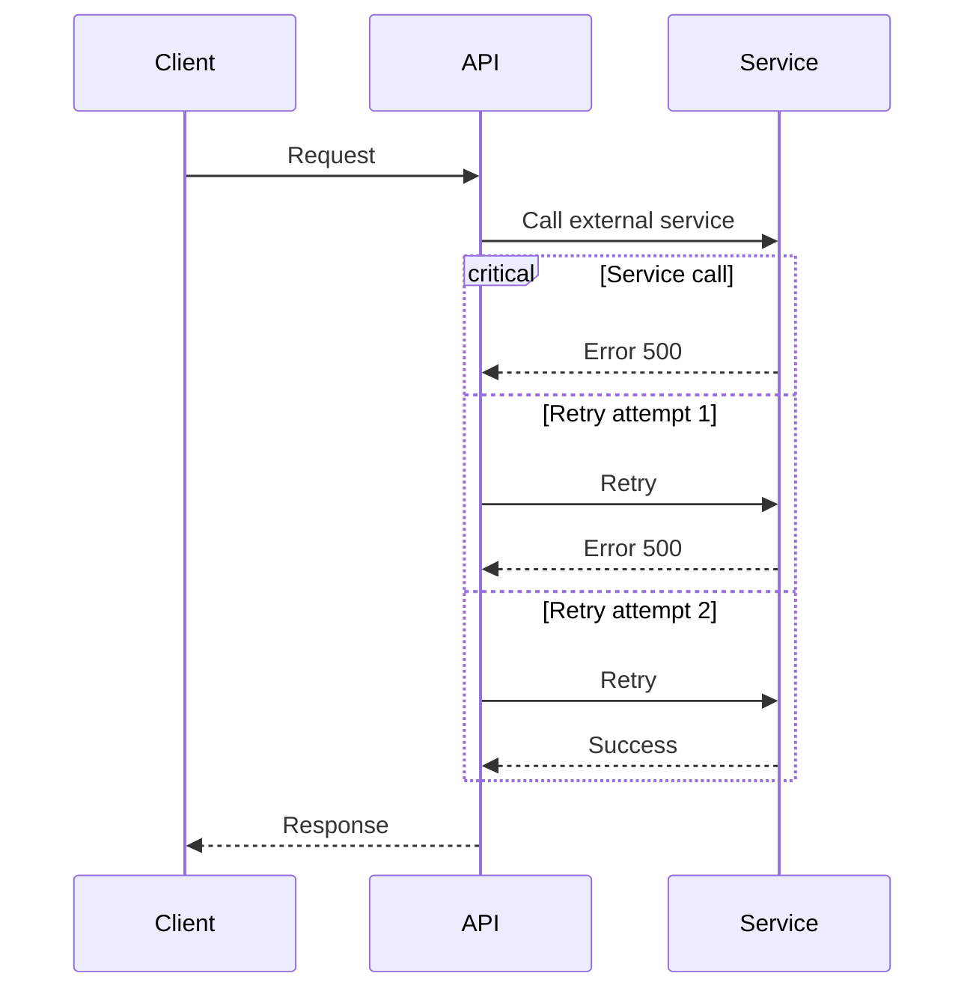
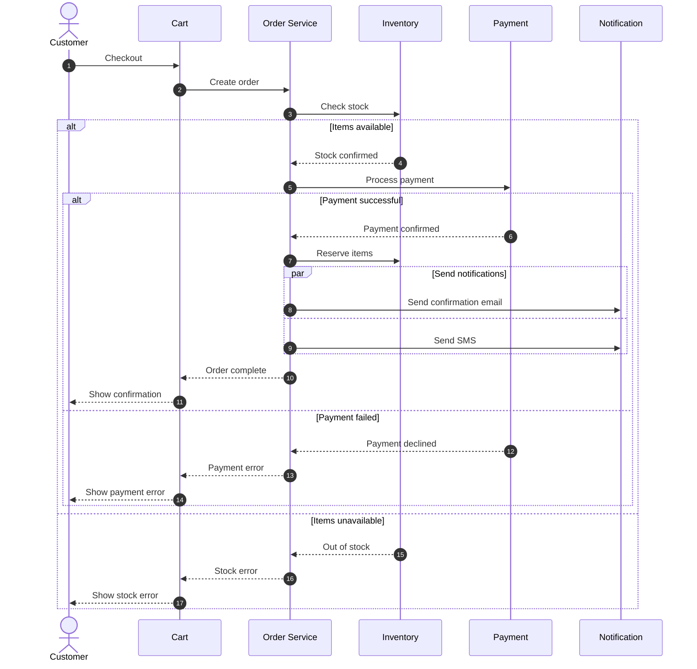

# Sequence Diagram Examples 📊

A collection of ready-to-use sequence diagram examples.

---

## 1. Simple Request-Response

---

## 2. REST API Call

---

## 3. Authentication Flow

---

## 4. Microservices Communication

---

## 5. WebSocket Connection

---

## 6. OAuth 2.0 Flow

---

## 7. Database Transaction

---

## 8. Event-Driven Architecture

---

## 9. Error Handling with Retry

---

## 10. Full E-Commerce Checkout

---

## How to Use These Examples

1. Copy any example code block
2. Paste into [Mermaid Live Editor](https://mermaid.live/)
3. Modify participants and messages for your needs
4. Export as SVG or PNG if needed
