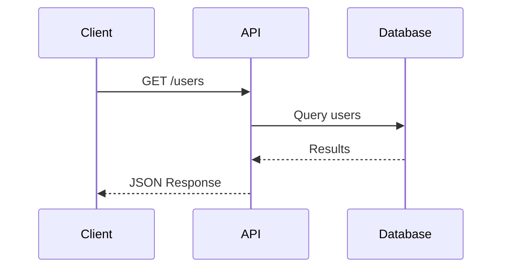
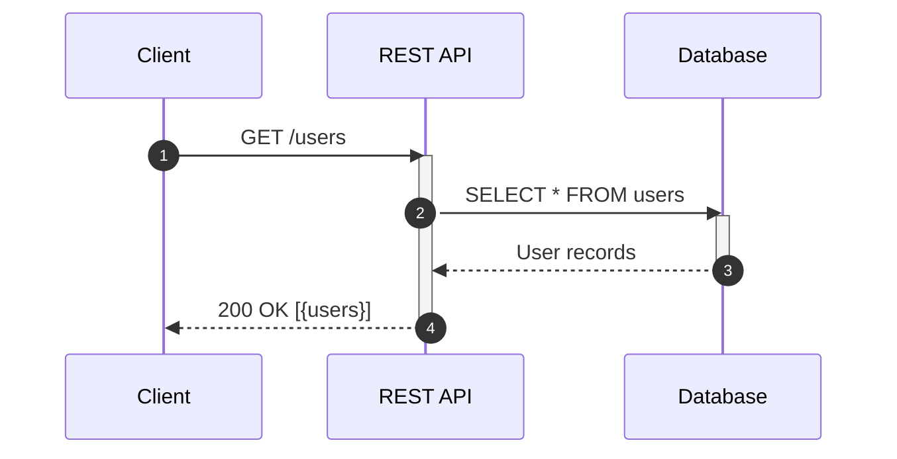
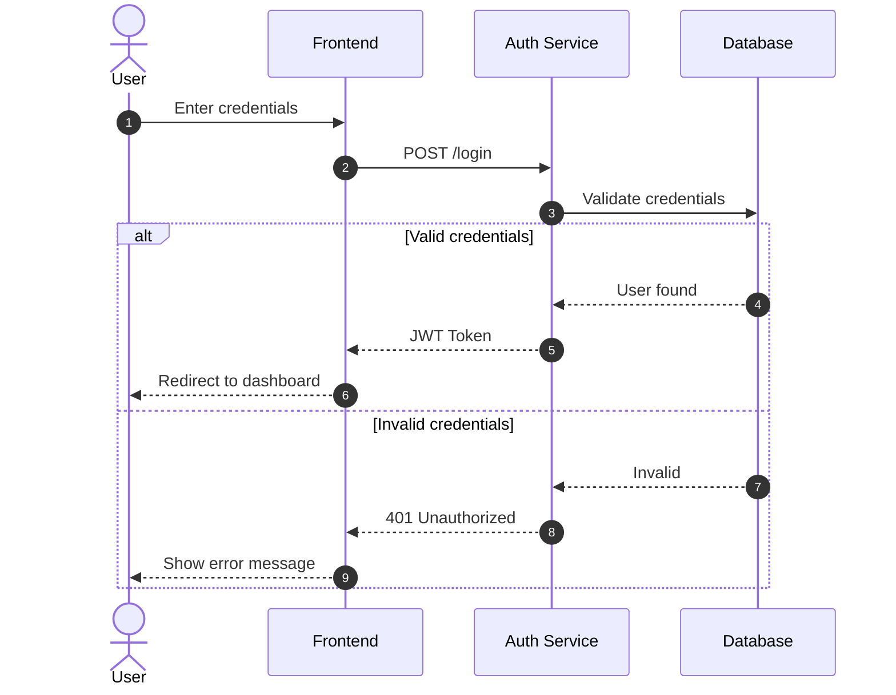
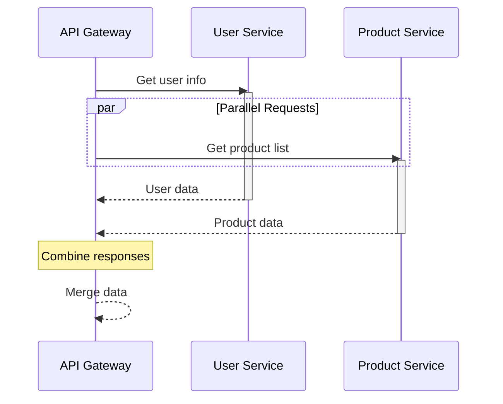
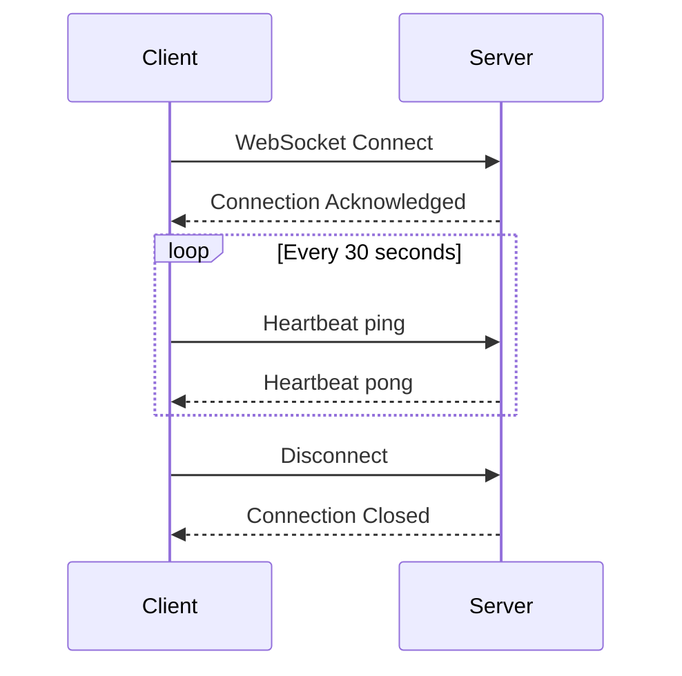
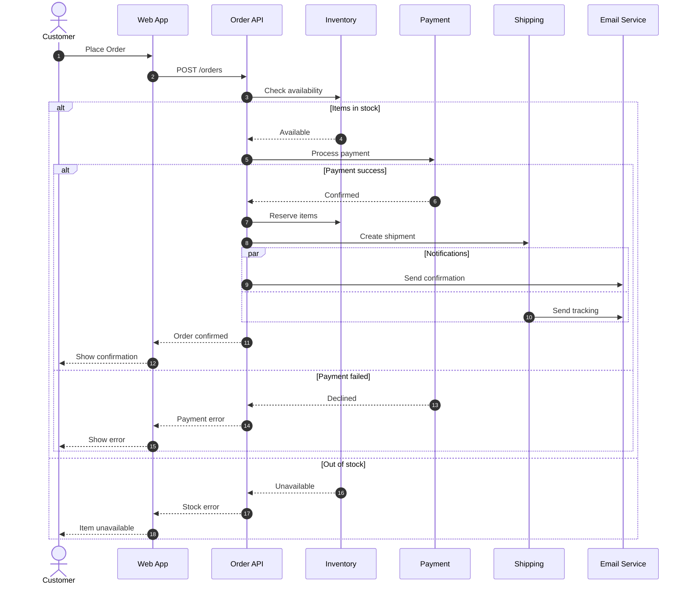

# Exercise Answers 📝

## Exercise 1: Simple API Call

**With more detail:**

---

## Exercise 2: Authentication Flow

---

## Exercise 3: Microservices

---

## Exercise 4: WebSocket Connection

---

## Bonus: Complete Order Processing

---

## Tips for Sequence Diagrams

1. **Use autonumber** - Makes it easier to reference steps
2. **Activate/deactivate** - Shows processing time clearly
3. **Use aliases** - Keep participant names short but descriptive
4. **Group with alt/par** - Show branching and parallel logic
5. **Add notes** - Clarify complex interactions
6. **Keep it readable** - Don't add too many participants
