# Module 3: Class & ER Diagrams 📈

> **Level: Intermediate** | **Estimated Time: 3-4 hours**

## 📋 Module Overview

This module covers two essential diagram types for software design: Class Diagrams for object-oriented design and Entity-Relationship Diagrams for database modeling.

```mermaid
graph LR
    A[3.1 Class Diagrams] --> B[3.2 ER Diagrams]
    B --> C[✅ Module Complete]
    
    style A fill:#87CEEB
    style C fill:#FFD700
```

---

## 📖 Chapter 3.1: Class Diagrams

### Basic Class Definition

**Syntax breakdown:**
- `classDiagram` - Diagram type
- `class ClassName` - Define a class
- `+String name` - Public attribute
- `+makeSound()` - Public method

### Visibility Modifiers

| Symbol | Visibility |
|--------|------------|
| `+` | Public |
| `-` | Private |
| `#` | Protected |
| `~` | Package/Internal |

### Method Parameters and Return Types

### Generic Types

### Static and Abstract

**Notation:**
- `$` - Static member
- `*` - Abstract method
- `<<abstract>>` - Abstract class annotation

### Annotations

Common annotations: `<<interface>>`, `<<abstract>>`, `<<service>>`, `<<enumeration>>`, `<<dto>>`

### Relationships

| Syntax | Relationship | Description |
|--------|--------------|-------------|
| `--|>` | Inheritance | "is a" |
| `--*` | Composition | Strong "has a" (lifecycle bound) |
| `--o` | Aggregation | Weak "has a" (independent lifecycle) |
| `-->` | Association | "uses" |
| `--` | Link | Simple connection |
| `..>` | Dependency | "depends on" |
| `..\|>` | Realization | Implements interface |

### Cardinality

| Notation | Meaning |
|----------|---------|
| `1` | Exactly one |
| `0..1` | Zero or one |
| `1..*` | One or more |
| `*` | Many |
| `n` | n exactly |
| `0..n` | Zero to n |

### Complete Example: E-Commerce System

### Styling Classes

---

## 📖 Chapter 3.2: Entity Relationship Diagrams

### Basic ER Diagram

### Relationship Types

| Left | Right | Meaning |
|------|-------|---------|
| `\|\|` | `\|\|` | Exactly one |
| `\|o` | `o\|` | Zero or one |
| `}o` | `o{` | Zero or more |
| `}\|` | `\|{` | One or more |

### Entity Attributes

**Attribute modifiers:**
- `PK` - Primary Key
- `FK` - Foreign Key
- `UK` - Unique Key

### Data Types

Common attribute types:
- `int`, `bigint` - Integers
- `string`, `varchar` - Text
- `decimal`, `float` - Numbers
- `date`, `datetime` - Dates
- `boolean` - True/False
- `text` - Long text
- `blob` - Binary data

### Complete Example: Blog Database

### E-Commerce Complete Example

---

## 🏋️ Exercises

### Exercise 1: Library System (Class Diagram)
Create a class diagram with:
- `Book` (title, author, ISBN, available)
- `Member` (name, memberID, email)
- `Loan` (book, member, dueDate, returned)
- Relationships: Member borrows Books through Loans

### Exercise 2: Animal Hierarchy (Class Diagram)
Create inheritance chain:
- Abstract `Animal` class
- `Mammal` and `Bird` subclasses
- Specific animals: `Dog`, `Cat`, `Eagle`, `Penguin`
- Use appropriate visibility and abstract methods

### Exercise 3: School Database (ER Diagram)
Design tables for:
- Students
- Teachers
- Courses
- Enrollments (students in courses)
- Departments
- Include appropriate attributes and relationships

### Exercise 4: Social Media (ER Diagram)
Design a social media database:
- Users (profile info)
- Posts (text, images)
- Comments
- Likes
- Friendships/Follows
- Show all relationships with cardinality

---

## ✅ Module Checklist

- [ ] Can create class diagrams with attributes and methods
- [ ] Understand visibility modifiers
- [ ] Know all relationship types
- [ ] Can add cardinality to relationships
- [ ] Can use annotations
- [ ] Can create ER diagrams
- [ ] Understand ER relationship notation
- [ ] Can define entity attributes with types and keys
- [ ] Completed all exercises

---

## 🔗 Resources

- [Mermaid Class Diagram Docs](https://mermaid.js.org/syntax/classDiagram.html)
- [Mermaid ER Diagram Docs](https://mermaid.js.org/syntax/entityRelationshipDiagram.html)

---

> **Next Module:** [Module 4: State & Journey Diagrams](../4-state-journey/README.md) →
