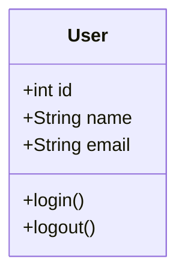
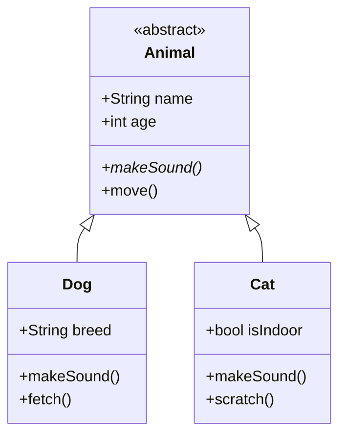
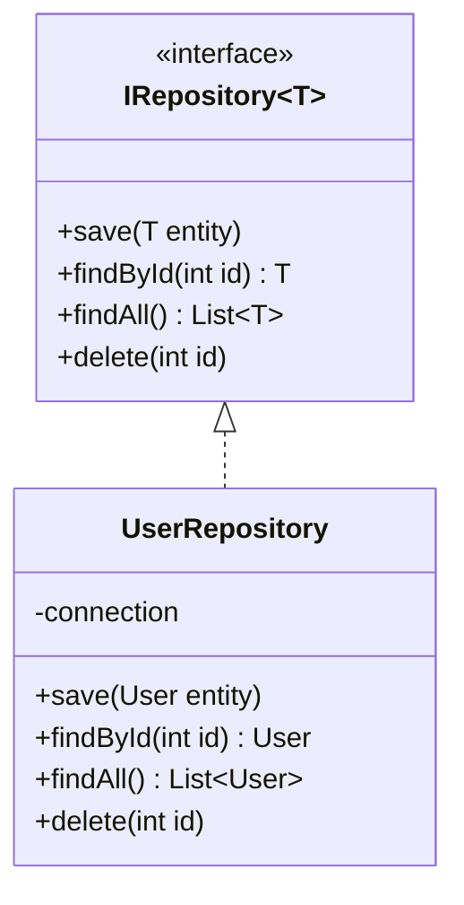
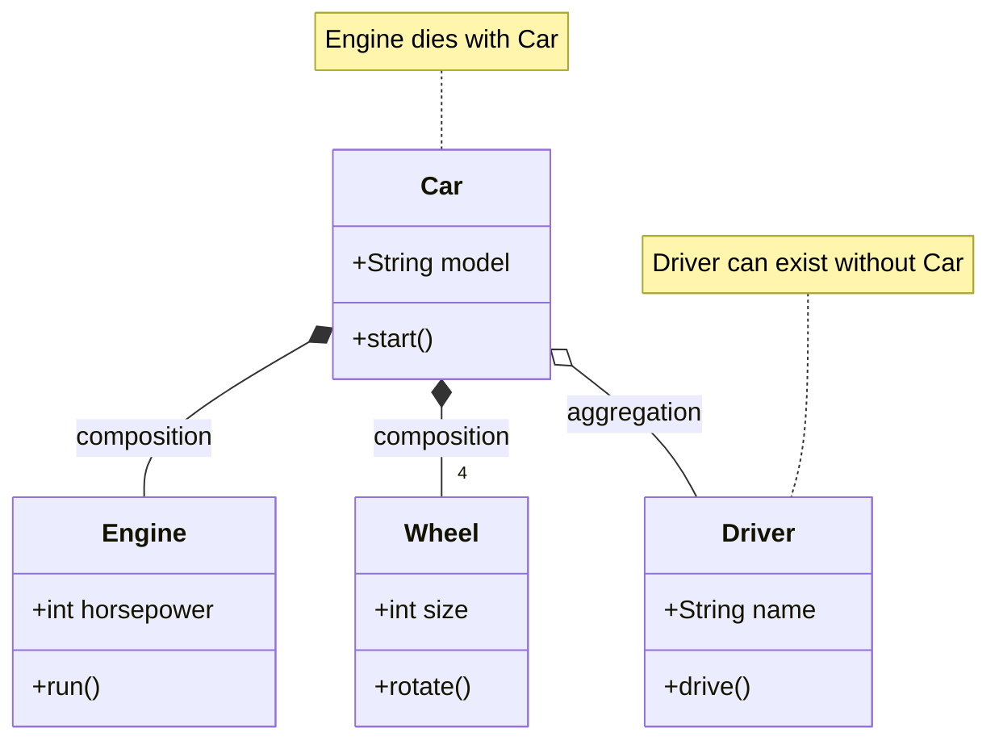
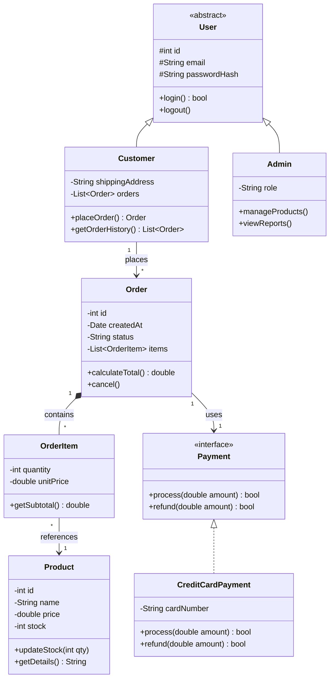
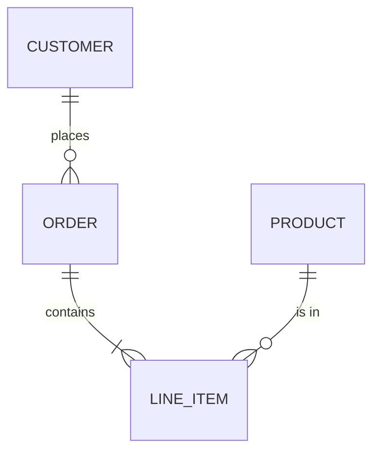
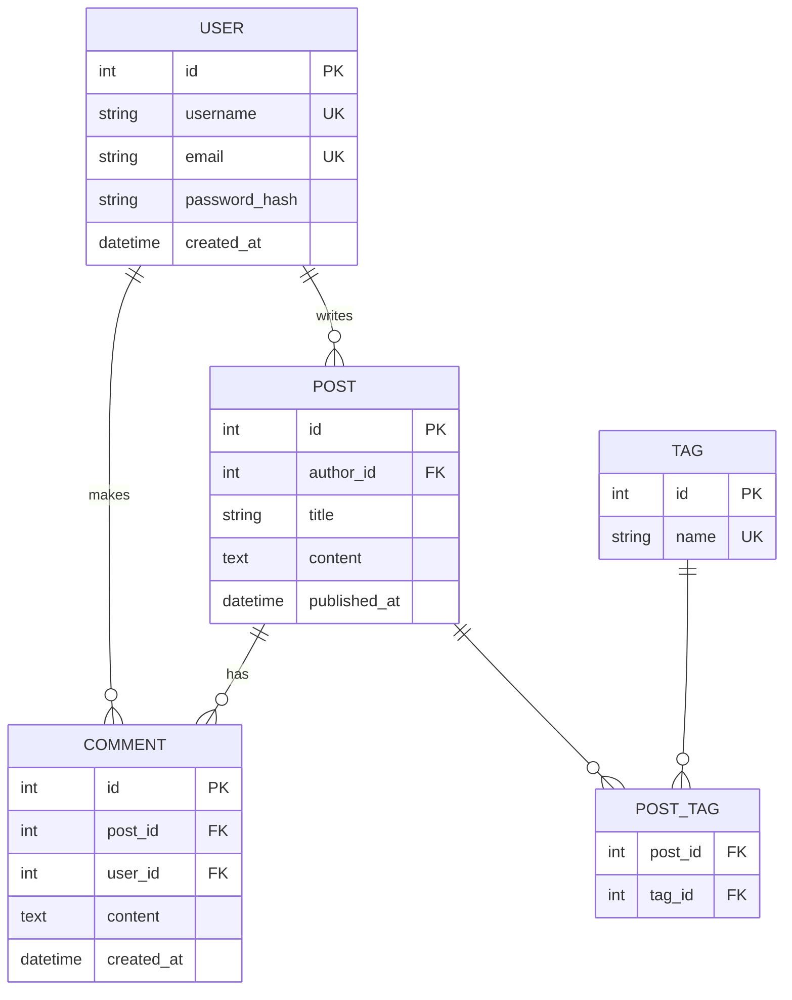
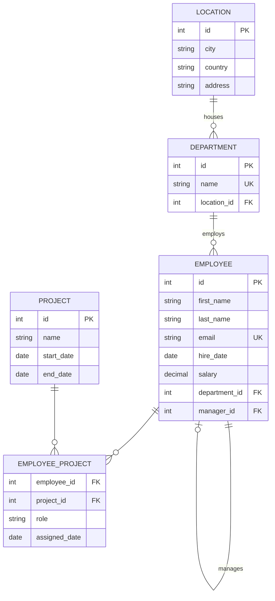
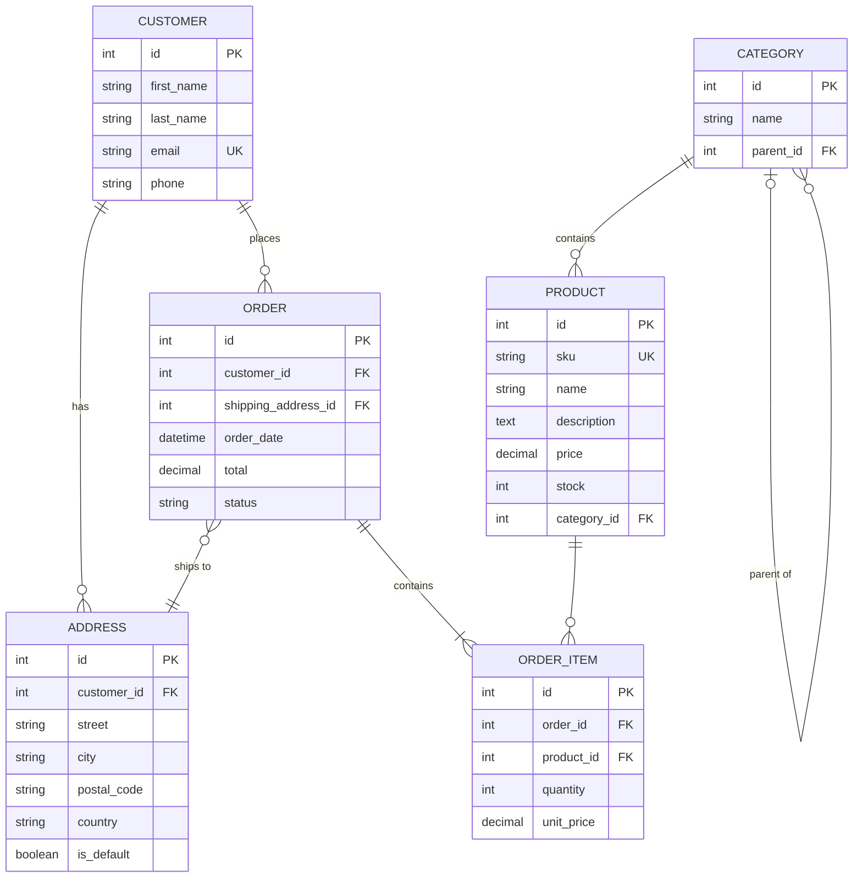

# Class & ER Diagram Examples 📊

A collection of ready-to-use class and ER diagram examples.

---

## Class Diagram Examples

### 1. Simple Class

### 2. Inheritance

### 3. Interface Implementation

### 4. Composition vs Aggregation

### 5. Complete E-Commerce System

---

## ER Diagram Examples

### 1. Simple Relationship

### 2. Blog Database

### 3. HR Database

### 4. E-Commerce Database

---

## Quick Reference

### Class Relationships
| Syntax | Meaning |
|--------|---------|
| `<\|--` | Inheritance |
| `*--` | Composition |
| `o--` | Aggregation |
| `-->` | Association |
| `<\|..` | Realization |
| `..>` | Dependency |

### ER Relationships
| Left | Right | Meaning |
|------|-------|---------|
| `\|\|` | `\|\|` | One to one |
| `\|\|` | `o{` | One to many |
| `}o` | `o{` | Many to many |
| `\|o` | `o\|` | Zero or one |
