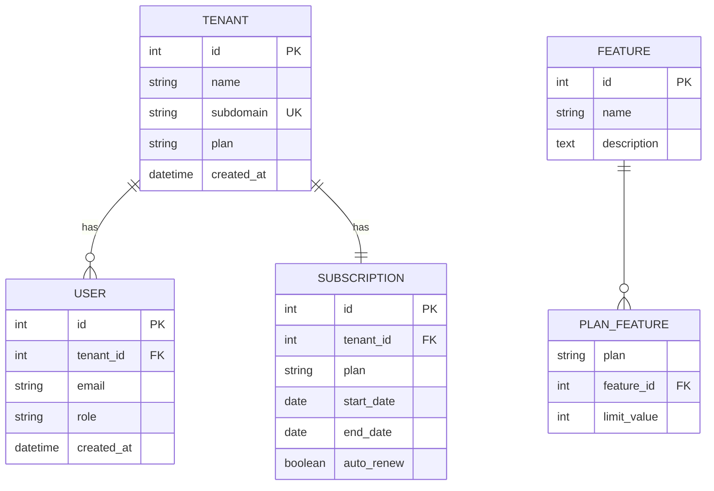

# Exercise Answers 📝

## Exercise 1: Library System (Class Diagram)

---

## Exercise 2: Animal Hierarchy (Class Diagram)

---

## Exercise 3: School Database (ER Diagram)

---

## Exercise 4: Social Media (ER Diagram)

---

## Bonus: Complete SaaS Application

### Class Diagram

### ER Diagram

---

## Tips

1. **Class Diagrams** - Focus on relationships and behaviors
2. **ER Diagrams** - Focus on data structure and constraints
3. **Use PK/FK/UK** - Mark keys clearly in ER diagrams
4. **Visibility matters** - Use +/-/#/~ correctly in classes
5. **Name relationships** - Add labels to clarify connections
