# Module 4: State & Journey Diagrams 📈

> **Level: Intermediate** | **Estimated Time: 3-4 hours**

## 📋 Module Overview

This module covers State Diagrams for modeling system states and transitions, and User Journey Diagrams for mapping user experiences.

```mermaid
graph LR
    A[4.1 State Diagrams] --> B[4.2 User Journey]
    B --> C[✅ Module Complete]
    
    style A fill:#87CEEB
    style C fill:#FFD700
```

---

## 📖 Chapter 4.1: State Diagrams

### Basic State Diagram

**Key elements:**
- `stateDiagram-v2` - Diagram type (use v2 for latest features)
- `[*]` - Start/End state
- `-->` - Transition
- `: text` - Transition label

### States and Transitions

### State Descriptions

### Composite States

### Nested States

### Fork and Join

### Choice (Decision)

### Notes

### Concurrency

### Complete Example: Order Lifecycle

### Styling States

---

## 📖 Chapter 4.2: User Journey Diagrams

### Basic Journey

**Syntax breakdown:**
- `journey` - Diagram type
- `title` - Diagram title
- `section Name` - Group of tasks
- `Task: score: actors` - Task with satisfaction score (1-5) and participants

### Score System

The score represents satisfaction/happiness:
- 🔴 **1** - Very unhappy
- 🟠 **2** - Unhappy
- 🟡 **3** - Neutral
- 🟢 **4** - Happy
- 💚 **5** - Very happy

### E-Commerce User Journey

### App Onboarding Journey

### Customer Support Journey

### Multi-Actor Journey

---

## 🏋️ Exercises

### Exercise 1: Traffic Light (State Diagram)
Create a state diagram for a traffic light:
- States: Red, Yellow, Green
- Transitions with timers
- Include pedestrian button interrupt

### Exercise 2: Document Workflow (State Diagram)
Create states for a document:
- Draft, In Review, Approved, Rejected, Published, Archived
- Include decision points and possible loops

### Exercise 3: Shopping Journey
Create a user journey for:
- Physical store shopping experience
- Include sections: Arrival, Shopping, Checkout, Departure
- Multiple actors: Customer, Staff

### Exercise 4: Job Application Journey
Map the job application process:
- From finding a job post to getting hired (or rejected)
- Include emotional highs and lows
- Multiple actors: Applicant, Recruiter, Hiring Manager

---

## ✅ Module Checklist

- [ ] Can create basic state diagrams
- [ ] Understand start and end states
- [ ] Can create composite/nested states
- [ ] Know how to use fork, join, and choice
- [ ] Can add notes to states
- [ ] Can create user journey diagrams
- [ ] Understand the scoring system
- [ ] Can define sections and actors
- [ ] Completed all exercises

---

## 🔗 Resources

- [Mermaid State Diagram Docs](https://mermaid.js.org/syntax/stateDiagram.html)
- [Mermaid User Journey Docs](https://mermaid.js.org/syntax/userJourney.html)

---

> **Next Module:** [Module 5: Gantt & Timeline](../5-gantt-timeline/README.md) →
