# State & Journey Diagram Examples 📊

---

## State Diagram Examples

### 1. Simple State Machine

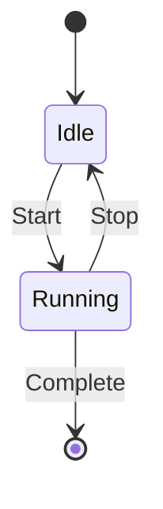

### 2. Traffic Light

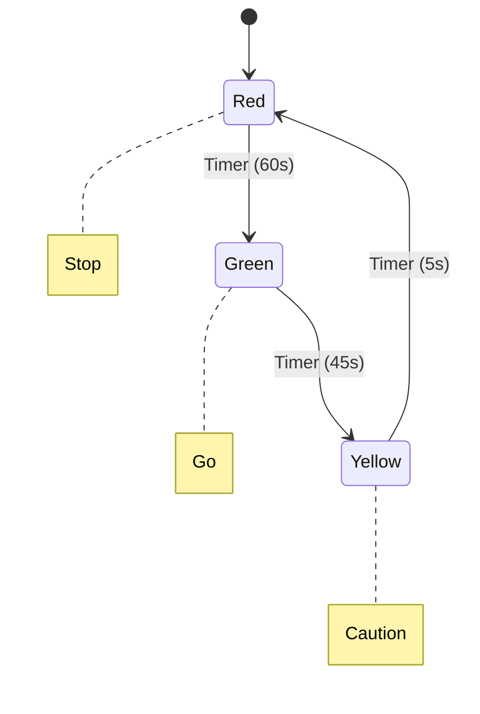

### 3. Order Lifecycle

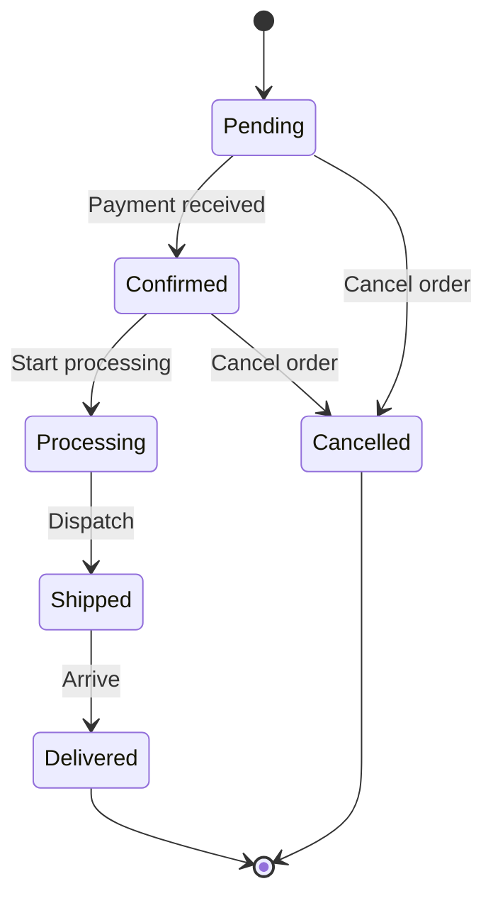

### 4. User Authentication

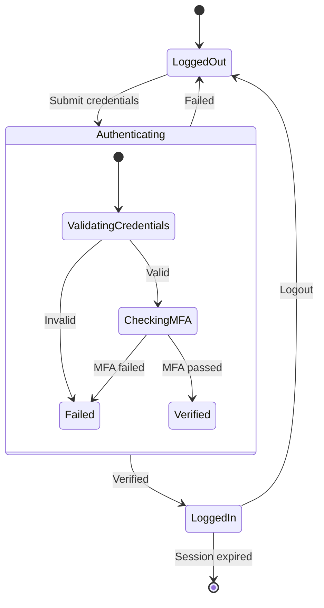

### 5. Document Workflow

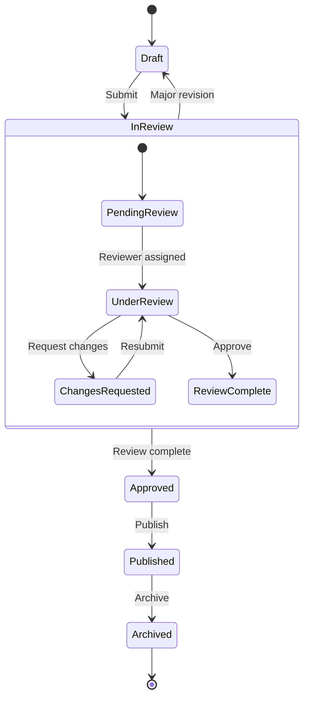

### 6. Parallel States (Fork/Join)

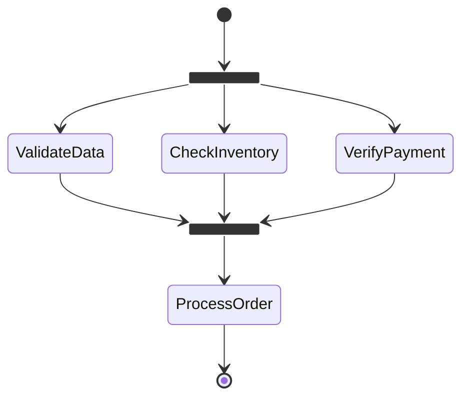

---

## User Journey Examples

### 1. Morning Routine

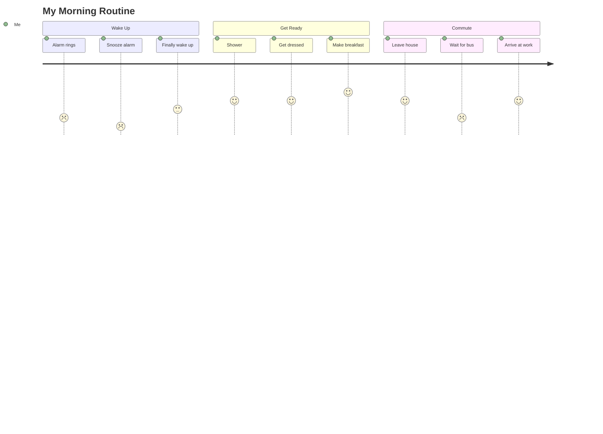

### 2. Online Shopping

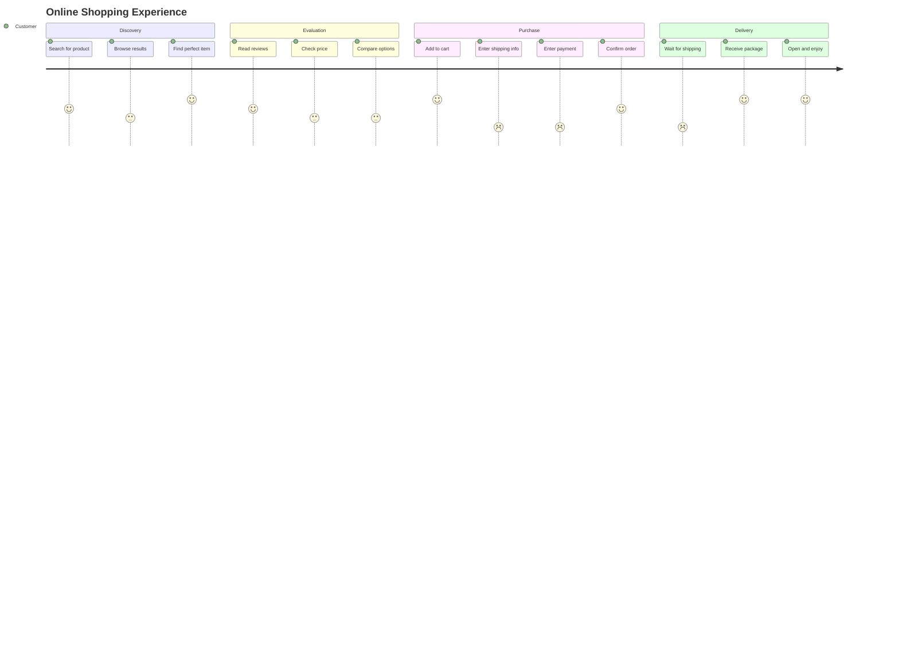

### 3. Job Interview Process

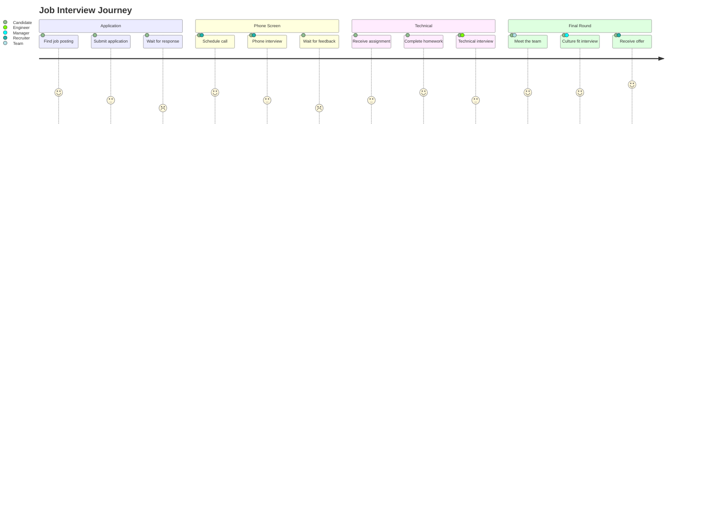

### 4. Restaurant Experience

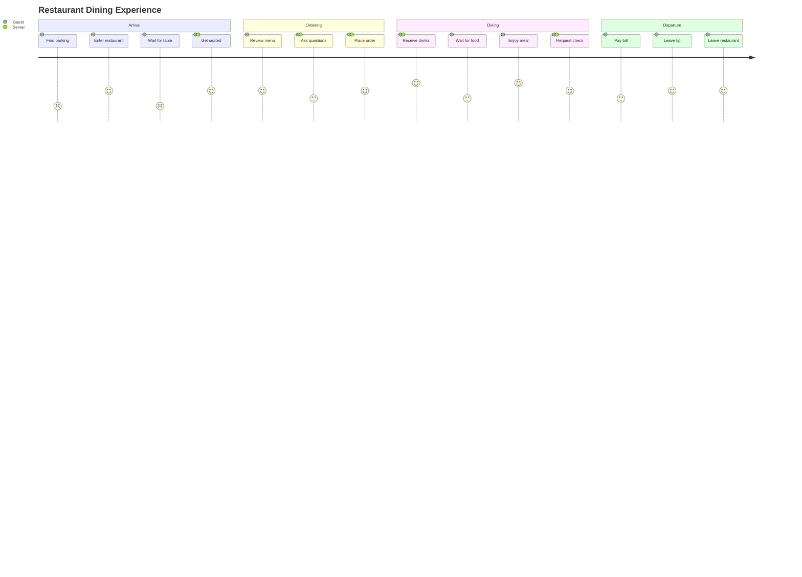

### 5. Customer Support

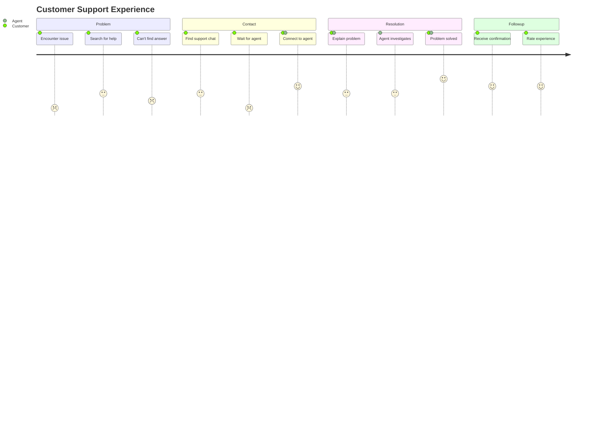

---

## Quick Reference

### State Diagram Elements
| Element | Syntax |
|---------|--------|
| Start | `[*] -->` |
| End | `--> [*]` |
| State | `StateName` |
| Transition | `-->` |
| Label | `: label` |
| Composite | `state Name { }` |
| Fork | `<<fork>>` |
| Join | `<<join>>` |
| Choice | `<<choice>>` |

### Journey Elements
| Element | Description |
|---------|-------------|
| `title` | Diagram title |
| `section` | Group of tasks |
| Task format | `Task: score: actors` |
| Score range | 1 (bad) to 5 (great) |
