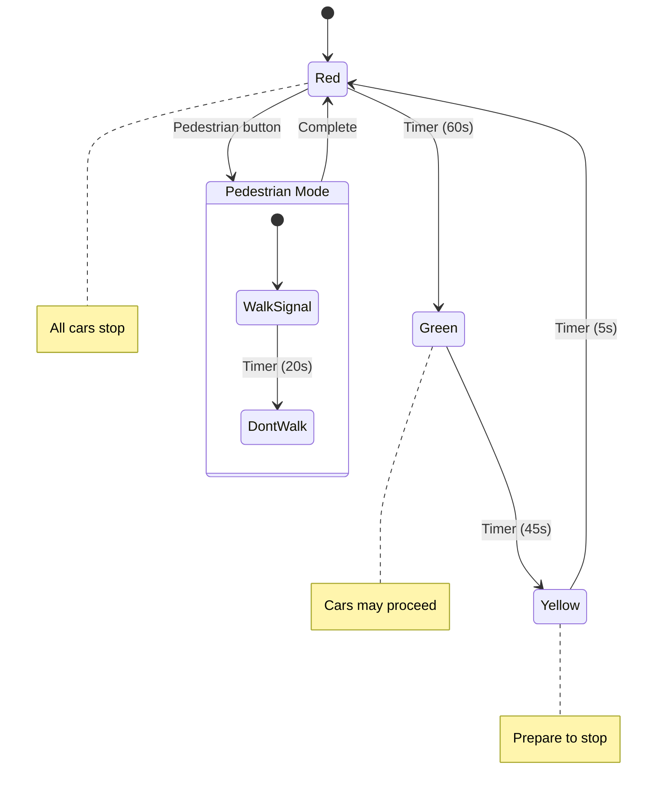
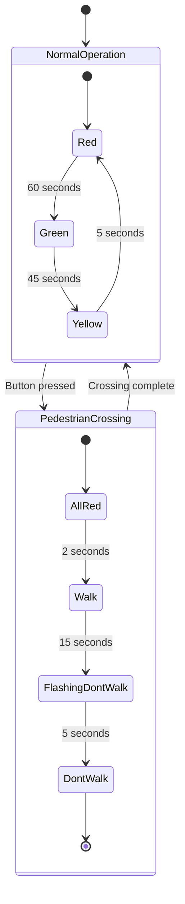
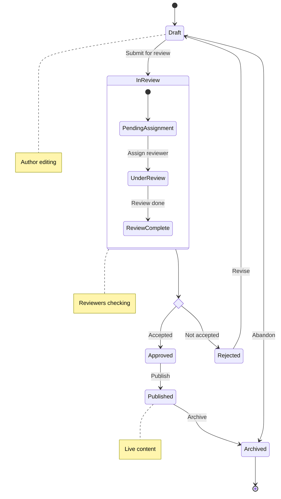
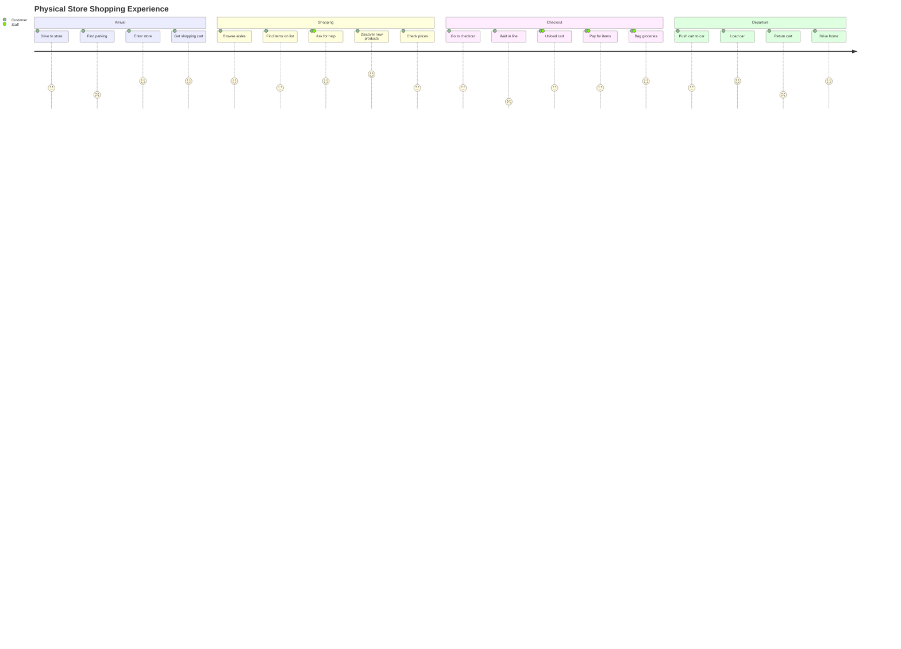
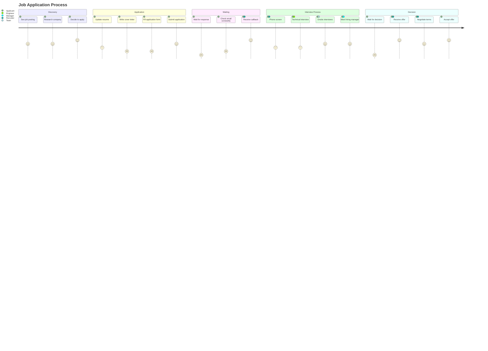
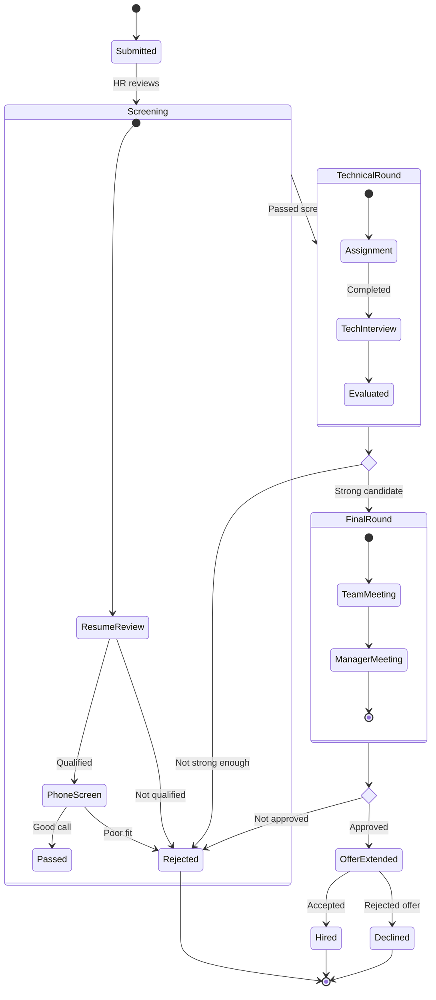

# Exercise Answers 📝

## Exercise 1: Traffic Light (State Diagram)

**Alternative with more detail:**

---

## Exercise 2: Document Workflow (State Diagram)

---

## Exercise 3: Shopping Journey

---

## Exercise 4: Job Application Journey

---

## Bonus: Full Application Lifecycle

### State Diagram

---

## Tips

1. **State diagrams** - Great for system/process states
2. **User journeys** - Great for emotional experiences
3. **Use scores meaningfully** - Reflect actual user sentiment
4. **Include multiple actors** - Shows collaboration points
5. **Keep sections logical** - Group related activities
