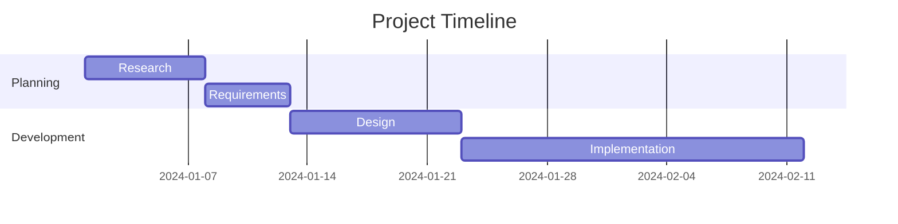
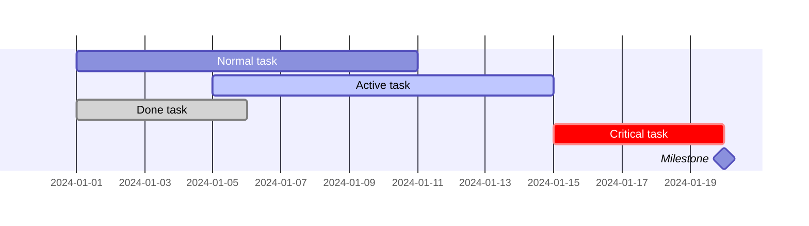
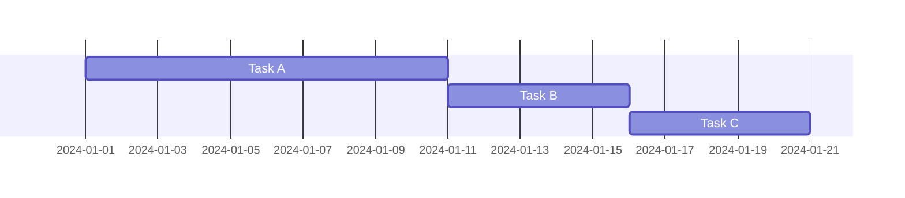
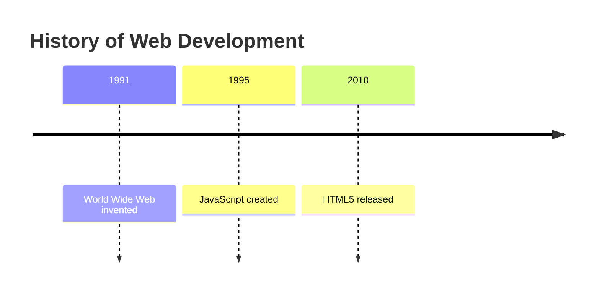
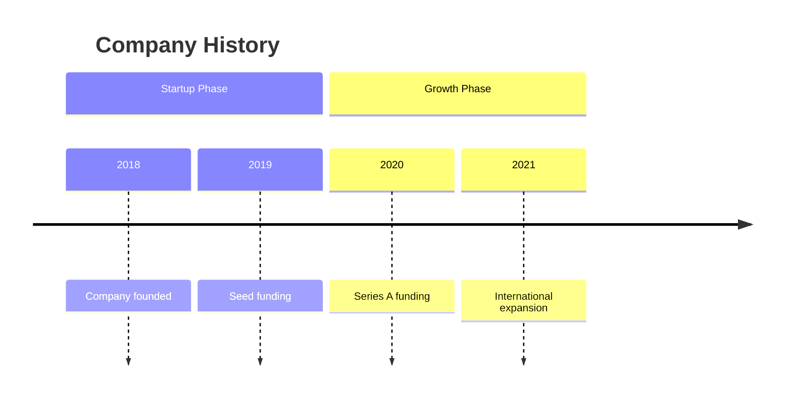
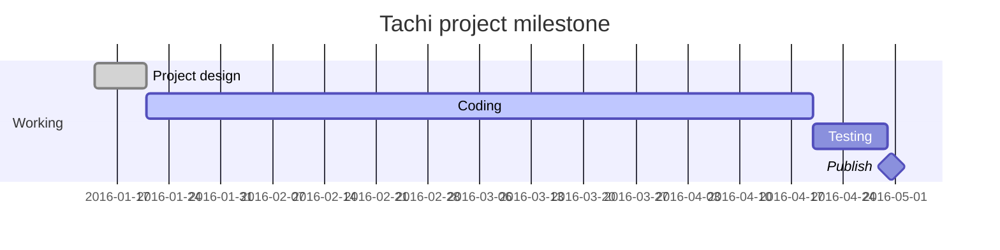

# Module 5: Gantt & Timeline 🚀

> **Level: Advanced** | **Estimated Time: 3-4 hours**

## 📋 Module Overview

This module covers Gantt charts for project planning and Timeline diagrams for chronological visualization.

---

## 📖 Chapter 5.1: Gantt Charts

### Basic Gantt Chart



### Date Formats

| Format | Example | Description |
|--------|---------|-------------|
| `YYYY-MM-DD` | 2024-01-15 | ISO date |
| `DD-MM-YYYY` | 15-01-2024 | European |

**Duration units:** `d` (days), `w` (weeks), `h` (hours)

### Task Types



### Dependencies



### Exclusions

```
excludes weekends
excludes 2024-01-15
```

---

## 📖 Chapter 5.2: Timeline Diagrams

### Basic Timeline



### Timeline with Sections



---

## 🏋️ Exercises

1. Create a 2-week sprint Gantt chart with dependencies
2. Plan a product launch over 3 months
3. Create a timeline of your favorite programming language
4. Map a personal project timeline with milestones




---

## ✅ Module Checklist

- [ ] Gantt charts with date formats
- [ ] Task types and dependencies
- [ ] Timeline with sections
- [ ] Completed exercises

> **Next:** [Module 6: Git Graph & Mindmaps](../6-git-mindmaps/README.md) →
