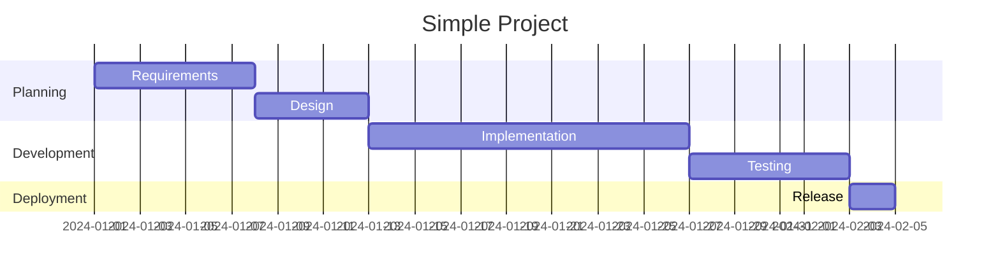
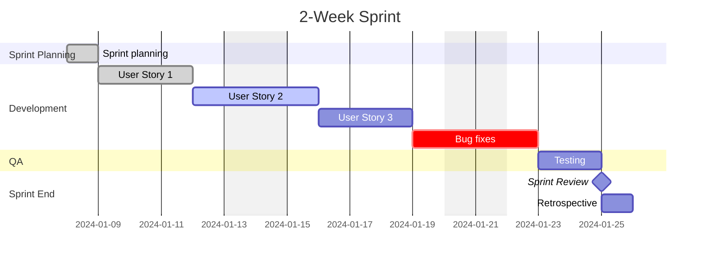
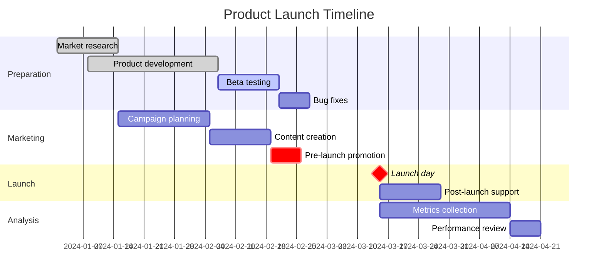
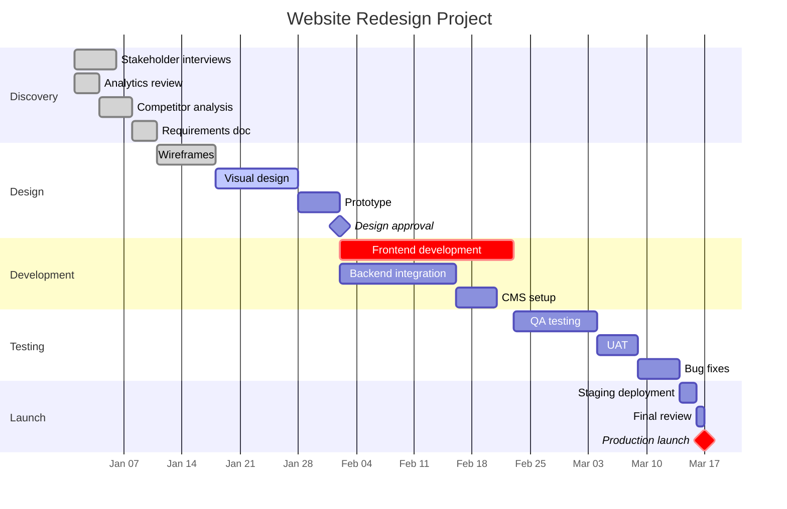
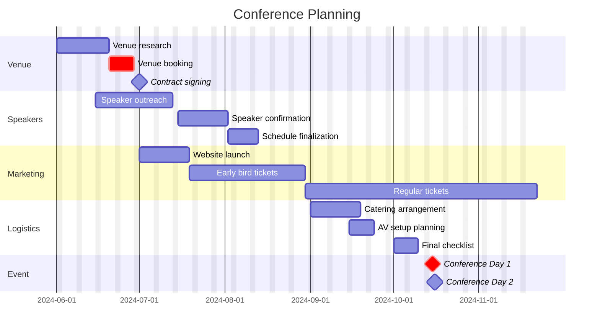
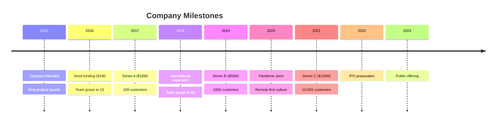
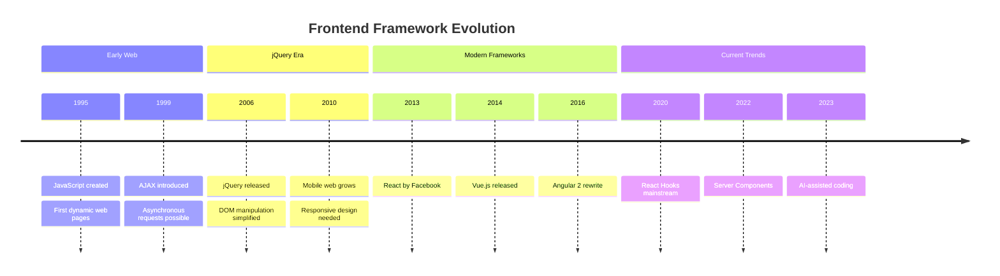
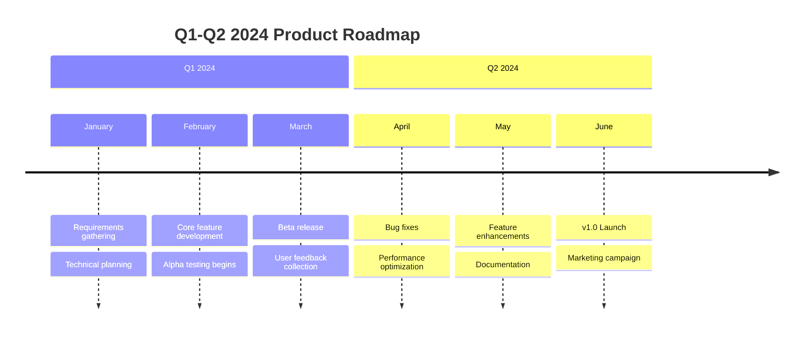
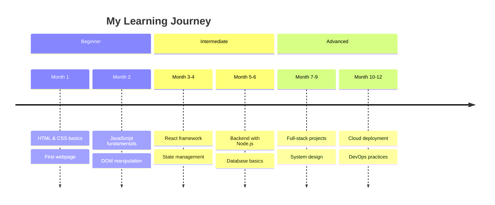

# Gantt & Timeline Examples 📊

---

## Gantt Chart Examples

### 1. Simple Project

### 2. Software Development Sprint

### 3. Product Launch

### 4. Website Redesign

### 5. Event Planning

---

## Timeline Examples

### 1. Company History

### 2. Technology Evolution

### 3. Project Roadmap

### 4. Personal Development

---

## Quick Reference

### Gantt Syntax
| Element | Syntax |
|---------|--------|
| Task | `taskname :id, start, duration` |
| After | `after taskid` |
| Done | `:done, id, start, duration` |
| Active | `:active, id, start, duration` |
| Critical | `:crit, id, start, duration` |
| Milestone | `:milestone, id, date, 0d` |
| Exclude | `excludes weekends` |

### Duration Units
| Unit | Example |
|------|---------|
| Days | `7d` |
| Weeks | `2w` |
| Hours | `8h` |
