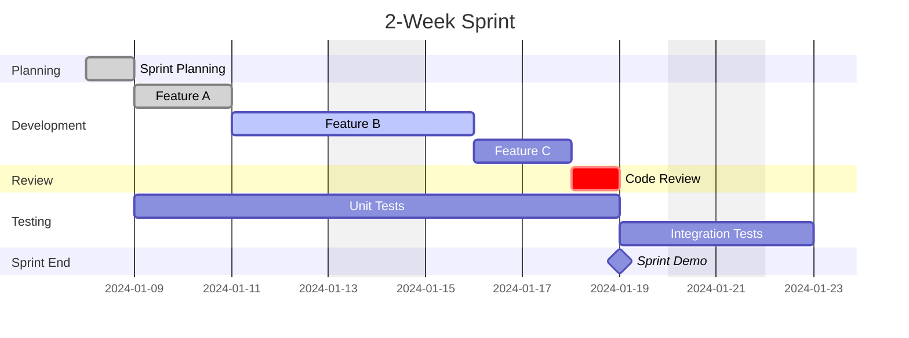
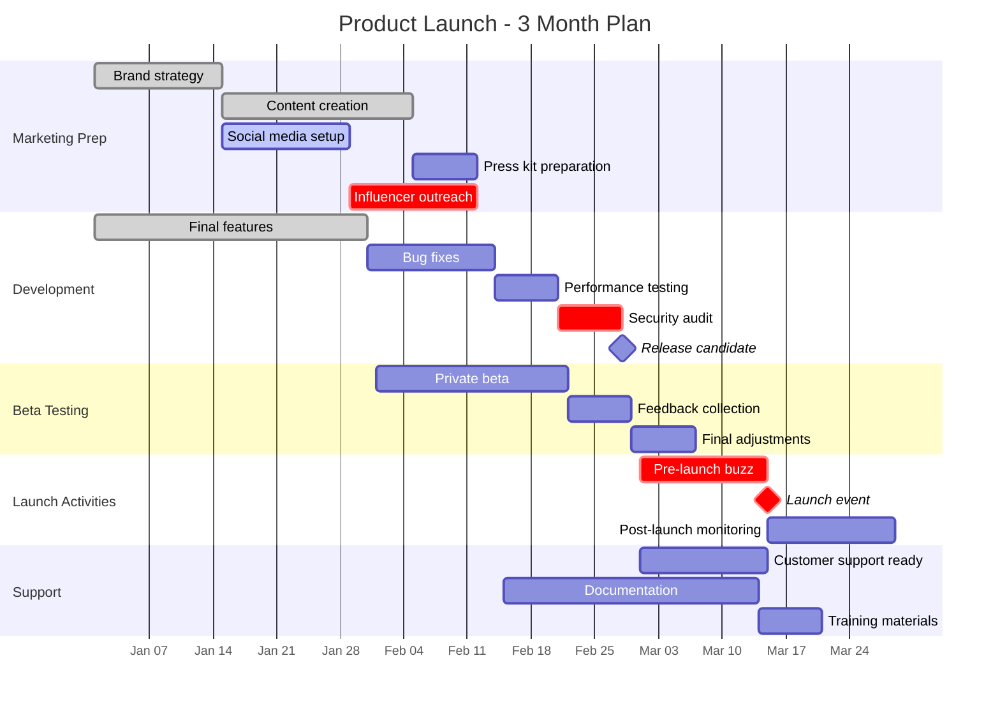
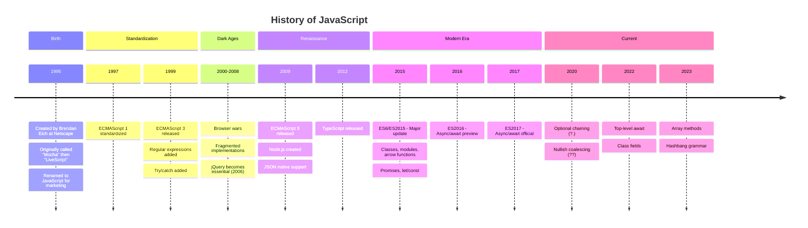
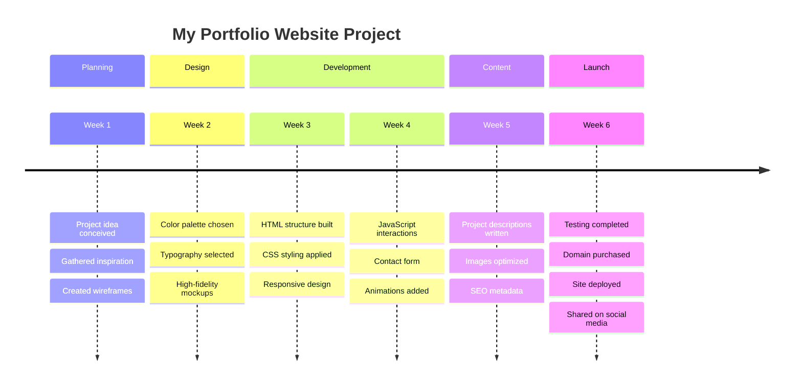
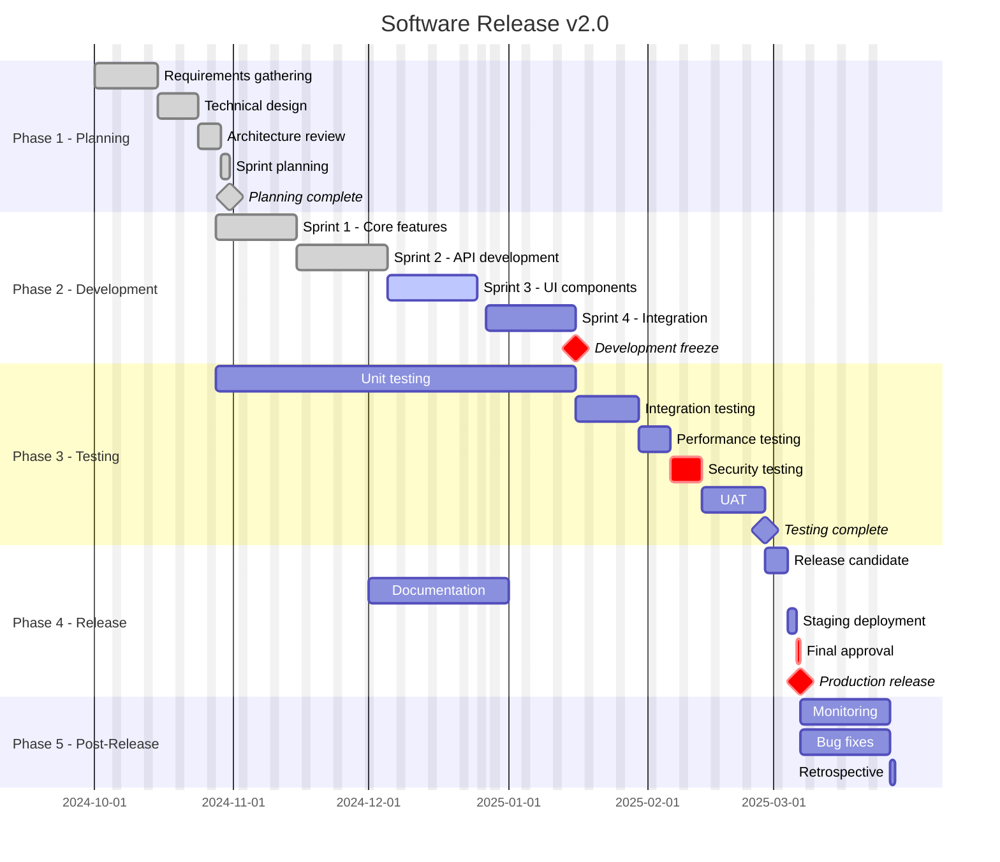

# Exercise Answers 📝

## Exercise 1: Sprint Planning (Gantt)

---

## Exercise 2: Product Launch (Gantt)

---

## Exercise 3: Historical Timeline

---

## Exercise 4: Personal Project Timeline

---

## Bonus: Complete Software Release

---

## Tips

1. **Use milestones** - Mark important dates with `milestone`
2. **Critical path** - Use `crit` for must-do items
3. **Dependencies** - Use `after taskid` for sequencing
4. **Exclude dates** - Skip weekends and holidays
5. **Sections** - Group related tasks logically
6. **Good labels** - Make task names descriptive but concise
