# Module 6: Git Graph & Mindmaps 🚀

> **Level: Advanced** | **Estimated Time: 2-3 hours**

## 📋 Module Overview

This module covers Git graphs for version control visualization, Mindmaps for brainstorming, Quadrant charts, and Pie charts.

---

## 📖 Chapter 6.1: Git Graphs

### Basic Git Graph

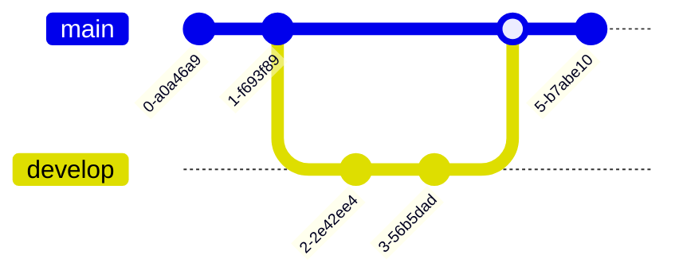

### Commits with IDs and Messages

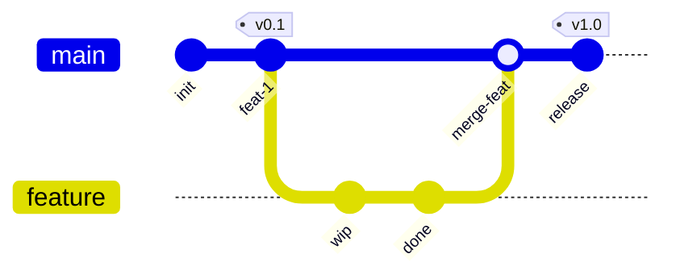

### Branching Strategies

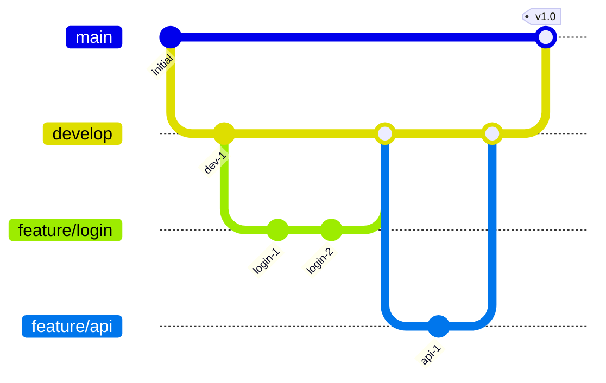

### Cherry-Pick

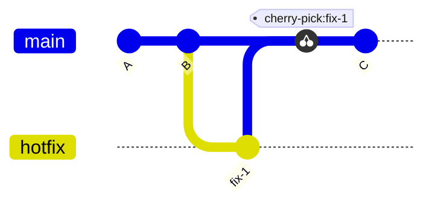

### Branch Ordering

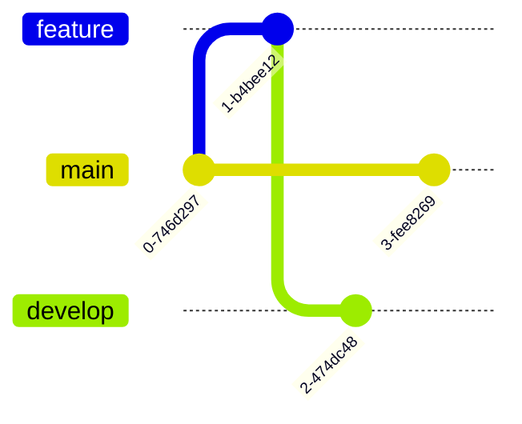

---

## 📖 Chapter 6.2: Mindmaps

### Basic Mindmap

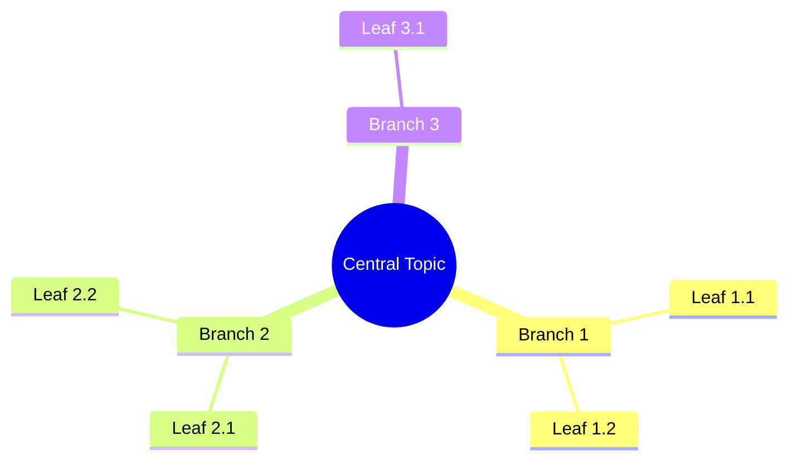

### Node Shapes

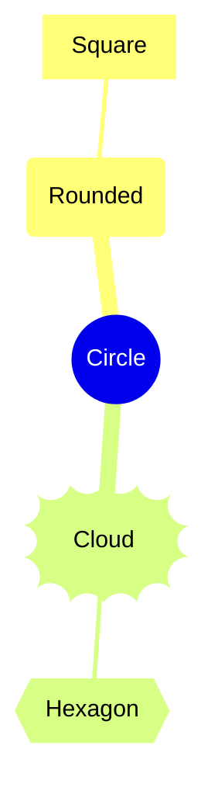

### Web Development Mindmap

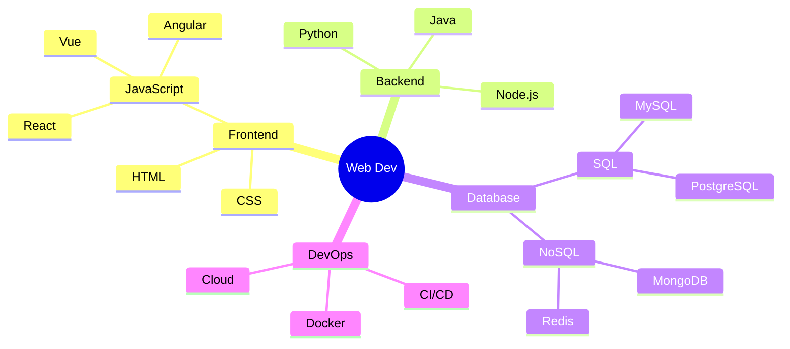

---

## 📖 Chapter 6.3: Quadrant Charts

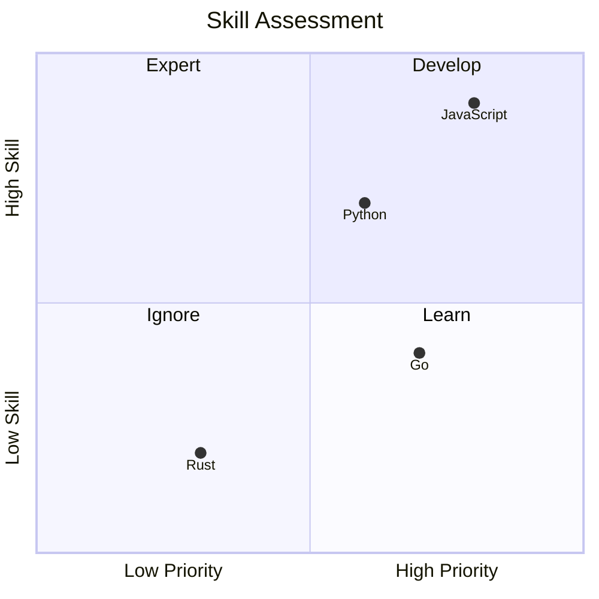

---

## 📖 Chapter 6.4: Pie Charts

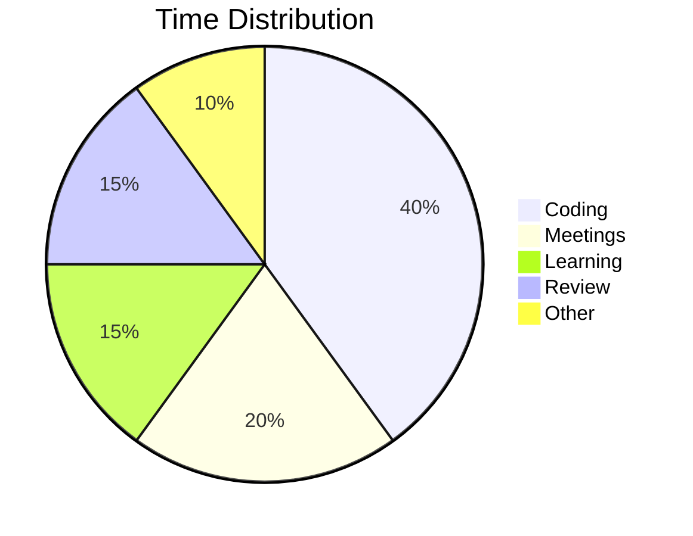

### With Show Data

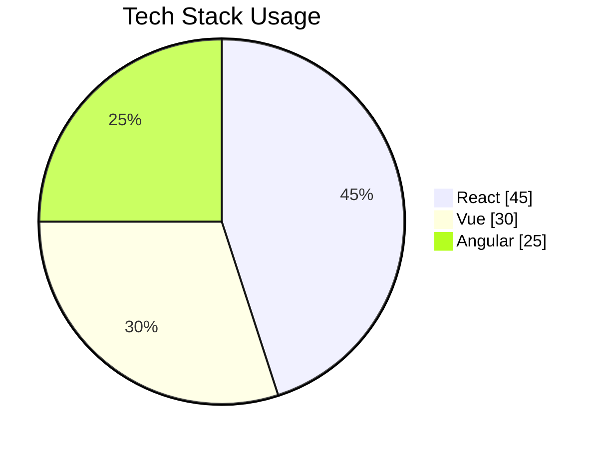

---

## 🏋️ Exercises

1. Create a Git-flow branching model diagram
2. Create a mindmap for learning a new technology
3. Plot a skill priority matrix using quadrant chart
4. Show your weekly time distribution as a pie chart

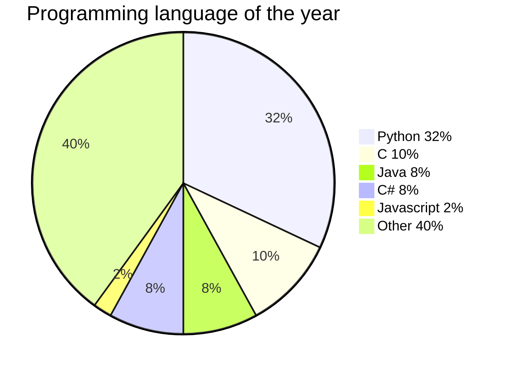
---

## ✅ Module Checklist

- [ ] Git graphs with branches and merges
- [ ] Mindmaps with hierarchy
- [ ] Quadrant charts
- [ ] Pie charts
- [ ] Completed exercises

> **Next:** [Module 7: Styling & Theming](../7-styling-theming/README.md) →
