# Git Graph, Mindmap & Chart Examples 📊

---

## Git Graph Examples

### 1. Simple Branching

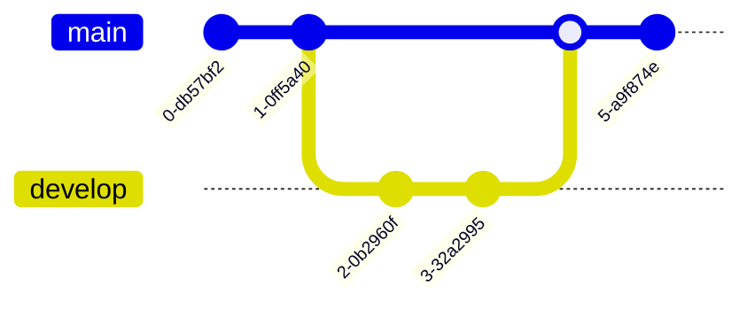

### 2. Feature Branch Workflow

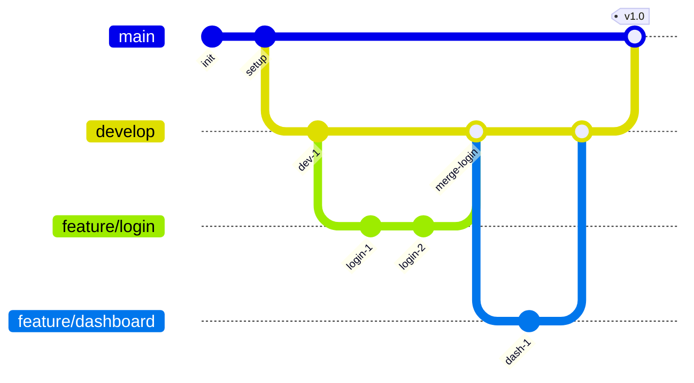

### 3. Git Flow

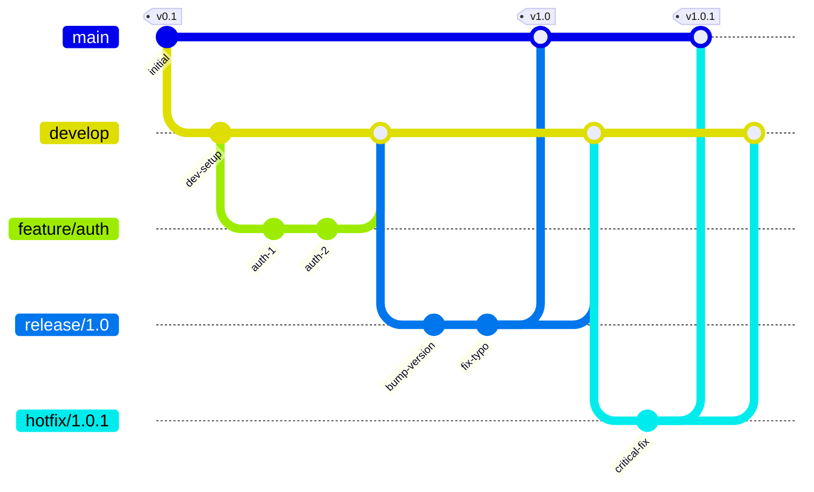

### 4. Release Tags

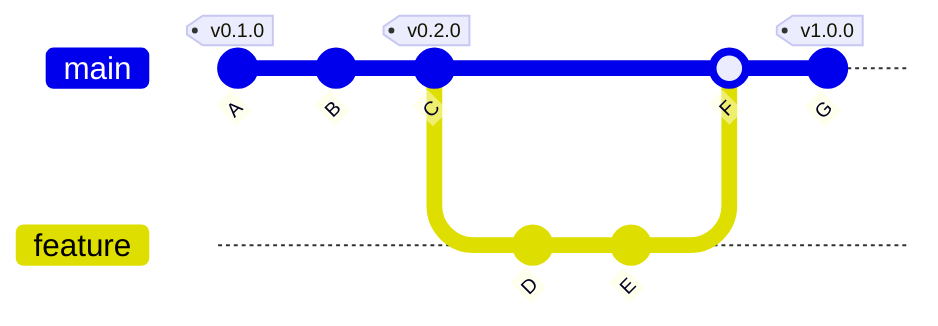

---

## Mindmap Examples

### 1. Web Development

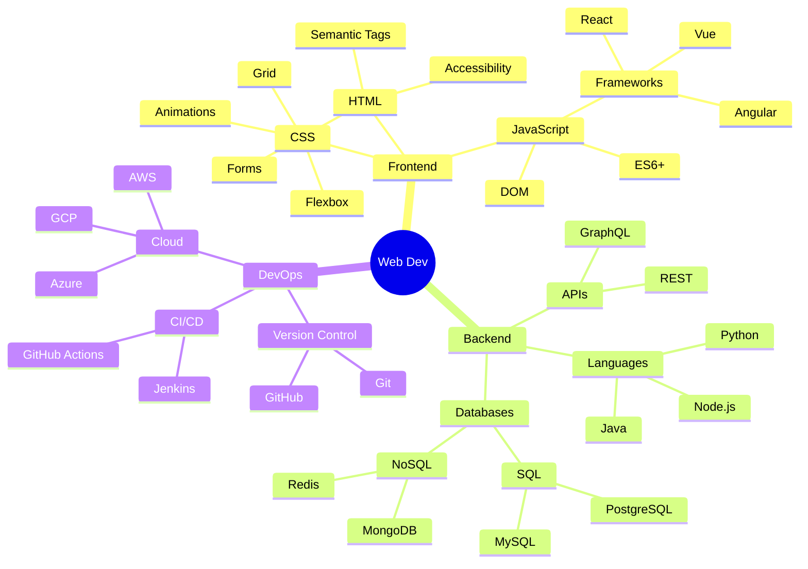

### 2. Project Planning

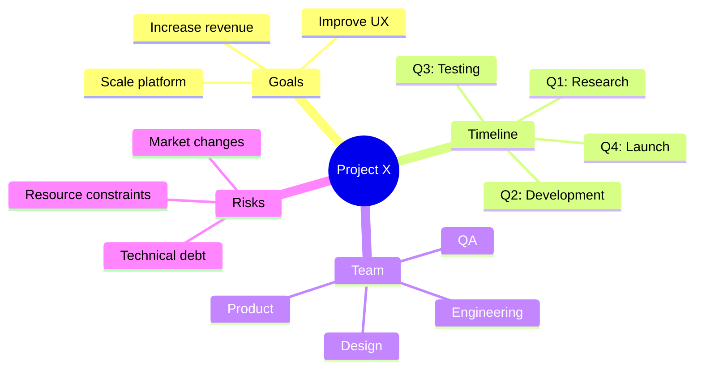

### 3. Learning Path

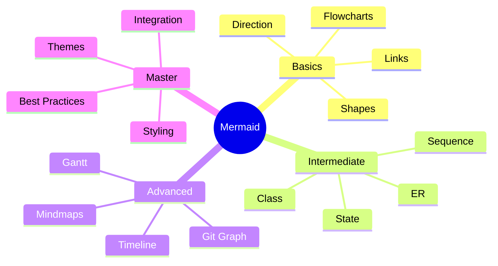

---

## Pie Chart Examples

### 1. Time Distribution

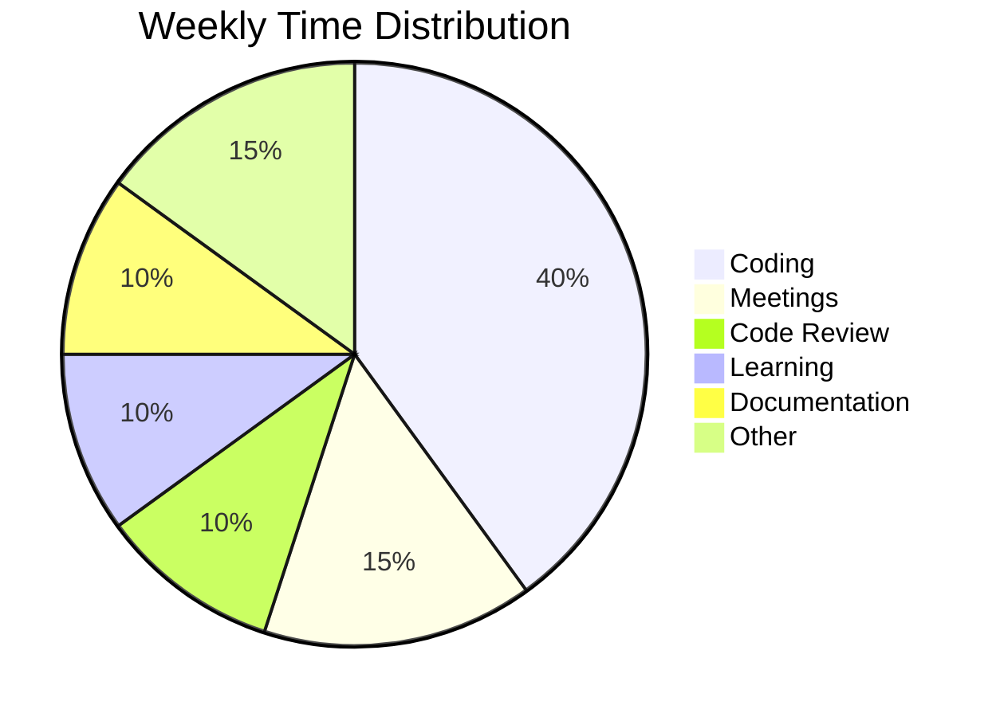

### 2. Tech Stack Usage

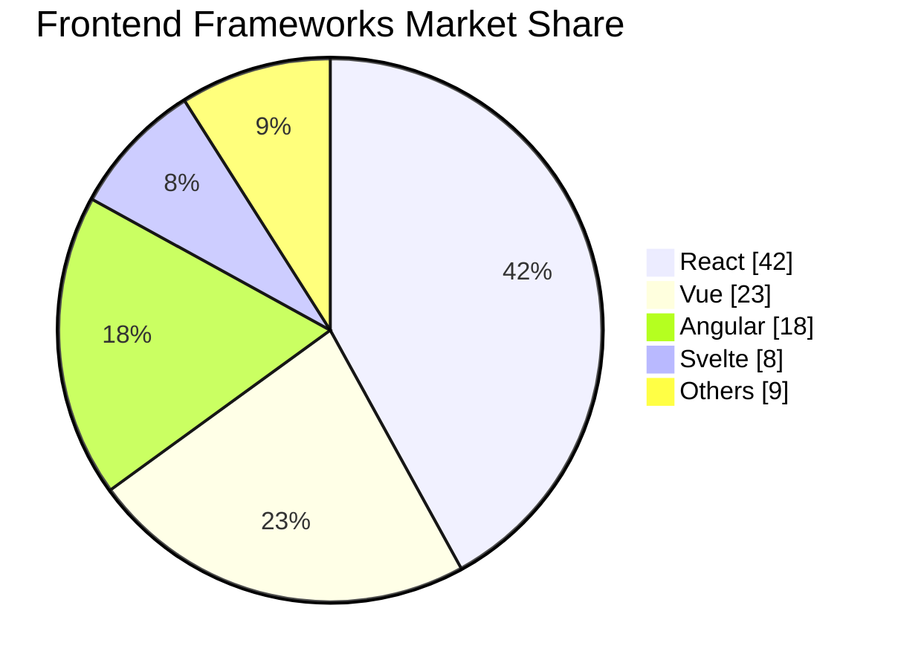

### 3. Budget Allocation

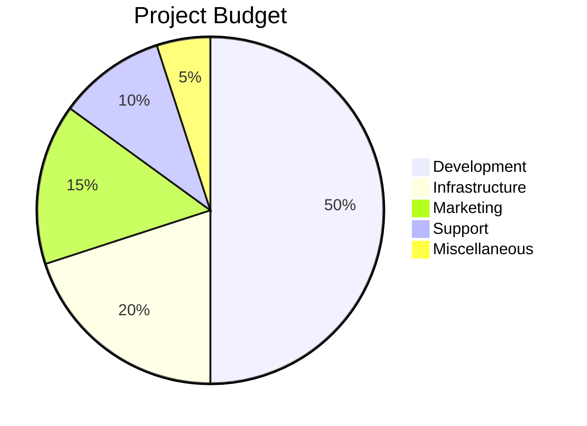

---

## Quadrant Chart Examples

### 1. Eisenhower Matrix

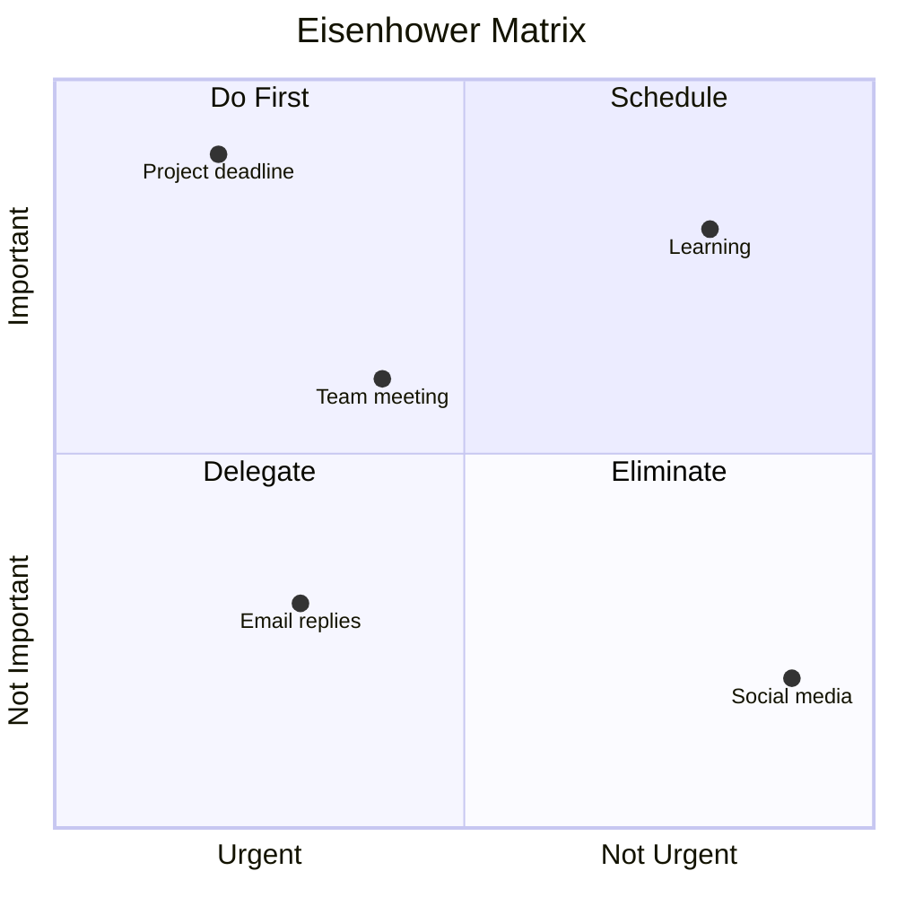

### 2. Skill Assessment

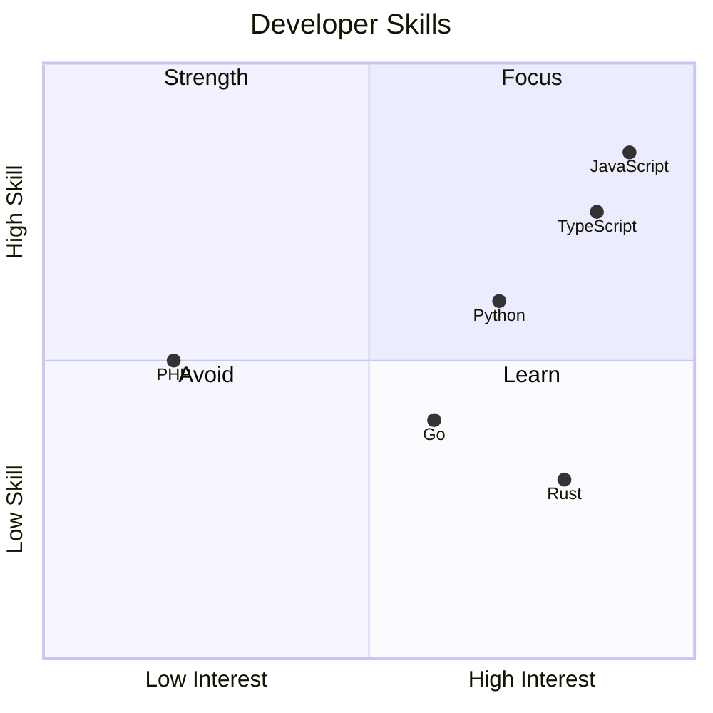

### 3. Feature Prioritization

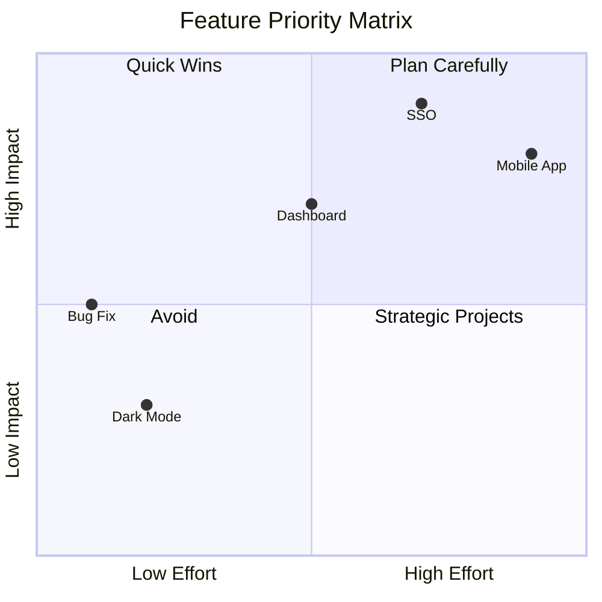

---

## Quick Reference

### Git Graph
| Command | Description |
|---------|-------------|
| `commit` | Add commit |
| `branch name` | Create branch |
| `checkout name` | Switch branch |
| `merge name` | Merge branch |
| `id: "text"` | Commit message |
| `tag: "v1.0"` | Add tag |

### Mindmap
| Element | Description |
|---------|-------------|
| `root((text))` | Circle root |
| `root[text]` | Square root |
| Indentation | Create hierarchy |

### Pie Chart
| Element | Description |
|---------|-------------|
| `pie` | Declare chart |
| `title` | Chart title |
| `showData` | Show values |
| `"Label" : value` | Data entry |
