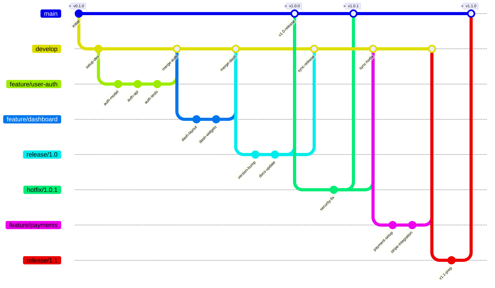
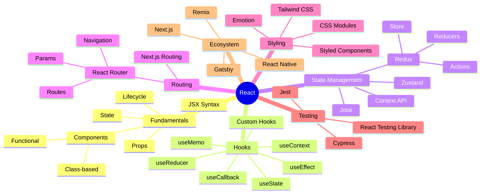
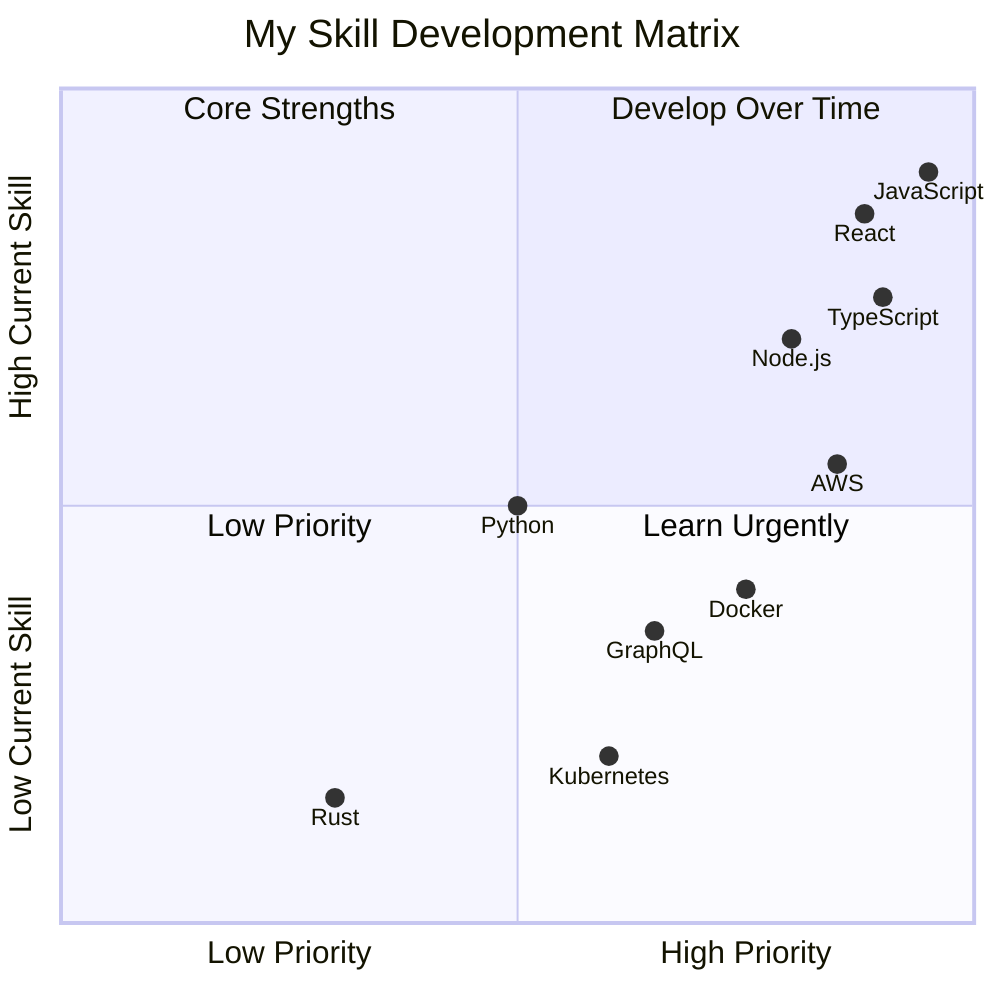
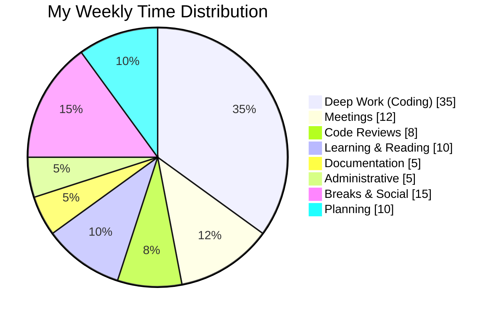
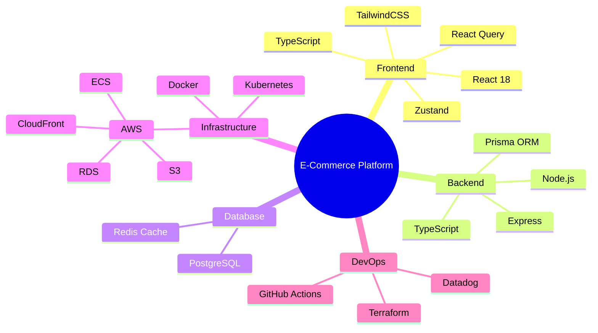
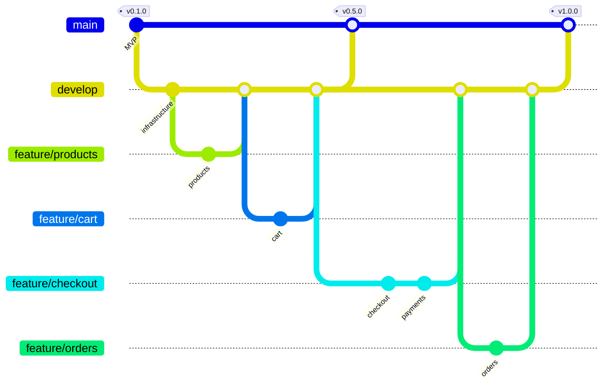
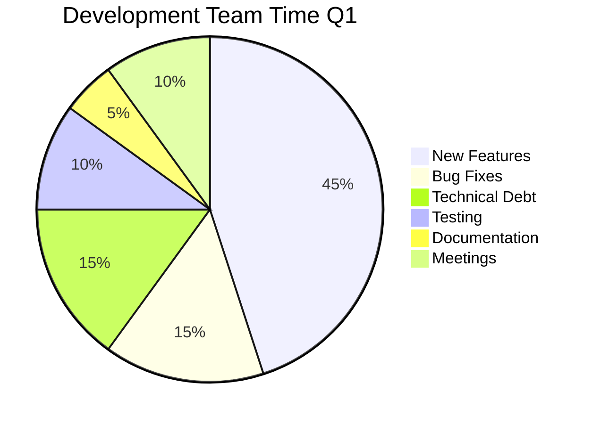

# Exercise Answers 📝

## Exercise 1: Git-flow Branching Model

---

## Exercise 2: Technology Learning Mindmap

---

## Exercise 3: Skill Priority Matrix (Quadrant)

---

## Exercise 4: Weekly Time Distribution (Pie)

---

## Bonus: Complete Project Visualization

### Project Tech Stack Mindmap

### Release History

### Team Time Allocation

---

## Tips

1. **Git graphs** - Great for visualizing branching strategies
2. **Mindmaps** - Perfect for brainstorming and organization
3. **Pie charts** - Simple data proportions
4. **Quadrant charts** - Useful for prioritization decisions
5. **Keep mindmaps focused** - Don't go too deep in hierarchy
6. **Use meaningful commit IDs** - Make git graphs readable
