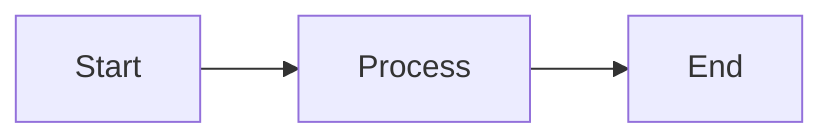
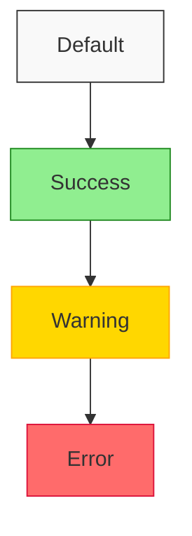
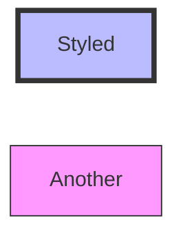
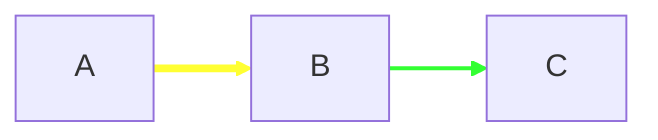

# Module 7: Advanced Styling & Theming 🏆

> **Level: Master** | **Estimated Time: 4-5 hours**

## 📋 Module Overview

Master the art of customizing Mermaid diagrams with themes, styles, and configuration directives.

---

## 📖 Chapter 7.1: Built-in Themes

### Available Themes

Mermaid provides 5 built-in themes:

| Theme | Description |
|-------|-------------|
| `default` | Default blue-gray theme |
| `dark` | Dark mode theme |
| `forest` | Green nature theme |
| `neutral` | Gray neutral theme |
| `base` | Minimal, unstyled base |

### Applying Themes

```
%%{init: {'theme': 'dark'}}%%
graph TD
    A --> B --> C
```

### Theme Comparison

**Default Theme:**


---

## 📖 Chapter 7.2: Custom Styling

### ClassDef Syntax



### Style Properties

| Property | Description | Example |
|----------|-------------|---------|
| `fill` | Background color | `fill:#ff0000` |
| `stroke` | Border color | `stroke:#333` |
| `stroke-width` | Border width | `stroke-width:2px` |
| `color` | Text color | `color:#fff` |
| `stroke-dasharray` | Dashed border | `stroke-dasharray:5,5` |

### Inline Styling



### Link Styling



---

## 📖 Chapter 7.3: Directives & Configuration

### Init Directive

```
%%{init: {
    'theme': 'base',
    'themeVariables': {
        'primaryColor': '#ff0000',
        'primaryTextColor': '#fff',
        'primaryBorderColor': '#000',
        'lineColor': '#666',
        'secondaryColor': '#00ff00',
        'tertiaryColor': '#fff'
    }
}}%%
```

### Common Theme Variables

| Variable | Description |
|----------|-------------|
| `primaryColor` | Main node color |
| `primaryTextColor` | Text on primary |
| `primaryBorderColor` | Border on primary |
| `secondaryColor` | Secondary elements |
| `tertiaryColor` | Background color |
| `lineColor` | Connection lines |
| `fontSize` | Base font size |
| `fontFamily` | Font family |

### Flowchart-Specific Variables

- `nodeBorder` - Node border color
- `nodeTextColor` - Node text
- `mainBkg` - Main background
- `clusterBkg` - Subgraph background
- `clusterBorder` - Subgraph border

### Diagram-Specific Config

```
%%{init: {
    'flowchart': {
        'curve': 'basis',
        'nodeSpacing': 50,
        'rankSpacing': 50,
        'padding': 15
    }
}}%%
```

---

## 🏋️ Exercises

1. Create a custom theme with your brand colors
2. Style a flowchart with different node types
3. Create a dark-themed sequence diagram
4. Apply consistent styling across multiple diagram types

---

## ✅ Module Checklist

- [ ] Know all built-in themes
- [ ] Can use classDef for styling
- [ ] Understand theme variables
- [ ] Can configure diagrams with directives
- [ ] Completed exercises

> **Next:** [Module 8: Integration & Best Practices](../8-integration-best-practices/README.md) →
