# Styling & Theming Examples 🎨

---

## Theme Examples

### Default Theme

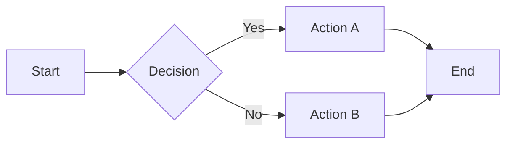

### Dark Theme

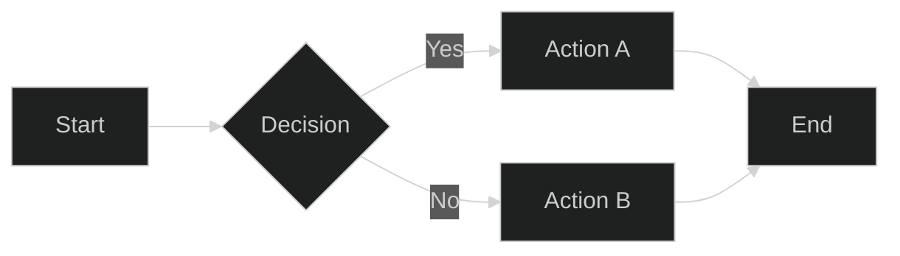

### Forest Theme

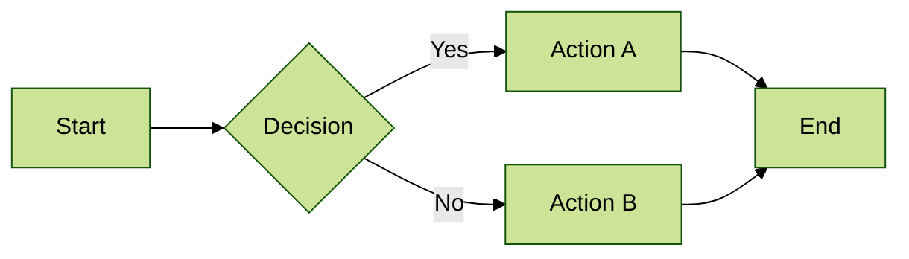

### Neutral Theme

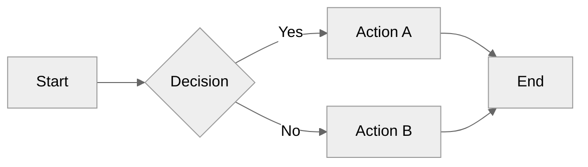

---

## Custom Theme Variables

### Blue Corporate

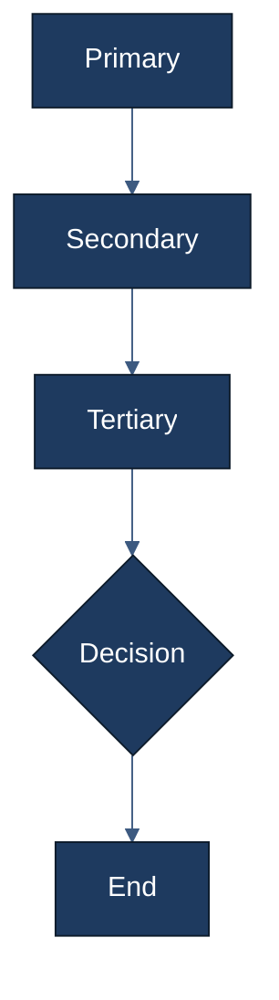

### Warm Sunset

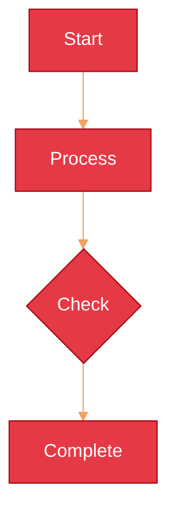

### Nature Green

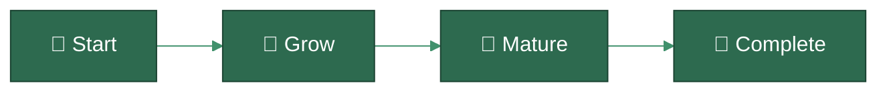

---

## ClassDef Examples

### Status Colors

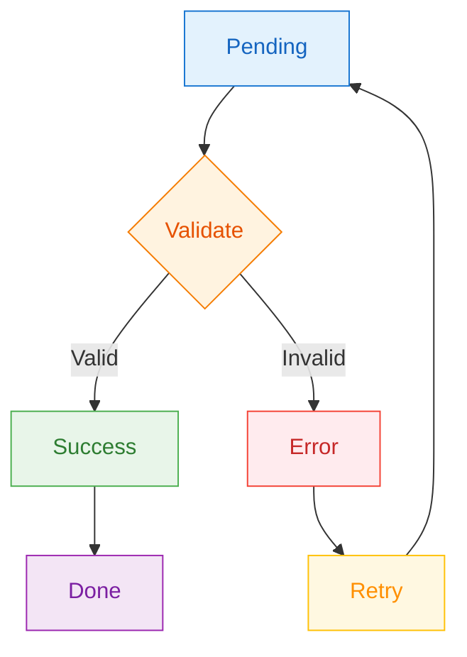

### Semantic Classes

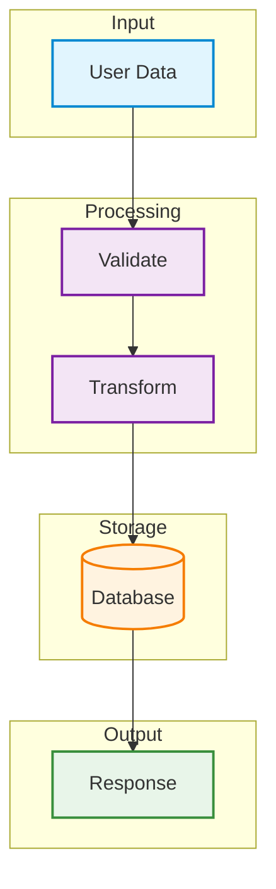

---

## Link Styling

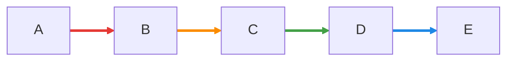

### Dashed Links

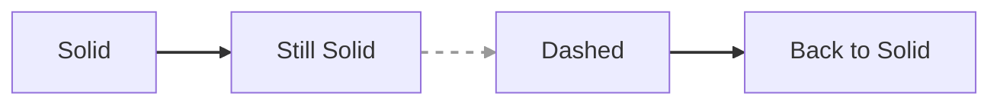

---

## Sequence Diagram Theming

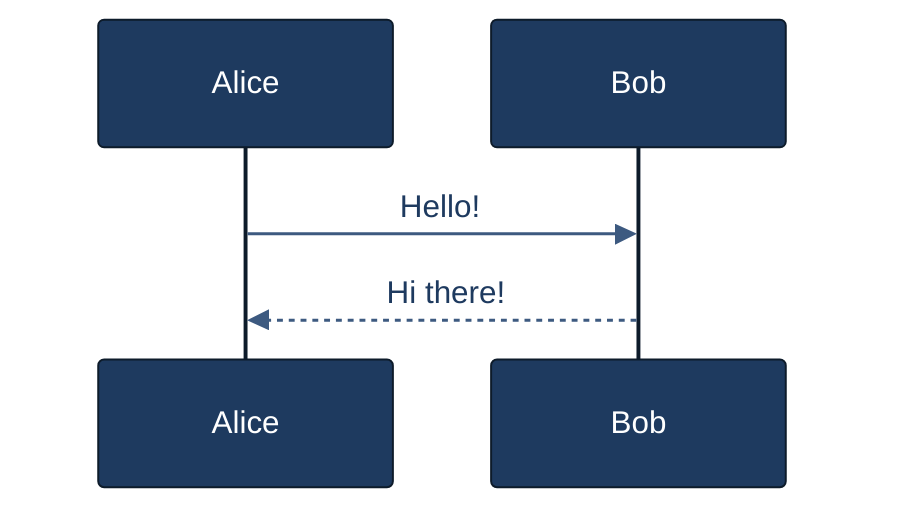

---

## Flowchart Configuration

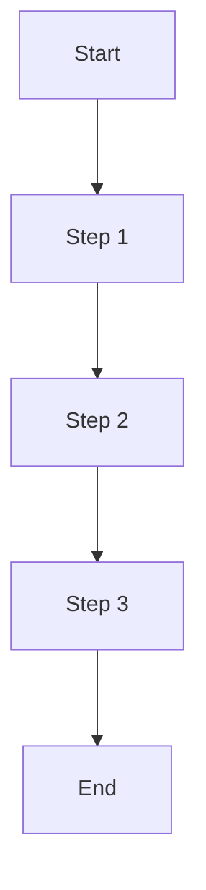

---

## Complete Styled Dashboard

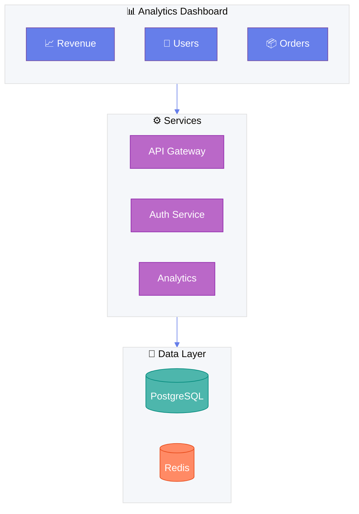

---

## Quick Reference

### Theme Variables
| Variable | Description |
|----------|-------------|
| `primaryColor` | Main node fill |
| `primaryTextColor` | Main node text |
| `primaryBorderColor` | Main node border |
| `lineColor` | Connection lines |
| `secondaryColor` | Secondary elements |
| `tertiaryColor` | Background elements |

### Style Properties
| Property | Example |
|----------|---------|
| `fill` | `fill:#ff0000` |
| `stroke` | `stroke:#333` |
| `stroke-width` | `stroke-width:2px` |
| `color` | `color:#fff` |
| `stroke-dasharray` | `stroke-dasharray:5,5` |
