# Exercise Answers 📝

## Exercise 1: Custom Brand Theme

```mermaid
%%{init: {
    'theme': 'base',
    'themeVariables': {
        'primaryColor': '#6366f1',
        'primaryTextColor': '#ffffff',
        'primaryBorderColor': '#4f46e5',
        'lineColor': '#818cf8',
        'secondaryColor': '#c7d2fe',
        'tertiaryColor': '#eef2ff',
        'fontFamily': 'Inter, sans-serif'
    }
}}%%
graph TD
    A([🚀 Start]):::primary --> B[Process Data]
    B --> C{Validate}
    C -->|Pass| D[Save]:::success
    C -->|Fail| E[Error]:::error
    D --> F([✅ Complete]):::primary
    E --> G[Retry]:::warning
    G --> B
    
    classDef primary fill:#6366f1,stroke:#4f46e5,color:#fff
    classDef success fill:#10b981,stroke:#059669,color:#fff
    classDef error fill:#ef4444,stroke:#dc2626,color:#fff
    classDef warning fill:#f59e0b,stroke:#d97706,color:#fff
```

---

## Exercise 2: Styled Flowchart with Node Types

---

## Exercise 3: Dark Theme Sequence Diagram

```mermaid
%%{init: {
    'theme': 'dark',
    'themeVariables': {
        'actorBkg': '#374151',
        'actorTextColor': '#f9fafb',
        'actorBorder': '#4b5563',
        'signalColor': '#60a5fa',
        'signalTextColor': '#e5e7eb',
        'noteBkgColor': '#1f2937',
        'noteTextColor': '#f3f4f6',
        'activationBorderColor': '#60a5fa'
    }
}}%%
sequenceDiagram
    autonumber
    actor User
    participant App as 📱 Mobile App
    participant API as ⚙️ API Server
    participant DB as 💾 Database
    
    User->>App: Open app
    App->>API: GET /profile
    activate API
    API->>DB: Query user
    activate DB
    DB-->>API: User data
    deactivate DB
    API-->>App: JSON response
    deactivate API
    App-->>User: Display profile
    
    Note over User,App: User views their profile
```

---

## Exercise 4: Consistent Multi-Diagram Styling

### Shared Color Palette

Use these colors across all diagrams for consistency:

| Purpose | Color | Hex |
|---------|-------|-----|
| Primary | Indigo | `#6366f1` |
| Success | Emerald | `#10b981` |
| Warning | Amber | `#f59e0b` |
| Error | Red | `#ef4444` |
| Info | Sky | `#0ea5e9` |
| Neutral | Slate | `#64748b` |

### Flowchart Example

### State Diagram Example

### Class Diagram Example

---

## Bonus: Complete Styled Architecture

```mermaid
%%{init: {
    'theme': 'base',
    'themeVariables': {
        'primaryColor': '#1e293b',
        'primaryTextColor': '#f8fafc',
        'primaryBorderColor': '#334155',
        'lineColor': '#64748b',
        'secondaryColor': '#475569',
        'tertiaryColor': '#f1f5f9'
    }
}}%%
graph TB
    subgraph Client["👤 Client Layer"]
        A[🌐 Web App]:::client
        B[📱 Mobile App]:::client
    end
    
    subgraph Gateway["🚪 API Gateway"]
        C[Load Balancer]:::gateway
        D[Rate Limiter]:::gateway
        E[Auth]:::gateway
    end
    
    subgraph Services["⚙️ Microservices"]
        F[User Service]:::service
        G[Order Service]:::service
        H[Payment Service]:::service
        I[Notification]:::service
    end
    
    subgraph Data["💾 Data Layer"]
        J[(PostgreSQL)]:::db
        K[(MongoDB)]:::db
        L[(Redis)]:::cache
    end
    
    subgraph External["🌍 External"]
        M[Stripe API]:::external
        N[SendGrid]:::external
    end
    
    A & B --> C
    C --> D --> E
    E --> F & G & H & I
    F --> J
    G --> K
    H --> M
    I --> N
    F & G --> L
    
    classDef client fill:#3b82f6,stroke:#2563eb,color:#fff
    classDef gateway fill:#8b5cf6,stroke:#7c3aed,color:#fff
    classDef service fill:#10b981,stroke:#059669,color:#fff
    classDef db fill:#f59e0b,stroke:#d97706,color:#000
    classDef cache fill:#ef4444,stroke:#dc2626,color:#fff
    classDef external fill:#64748b,stroke:#475569,color:#fff
```

---

## Tips

1. **Consistency** - Use the same colors for same concepts
2. **Contrast** - Ensure text is readable on backgrounds
3. **Hierarchy** - Use stroke-width to show importance
4. **Semantics** - Colors should convey meaning (green=success, red=error)
5. **Accessibility** - Don't rely only on color, use shapes/icons too
