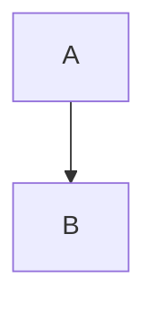
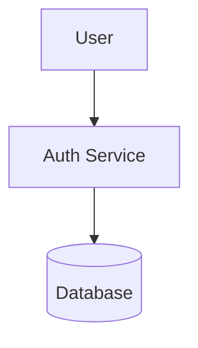
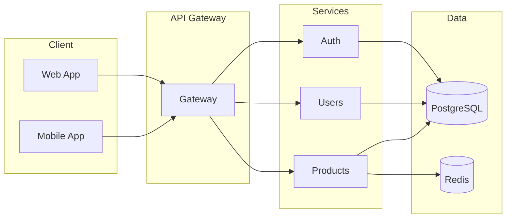
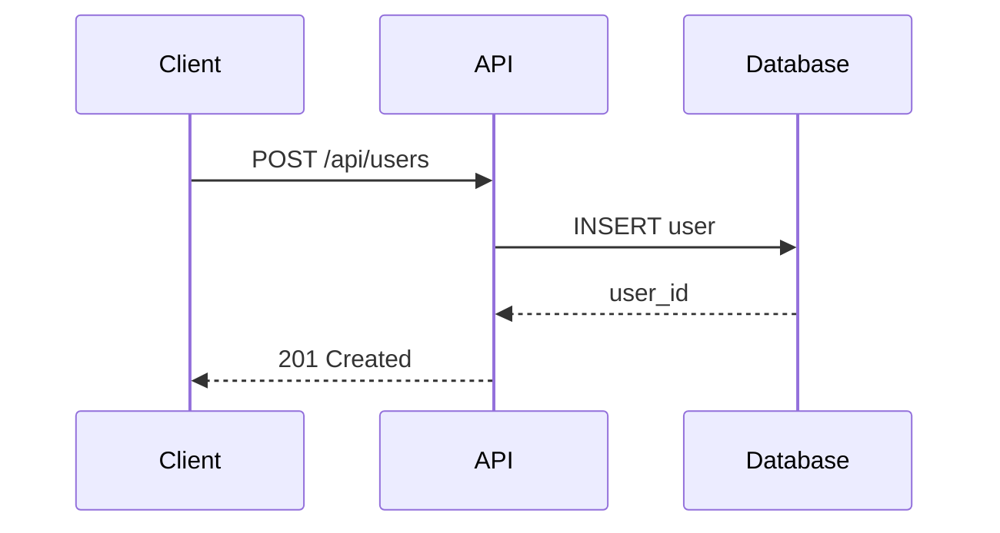

# Module 8: Integration & Best Practices 🏆

> **Level: Master** | **Estimated Time: 3-4 hours**

## 📋 Module Overview

Learn to integrate Mermaid into various platforms and follow best practices for creating maintainable diagrams.

---

## 📖 Chapter 8.1: Platform Integration

### GitHub / GitLab

Native support in Markdown files:

````markdown

````

### VS Code

**Extensions:**
- [Markdown Preview Mermaid](https://marketplace.visualstudio.com/items?itemName=bierner.markdown-mermaid)
- [Mermaid Chart](https://marketplace.visualstudio.com/items?itemName=MermaidChart.vscode-mermaid-chart)

### Obsidian

Native support - just use mermaid code blocks in notes.

### Notion

Use code blocks with `mermaid` language.

### Confluence

Install the Mermaid plugin from Atlassian Marketplace.

---

## 📖 Chapter 8.2: Programmatic Usage

### Mermaid CLI (mermaid-cli)

```bash
npm install -g @mermaid-js/mermaid-cli
```

**Generate images:**
```bash
mmdc -i input.mmd -o output.svg
mmdc -i input.mmd -o output.png -b transparent
```

### JavaScript API

```javascript
import mermaid from 'mermaid';

mermaid.initialize({ startOnLoad: true });

// Or render dynamically
const { svg } = await mermaid.render('id', `
  graph TD
    A --> B
`);
```

### HTML Integration

```html
<script type="module">
  import mermaid from 'https://cdn.jsdelivr.net/npm/mermaid@10/dist/mermaid.esm.min.mjs';
  mermaid.initialize({ startOnLoad: true });
</script>

<pre class="mermaid">
graph TD
    A --> B
</pre>
```

---

## 📖 Chapter 8.3: Best Practices

### 1. Keep Diagrams Simple

❌ **Avoid:**
- More than 15-20 nodes
- Crossing lines
- Too many colors

✅ **Do:**
- Break into multiple diagrams
- Use subgraphs for grouping
- Maintain consistent direction

### 2. Use Meaningful IDs



### 3. Add Comments

```
graph TD
    %% User authentication flow
    A --> B
    %% Payment processing
    B --> C
```

### 4. Consistent Styling

Create a style guide for your team:
- Same node shapes for same concepts
- Consistent color coding
- Standard naming conventions

### 5. Version Control

- Store diagrams as code
- Review changes in PRs
- Document diagram purpose

---

## 📖 Chapter 8.4: Real-World Examples

### System Architecture



### API Documentation



---

## 🏋️ Exercises

1. Set up Mermaid in your preferred editor
2. Generate PNG/SVG using mermaid-cli
3. Create an architecture diagram for a project
4. Document an API flow with sequence diagrams

---

## ✅ Module Checklist

- [ ] Know platform integrations
- [ ] Can use mermaid-cli
- [ ] Understand JavaScript API
- [ ] Follow best practices
- [ ] Created real-world diagrams
- [ ] Completed exercises

---

## 🎉 Congratulations!

You've completed the Mermaid Learning Path! You can now:

- Create all major diagram types
- Apply custom styling and themes
- Integrate Mermaid into your workflow
- Follow professional best practices

**Keep practicing** by using Mermaid in your daily documentation!

---

## 🔗 Resources

- [Mermaid Official Docs](https://mermaid.js.org/)
- [Mermaid Live Editor](https://mermaid.live/)
- [GitHub Mermaid Support](https://docs.github.com/en/get-started/writing-on-github/working-with-advanced-formatting/creating-diagrams)
- [Mermaid CLI](https://github.com/mermaid-js/mermaid-cli)
