# Integration & Best Practices Examples 📊

---

## Platform Integration Examples

### GitHub README Example

````markdown
# My Project

## Architecture


## Deployment Flow


````

### VS Code Preview

Create `.mmd` files for dedicated diagrams:

```
// architecture.mmd
graph TB
    subgraph Frontend
        React
        Redux
    end
    subgraph Backend
        API
        Services
    end
    Frontend --> Backend
```

### HTML Integration

```html
<!DOCTYPE html>
<html>
<head>
    <title>Mermaid Demo</title>
</head>
<body>
    <h1>System Architecture</h1>
    
    <pre class="mermaid">
    graph LR
        A[User] --> B[Web App]
        B --> C[API]
        C --> D[(Database)]
    </pre>
    
    <script type="module">
        import mermaid from 'https://cdn.jsdelivr.net/npm/mermaid@10/dist/mermaid.esm.min.mjs';
        mermaid.initialize({ startOnLoad: true, theme: 'dark' });
    </script>
</body>
</html>
```

---

## CLI Usage Examples

### Generate PNG

```bash
# Install mermaid-cli
npm install -g @mermaid-js/mermaid-cli

# Create diagram file
echo 'graph LR
    A --> B --> C' > diagram.mmd

# Generate PNG
mmdc -i diagram.mmd -o diagram.png

# Generate with background
mmdc -i diagram.mmd -o diagram.png -b white

# Generate SVG
mmdc -i diagram.mmd -o diagram.svg
```

### Batch Processing

```bash
# Convert all .mmd files to PNG
for file in *.mmd; do
    mmdc -i "$file" -o "${file%.mmd}.png"
done
```

### Config File

```json
// .mermaidrc
{
    "theme": "dark",
    "flowchart": {
        "curve": "basis"
    },
    "sequence": {
        "actorMargin": 50
    }
}
```

```bash
mmdc -i diagram.mmd -o diagram.png -c .mermaidrc
```

---

## JavaScript API Examples

### Basic Rendering

```javascript
import mermaid from 'mermaid';

// Initialize with config
mermaid.initialize({
    startOnLoad: true,
    theme: 'default',
    securityLevel: 'loose'
});

// Render dynamically
async function renderDiagram() {
    const { svg } = await mermaid.render('diagramId', `
        graph TD
            A[Start] --> B[End]
    `);
    document.getElementById('container').innerHTML = svg;
}
```

### React Component

```jsx
import { useEffect, useRef } from 'react';
import mermaid from 'mermaid';

const MermaidDiagram = ({ chart }) => {
    const ref = useRef(null);

    useEffect(() => {
        mermaid.initialize({ startOnLoad: true });
        mermaid.contentLoaded();
    }, [chart]);

    return (
        <div ref={ref} className="mermaid">
            {chart}
        </div>
    );
};

// Usage
<MermaidDiagram chart={`
    graph LR
        A --> B
`} />
```

---

## Real-World Documentation Examples

### API Documentation


### System Architecture

```mermaid
graph TB
    subgraph Users["👤 Users"]
        Web[🌐 Web Browser]
        Mobile[📱 Mobile App]
    end
    
    subgraph CDN["🌍 CDN Layer"]
        CF[CloudFlare]
    end
    
    subgraph Gateway["🚪 API Layer"]
        LB[Load Balancer]
        API1[API Server 1]
        API2[API Server 2]
    end
    
    subgraph Services["⚙️ Services"]
        Auth[Auth Service]
        User[User Service]
        Order[Order Service]
        Notify[Notification]
    end
    
    subgraph Data["💾 Data"]
        PG[(PostgreSQL)]
        Redis[(Redis)]
        S3[S3 Storage]
    end
    
    subgraph Queue["📨 Message Queue"]
        RMQ[RabbitMQ]
    end
    
    Web & Mobile --> CF
    CF --> LB
    LB --> API1 & API2
    API1 & API2 --> Auth & User & Order
    Order --> RMQ --> Notify
    Auth & User --> PG
    Order --> Redis
    Notify --> S3
```



### Database Schema


### Deployment Pipeline

```mermaid
graph LR
    subgraph Dev["Development"]
        Code[💻 Code]
        PR[Pull Request]
    end
    
    subgraph CI["CI Pipeline"]
        Build[🔨 Build]
        Test[🧪 Test]
        Lint[📝 Lint]
    end
    
    subgraph Deploy["Deployment"]
        Staging[🎭 Staging]
        Prod[🚀 Production]
    end
    
    Code --> PR
    PR --> Build
    Build --> Test & Lint
    Test & Lint --> Staging
    Staging -->|Approval| Prod
```



---

## Best Practices Checklist

### ✅ Diagram Design

- [ ] Keep diagrams simple (max 15-20 nodes)
- [ ] Use consistent direction (LR or TD)
- [ ] Group related items in subgraphs
- [ ] Add meaningful connection labels
- [ ] Use appropriate node shapes
- [ ] Apply semantic colors

### ✅ Code Organization

- [ ] Store diagrams as code files
- [ ] Use comments to document sections
- [ ] Keep consistent naming conventions
- [ ] Version control your diagrams
- [ ] Review diagram changes in PRs

### ✅ Documentation

- [ ] Include diagrams in README
- [ ] Document API flows with sequence diagrams
- [ ] Visualize database schemas with ER diagrams
- [ ] Show architecture with flowcharts
- [ ] Map user journeys for UX docs

### ✅ Maintenance

- [ ] Update diagrams when code changes
- [ ] Automate diagram generation where possible
- [ ] Include diagrams in code review process
- [ ] Use consistent styling across projects
