# Exercise Answers 📝

## Exercise 1: Setup Mermaid in Your Editor

### VS Code Setup

1. **Install Extension:**
   - Open VS Code
   - Go to Extensions (Ctrl+Shift+X)
   - Search "Markdown Preview Mermaid Support"
   - Install by Matt Bierner

2. **Create Test File:**
```markdown
<!-- test.md -->
# Mermaid Test


```

3. **Preview:**
   - Open the file
   - Press Ctrl+Shift+V (or Cmd+Shift+V on Mac)
   - See rendered diagram!

### Obsidian Setup

Mermaid works out of the box in Obsidian:

```markdown

```

---

## Exercise 2: Generate PNG/SVG Using Mermaid CLI

### Step 1: Installation

```bash
npm install -g @mermaid-js/mermaid-cli
```

### Step 2: Create Diagram File

```bash
# Create architecture.mmd
cat > architecture.mmd << 'EOF'
graph TB
    subgraph Frontend
        React[React App]
        Redux[Redux Store]
    end
    
    subgraph Backend
        API[Express API]
        Auth[Auth Service]
    end
    
    subgraph Database
        PG[(PostgreSQL)]
        Redis[(Redis Cache)]
    end
    
    React --> Redux
    Redux --> API
    API --> Auth
    API --> PG
    Auth --> Redis
EOF
```

### Step 3: Generate Images

```bash
# Generate SVG (best for web)
mmdc -i architecture.mmd -o architecture.svg

# Generate PNG with white background
mmdc -i architecture.mmd -o architecture.png -b white

# Generate with custom theme
mmdc -i architecture.mmd -o architecture-dark.png -t dark

# Generate with custom config
echo '{"theme": "forest"}' > config.json
mmdc -i architecture.mmd -o architecture-forest.png -c config.json
```

### Result

Generated files:
- `architecture.svg` - Scalable vector format
- `architecture.png` - Raster image
- `architecture-dark.png` - Dark theme version
- `architecture-forest.png` - Forest theme version

---

## Exercise 3: Architecture Diagram for a Project

### Simple Blog Platform


---

## Exercise 4: API Flow Documentation

### User Registration API

```mermaid
sequenceDiagram
    autonumber
    
    actor User
    participant Client as 📱 Client App
    participant Gateway as 🚪 API Gateway
    participant Auth as 🔐 Auth Service
    participant User as 👤 User Service
    participant DB as 💾 Database
    participant Email as ✉️ Email Service
    participant Queue as 📬 Queue
    
    Note over User,Queue: POST /api/v1/users/register
    
    User->>Client: Fill registration form
    Client->>Client: Validate input
    
    alt Invalid Input
        Client-->>User: Show validation errors
    end
    
    Client->>Gateway: POST /api/v1/users/register
    Note right of Client: {email, password, name}
    
    Gateway->>Auth: Check rate limit
    
    alt Rate Limited
        Auth-->>Gateway: 429 Too Many Requests
        Gateway-->>Client: Rate limit error
        Client-->>User: Please try again later
    end
    
    Gateway->>User: Create user request
    User->>DB: Check email exists
    
    alt Email Exists
        DB-->>User: Email found
        User-->>Gateway: 409 Conflict
        Gateway-->>Client: Email already registered
        Client-->>User: Show error
    end
    
    User->>Auth: Hash password
    Auth-->>User: Password hash
    
    User->>DB: INSERT user
    DB-->>User: User created
    
    User->>Queue: Send welcome email event
    Queue->>Email: Process email
    Email-->>Queue: Email sent
    
    User->>Auth: Generate verification token
    Auth-->>User: Token
    
    User-->>Gateway: 201 Created
    Note right of Gateway: {id, email, verificationRequired}
    
    Gateway-->>Client: Success response
    Client-->>User: Show success + check email
```



### Login API

```mermaid
sequenceDiagram
    autonumber
    
    actor User
    participant Client as 📱 Client
    participant Gateway as 🚪 Gateway
    participant Auth as 🔐 Auth
    participant DB as 💾 Database
    participant Redis as ⚡ Redis
    
    Note over User,Redis: POST /api/v1/auth/login
    
    User->>Client: Enter credentials
    Client->>Gateway: POST /api/v1/auth/login
    
    Gateway->>Auth: Authenticate
    Auth->>DB: Find user by email
    
    alt User Not Found
        Auth-->>Gateway: 401 Unauthorized
        Gateway-->>Client: Invalid credentials
    end
    
    Auth->>Auth: Verify password hash
    
    alt Invalid Password
        Auth->>Redis: Increment failed attempts
        Auth-->>Gateway: 401 Unauthorized
        Gateway-->>Client: Invalid credentials
    end
    
    Auth->>Redis: Clear failed attempts
    Auth->>Auth: Generate JWT
    Auth->>Redis: Store refresh token
    
    Auth-->>Gateway: 200 OK
    Note right of Gateway: {accessToken, refreshToken, expiresIn}
    
    Gateway-->>Client: Login success
    Client->>Client: Store tokens
    Client-->>User: Redirect to dashboard
```



---

## Bonus: Complete Project Documentation

### README Template with Diagrams

````markdown
# Project Name

## Overview

Brief description of the project.

## Architecture


## API Flow


## Database Schema


## Development Workflow


````

---

## Tips

1. **Document as you build** - Add diagrams during development
2. **Keep diagrams updated** - Review in PRs
3. **Use consistent style** - Create a style guide
4. **Automate where possible** - Generate from code
5. **Store in version control** - Track changes over time
