# 🧜‍♀️ Mermaid Learning Roadmap

> **From Beginner to Master** - A comprehensive guide to mastering Mermaid diagram syntax

## 📋 Overview

[Mermaid](https://mermaid.js.org/) is a JavaScript-based diagramming and charting tool that renders Markdown-inspired text definitions to create and modify diagrams dynamically. It's widely supported in GitHub, GitLab, Notion, Obsidian, and many other platforms.

---

## 🎯 Learning Path Structure

```mermaid
graph LR
    A[🌱 Beginner] --> B[📈 Intermediate]
    B --> C[🚀 Advanced]
    C --> D[🏆 Master]
    
    style A fill:#90EE90
    style B fill:#87CEEB
    style C fill:#DDA0DD
    style D fill:#FFD700
```



---

## 📚 Module Overview

| Module | Level | Topics | Estimated Time |
|--------|-------|--------|----------------|
| 1 | 🌱 Beginner | Basics & Flowcharts | 2-3 hours |
| 2 | 🌱 Beginner | Sequence Diagrams | 2-3 hours |
| 3 | 📈 Intermediate | Class & ER Diagrams | 3-4 hours |
| 4 | 📈 Intermediate | State & Journey Maps | 3-4 hours |
| 5 | 🚀 Advanced | Gantt & Timeline | 3-4 hours |
| 6 | 🚀 Advanced | Git Graph & Mindmaps | 2-3 hours |
| 7 | 🏆 Master | Advanced Styling & Theming | 4-5 hours |
| 8 | 🏆 Master | Integration & Best Practices | 3-4 hours |

**Total Estimated Time: 22-30 hours**

---

## 📖 Detailed Learning Plan

### Module 1: Introduction & Flowcharts 🌱
**Level: Beginner | Time: 2-3 hours**

#### 1.1 Getting Started
- [ ] What is Mermaid?
- [ ] Where can you use Mermaid? (GitHub, VS Code, Obsidian, etc.)
- [ ] Setting up your development environment
- [ ] Your first Mermaid diagram

#### 1.2 Flowchart Basics
- [ ] Basic syntax and structure
- [ ] Node shapes (rectangle, rounded, stadium, etc.)
- [ ] Connection types (arrows, lines, dotted)
- [ ] Direction control (TB, BT, LR, RL)

#### 1.3 Flowchart Advanced
- [ ] Subgraphs and grouping
- [ ] Link text and labels
- [ ] Special characters and escaping
- [ ] Styling individual nodes

---

### Module 2: Sequence Diagrams 🌱
**Level: Beginner | Time: 2-3 hours**

<!-- Start Document Outline -->

      * [2.1 Sequence Diagram Basics](#21-sequence-diagram-basics)
      * [2.2 Sequence Diagram Advanced](#22-sequence-diagram-advanced)
   * [Module 3: Class & ER Diagrams 📈](#module-3-class--er-diagrams-)
      * [3.1 Class Diagrams](#31-class-diagrams)
      * [3.2 Entity Relationship Diagrams](#32-entity-relationship-diagrams)
   * [Module 4: State & Journey Diagrams 📈](#module-4-state--journey-diagrams-)
      * [4.1 State Diagrams](#41-state-diagrams)
      * [4.2 User Journey Diagrams](#42-user-journey-diagrams)
   * [Module 5: Gantt & Timeline 🚀](#module-5-gantt--timeline-)
      * [5.1 Gantt Charts](#51-gantt-charts)
      * [5.2 Timeline Diagrams](#52-timeline-diagrams)
   * [Module 6: Git Graph & Mindmaps 🚀](#module-6-git-graph--mindmaps-)
      * [6.1 Git Graphs](#61-git-graphs)
      * [6.2 Mindmaps](#62-mindmaps)
      * [6.3 Quadrant Charts](#63-quadrant-charts)
      * [6.4 Pie Charts](#64-pie-charts)
   * [Module 7: Advanced Styling & Theming 🏆](#module-7-advanced-styling--theming-)
      * [7.1 Themes](#71-themes)
      * [7.2 Styling](#72-styling)
      * [7.3 Directives](#73-directives)
   * [Module 8: Integration & Best Practices 🏆](#module-8-integration--best-practices-)
      * [8.1 Integration Platforms](#81-integration-platforms)
      * [8.2 Programmatic Usage](#82-programmatic-usage)
      * [8.3 Best Practices](#83-best-practices)
      * [8.4 Real-World Projects](#84-real-world-projects)
* [🛠️ Recommended Tools](#-recommended-tools)
* [📂 Repository Structure](#-repository-structure)
* [🚀 How to Use This Roadmap](#-how-to-use-this-roadmap)
* [✅ Progress Tracker](#-progress-tracker)
* [📚 Additional Resources](#-additional-resources)

<!-- End Document Outline -->#### 2.1 Sequence Diagram Basics
- [ ] Participants and actors
- [ ] Message types (solid, dotted, arrows)
- [ ] Activations and deactivations
- [ ] Notes and comments

#### 2.2 Sequence Diagram Advanced
- [ ] Loops and alternatives (alt/opt/loop)
- [ ] Parallel execution (par)
- [ ] Critical regions
- [ ] Breaks and highlights
- [ ] Auto-numbering

---

### Module 3: Class & ER Diagrams 📈
**Level: Intermediate | Time: 3-4 hours**

#### 3.1 Class Diagrams
- [ ] Class definition syntax
- [ ] Attributes and methods
- [ ] Visibility modifiers (+, -, #, ~)
- [ ] Relationships (inheritance, composition, aggregation)
- [ ] Annotations and stereotypes

#### 3.2 Entity Relationship Diagrams
- [ ] Entity definition
- [ ] Relationship types (one-to-one, one-to-many, many-to-many)
- [ ] Cardinality notation
- [ ] Identifying vs non-identifying relationships
- [ ] Attributes

---

### Module 4: State & Journey Diagrams 📈
**Level: Intermediate | Time: 3-4 hours**

#### 4.1 State Diagrams
- [ ] States and transitions
- [ ] Start and end states
- [ ] Composite states
- [ ] Forks and joins
- [ ] Choice and decision nodes
- [ ] Notes on states

#### 4.2 User Journey Diagrams
- [ ] Defining actors
- [ ] Journey sections
- [ ] Task scoring system
- [ ] Styling and customization

---

### Module 5: Gantt & Timeline 🚀
**Level: Advanced | Time: 3-4 hours**

#### 5.1 Gantt Charts
- [ ] Basic Gantt structure
- [ ] Tasks and milestones
- [ ] Dependencies between tasks
- [ ] Sections and grouping
- [ ] Date formats and durations
- [ ] Exclusions (weekends, holidays)
- [ ] Critical path

#### 5.2 Timeline Diagrams
- [ ] Timeline structure
- [ ] Time periods and events
- [ ] Sections and theming
- [ ] Nested events

---

### Module 6: Git Graph & Mindmaps 🚀
**Level: Advanced | Time: 2-3 hours**

#### 6.1 Git Graphs
- [ ] Commits and branches
- [ ] Merge and cherry-pick
- [ ] Tags and labels
- [ ] Branch ordering
- [ ] Customizing commit display

#### 6.2 Mindmaps
- [ ] Root and child nodes
- [ ] Multi-level hierarchy
- [ ] Node shapes
- [ ] Icons and styling

#### 6.3 Quadrant Charts
- [ ] Defining quadrants
- [ ] Plotting data points
- [ ] Axis labels and titles

#### 6.4 Pie Charts
- [ ] Basic pie chart syntax
- [ ] Labels and values
- [ ] Customization options

---

### Module 7: Advanced Styling & Theming 🏆
**Level: Master | Time: 4-5 hours**

#### 7.1 Themes
- [ ] Built-in themes (default, dark, forest, neutral, base)
- [ ] Theme customization
- [ ] Theme variables

#### 7.2 Styling
- [ ] CSS-like styling
- [ ] ClassDefs and style blocks
- [ ] Applying styles to nodes and edges
- [ ] Font and color customization

#### 7.3 Directives
- [ ] Configuration options
- [ ] Security considerations
- [ ] Performance optimization

---

### Module 8: Integration & Best Practices 🏆
**Level: Master | Time: 3-4 hours**

#### 8.1 Integration Platforms
- [ ] GitHub Markdown integration
- [ ] GitLab integration
- [ ] VS Code extensions
- [ ] Obsidian and Notion
- [ ] Confluence and documentation tools

#### 8.2 Programmatic Usage
- [ ] Mermaid API
- [ ] JavaScript/Node.js integration
- [ ] Command-line tools (mermaid-cli)
- [ ] Generating diagrams from code

#### 8.3 Best Practices
- [ ] Diagram design principles
- [ ] Readability and maintainability
- [ ] Version control for diagrams
- [ ] Documentation strategies
- [ ] Common pitfalls and solutions

#### 8.4 Real-World Projects
- [ ] System architecture diagrams
- [ ] API documentation
- [ ] Database schemas
- [ ] Project planning
- [ ] Technical specifications

---

## 🛠️ Recommended Tools

| Tool | Purpose | Link |
|------|---------|------|
| **Mermaid Live Editor** | Online diagram editor | [live.mermaid.js.org](https://mermaid.live/) |
| **VS Code Extension** | IDE integration | [Mermaid Preview](https://marketplace.visualstudio.com/items?itemName=bierner.markdown-mermaid) |
| **mermaid-cli** | Command-line generation | [mermaid-cli](https://github.com/mermaid-js/mermaid-cli) |
| **Obsidian** | Note-taking with Mermaid | [obsidian.md](https://obsidian.md/) |

---

## 📂 Repository Structure

```
MermaidLearn/
├── README.md                    # This file
├── 1-basics-flowcharts/         # Module 1
│   ├── README.md
│   ├── examples/
│   └── exercises/
├── 2-sequence-diagrams/         # Module 2
│   ├── README.md
│   ├── examples/
│   └── exercises/
├── 3-class-er-diagrams/         # Module 3
│   ├── README.md
│   ├── examples/
│   └── exercises/
├── 4-state-journey/             # Module 4
│   ├── README.md
│   ├── examples/
│   └── exercises/
├── 5-gantt-timeline/            # Module 5
│   ├── README.md
│   ├── examples/
│   └── exercises/
├── 6-git-mindmaps/              # Module 6
│   ├── README.md
│   ├── examples/
│   └── exercises/
├── 7-styling-theming/           # Module 7
│   ├── README.md
│   ├── examples/
│   └── exercises/
└── 8-integration-best-practices/ # Module 8
    ├── README.md
    ├── examples/
    └── exercises/
```

---

## 🚀 How to Use This Roadmap

1. **Start from Module 1** - Even if you have some experience, the basics build a strong foundation
2. **Practice with examples** - Each module includes practical examples you should try
3. **Complete exercises** - Hands-on practice is essential for mastery
4. **Build projects** - Apply what you learn to real-world scenarios
5. **Reference official docs** - [Mermaid Official Documentation](https://mermaid.js.org/intro/)

---

## ✅ Progress Tracker


---

## 📚 Additional Resources

- [Mermaid Official Documentation](https://mermaid.js.org/)
- [Mermaid GitHub Repository](https://github.com/mermaid-js/mermaid)
- [Mermaid Live Editor](https://mermaid.live/)
- [GitHub Mermaid Support](https://docs.github.com/en/get-started/writing-on-github/working-with-advanced-formatting/creating-diagrams)

---

> **Ready to start?** Begin with [Module 1: Introduction & Flowcharts](./1-basics-flowcharts/README.md)! 🚀
